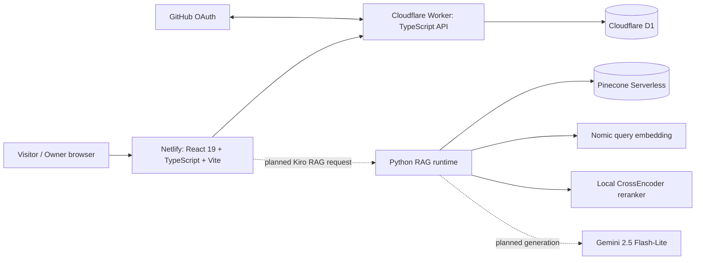

# Kirolos Portfolio

## Table of Contents

- [Project Scope](#project-scope)
- [Current System Architecture](#current-system-architecture)
  - [Deployed portfolio path](#deployed-portfolio-path)
  - [Kiro RAG path](#kiro-rag-path)
- [Repository Layout](#repository-layout)
- [Public Product Surfaces](#public-product-surfaces)
  - [Timeline and milestone stories](#timeline-and-milestone-stories)
  - [Opinions](#opinions)
  - [Skills](#skills)
  - [Kiro RAG](#kiro-rag)
- [Frontend Runtime](#frontend-runtime)
- [Cloudflare Worker and D1](#cloudflare-worker-and-d1)
- [GitHub OAuth Administrator Model](#github-oauth-administrator-model)
- [Admin Workspace](#admin-workspace)
- [D1 Image Storage](#d1-image-storage)
- [API Catalog](#api-catalog)
  - [Public API](#public-api)
  - [Authentication API](#authentication-api)
  - [Administration API](#administration-api)
  - [RAG runtime API](#rag-runtime-api)
- [CLI Milestone Authoring](#cli-milestone-authoring)
- [Database Migration Chain](#database-migration-chain)
- [Install, Verify and Run](#install-verify-and-run)
  - [Local Worker](#local-worker)
- [CI/CD](#cicd)
- [RAG Subsystem Snapshot](#rag-subsystem-snapshot)
- [Documentation Map](#documentation-map)
- [Deployment Ownership](#deployment-ownership)

<a id="project-scope"></a>
## Project Scope

`kirolos.dev` is a full portfolio application, not a standalone RAG repository. The current application is a React + TypeScript frontend deployed to Netlify, backed by a TypeScript Cloudflare Worker and Cloudflare D1. It includes the public career timeline, long-form milestone stories, D1-backed photographs, moderated visitor opinions, an evidence-oriented skills page, a private GitHub-OAuth administration workspace, CI/CD, and an in-progress Kiro RAG experience with a rigged 3D avatar and a separately engineered evidence-aware RAG backend.

The RAG subsystem under [`rag/`](rag/README.md) is intentionally documented as one subsystem of this larger application. It is unusually deep because it contains a complete 134-repository evidence corpus, multiple retrieval generations, local embedding/reranking infrastructure, Pinecone validation, and an HTTP retrieval runtime.

<a id="current-system-architecture"></a>
## Current System Architecture





<a id="deployed-portfolio-path"></a>
### Deployed portfolio path

The deployed non-RAG path is currently:

```text
Browser
  -> kirolos.dev on Netlify (React + TypeScript + Vite)
  -> kirolos-portfolio-api.linc-ministry.workers.dev (Cloudflare Worker)
  -> D1: kirolos-portfolio-db
```

D1 stores milestones, ordered long-form sections, milestone images as Base64 text, moderated opinions, and short-lived OAuth exchange-code state. The Worker decodes stored Base64 photographs and serves ordinary binary image responses.

<a id="kiro-rag-path"></a>
### Kiro RAG path

The current `/kiro-rag` page exists and is routed by `src/App.tsx`. Its browser-side interaction is presently an animation/state probe: `idle -> thinking -> retrieving -> answering -> success/error`. The query box does **not yet call the Python retrieval API**; timers exercise the same semantic states that the real RAG flow will later drive. The page renders a real GLB-oriented runtime boundary rather than manufacturing anatomy from a flat image.

The separately engineered Python runtime already exposes `GET /health` and `POST /api/rag/retrieve`, uses Nomic + Pinecone + BM25 + metadata + a CrossEncoder, and has been locally exercised. Gemini generation and browser wiring remain future integration steps. See [`rag/README.md`](rag/README.md) and [`src/features/kiro-rag/README.md`](src/features/kiro-rag/README.md).

<a id="repository-layout"></a>
## Repository Layout

```text
src/                         React + TypeScript frontend
src/admin/                   private GitHub-authenticated admin workspace
src/features/kiro-rag/       Kiro UI, GLB model contract, rig/animation runtime
shared/                      frontend/Worker API contracts
worker/                      Cloudflare Worker API + OAuth + D1 repositories
migrations/                  D1 schema migrations
scripts/                     portfolio authoring CLI + repository policy gates
rag/                         RAG corpus, pipeline, validation, Pinecone and Python runtime
docs/                        whole-project architecture / operations / version docs
examples/                    milestone payload templates
.github/workflows/           CI/CD
netlify.toml                 Netlify build + SPA routing
wrangler.jsonc               Worker + D1 binding configuration
```

<a id="public-product-surfaces"></a>
## Public Product Surfaces

<a id="timeline-and-milestone-stories"></a>
### Timeline and milestone stories

The home page loads the chronological timeline from the Worker. Individual `/milestones/:slug` pages load long-form milestone detail. The timeline keeps equal center-to-center milestone spacing rather than compressing short calendar gaps. Reveals are scroll-reversible. The view can be vertical or horizontal; hover/touch behavior exposes additional milestone context.

Season-aware transitions occur when the active milestone crosses seasons rather than at every calendar boundary: restrained leaves in fall, snow in winter, petals in spring, and a short rain-to-sun transition in summer. Motion effects are pointer-transparent and disabled or simplified for `prefers-reduced-motion`.

<a id="opinions"></a>
### Opinions

`/opinions` shows only approved opinions. Visitors may submit a display name, optional relationship/context, the opinion text, and explicit publication consent. New submissions enter D1 as `pending` and require owner moderation. A honeypot is used as a lightweight bot signal without collecting extra visitor identifiers. Approved opinion bubbles use viewport-aware motion based on `requestAnimationFrame` and `ResizeObserver`; reduced-motion users receive a static presentation.

<a id="skills"></a>
### Skills

`/skills` is a static, versioned source-and-commit evidence presentation derived from the LInC One and EurekaVault work. The evidence is stored in `src/data/project-skills.ts`; it does not require a D1 table or public API. Desktop uses a sticky visual evidence panel beside a scrolling capability feed; smaller layouts stack into a single flow. Capability reveals are reversible with scroll and respect reduced-motion preferences.

Public project imagery used by the skills page remains at:

```text
public/media/projects/linc-one/
public/media/projects/eureka-vault/
```

<a id="kiro-rag"></a>
### Kiro RAG

`/kiro-rag` is the portfolio-intelligence surface. Today its visible React side is primarily the 3D interaction backbone and behavior-state adapter. The final product path is intended to connect this interface to the evidence-aware RAG runtime and grounded generation layer, not to replace the rest of the portfolio.

<a id="frontend-runtime"></a>
## Frontend Runtime

The application uses React `19.1.1`, React DOM `19.1.1`, Three.js `0.185.1`, TypeScript, and Vite. `src/App.tsx` performs lightweight path-based routing for the public portfolio, `/skills`, `/opinions`, `/kiro-rag`, `/admin`, and `/admin/auth/callback`.

The frontend reads `VITE_API_BASE_URL` when provided; production builds set it to the Cloudflare Worker URL. Netlify rewrites all browser paths to `/index.html` with a `200` response so client-side routes can be loaded directly.

<a id="cloudflare-worker-and-d1"></a>
## Cloudflare Worker and D1

The Worker entry point is `worker/index.ts`. It separates public, authentication, and administration request handling in code and relies on repository modules for milestones and opinions.

Public routes include health, published milestones, milestone detail, published D1-backed images, approved opinions, and opinion submission. Authentication routes implement GitHub OAuth and one-time exchange. Administration routes require a signed admin session and support milestone CRUD, section replacement, image management, and opinion moderation.

`wrangler.jsonc` binds `DB` to `kirolos-portfolio-db`, sets `FRONTEND_ORIGIN=https://kirolos.dev`, versions the GitHub callback URL, and enables Worker observability.

<a id="github-oauth-administrator-model"></a>
## GitHub OAuth Administrator Model

The private owner interface is `/admin`. There is no public account registration, application password database, Firebase Authentication, or multi-role account system in this portfolio.

The current owner-authentication flow is:

```text
/admin
  -> Sign in with GitHub
  -> Worker creates signed OAuth state
  -> GitHub callback reaches Worker
  -> Worker exchanges GitHub authorization code server-side
  -> Worker fetches authenticated GitHub identity
  -> numeric GitHub user ID must equal ADMIN_GITHUB_USER_ID
  -> Worker creates 2-minute single-use D1 exchange code
  -> browser returns to /admin/auth/callback
  -> React consumes the exchange code once
  -> Worker issues signed 60-minute admin session
  -> browser keeps the session in sessionStorage
```

Authorization is anchored to the immutable numeric GitHub user ID rather than the username. The OAuth handoff code is stored only as a SHA-256 hash and consumed transactionally. The GitHub access token is used during the callback and is not persisted.

Production Worker secrets are `GITHUB_CLIENT_ID`, `GITHUB_CLIENT_SECRET`, `ADMIN_GITHUB_USER_ID`, and `SESSION_SECRET`. They belong in Wrangler secrets, never source control. The local `.dev.vars` file is also secret and must never be committed; it additionally carries local-only RAG credentials such as `PINECONE_API_KEY` when running the Python RAG service locally.

`GITHUB_CALLBACK_URL` is non-secret and is versioned in `wrangler.jsonc` as:

```text
https://kirolos-portfolio-api.linc-ministry.workers.dev/api/auth/github/callback
```

Set the four production secrets through Wrangler rather than source control:

```bash
npx wrangler secret put GITHUB_CLIENT_ID
npx wrangler secret put GITHUB_CLIENT_SECRET
npx wrangler secret put ADMIN_GITHUB_USER_ID
npx wrangler secret put SESSION_SECRET
```

The unavoidable GitHub GUI bootstrap is creation of the OAuth App with:

```text
Homepage URL: https://kirolos.dev
Authorization callback URL: https://kirolos-portfolio-api.linc-ministry.workers.dev/api/auth/github/callback
```

<a id="admin-workspace"></a>
## Admin Workspace

After OAuth is configured, `/admin` provides all of the capabilities documented before this overhaul:

- list draft and published milestones;
- create, edit and delete milestone metadata;
- year/month and deterministic display order;
- publish/draft state;
- short timeline description;
- expanded hover/touch description;
- full-story introduction;
- ordered long-form sections;
- Base64 photograph upload directly to D1;
- existing-image deletion;
- short-lived session copy for CLI use;
- opinion moderation with explicit approve/reject/delete actions.

No application password exists.

<a id="d1-image-storage"></a>
## D1 Image Storage

The portfolio deliberately uses D1 rather than active Cloudflare R2 integration for milestone photographs. `milestone_images` stores MIME type, Base64 image data, raw byte size, alt text, caption, order and cover status. The raw image limit is **1,310,720 bytes (1.25 MiB)** to keep Base64-expanded rows inside D1 limits with margin. Supported formats are AVIF, GIF, JPEG, PNG and WebP.

Public milestone JSON exposes image URLs rather than Base64. `GET /api/images/:id` reads the D1 row, decodes Base64 to an `ArrayBuffer`, sends the stored MIME type, and adds cache/nosniff headers.

<a id="api-catalog"></a>
## API Catalog

<a id="public-api"></a>
### Public API

| Method | Route | Purpose |
|---|---|---|
| `GET` | `/api/health` | Worker and D1 health |
| `GET` | `/api/milestones` | Published chronological timeline |
| `GET` | `/api/milestones/:slug` | Published milestone detail |
| `GET` | `/api/images/:id` | Published D1-backed image |
| `GET` | `/api/opinions` | Approved public opinions |
| `POST` | `/api/opinions` | Submit opinion for moderation |

<a id="authentication-api"></a>
### Authentication API

| Method | Route | Purpose |
|---|---|---|
| `GET` | `/api/auth/github` | Start GitHub OAuth |
| `GET` | `/api/auth/github/callback` | Server-side callback |
| `POST` | `/api/auth/exchange` | Consume one-time handoff and issue session |
| `GET` | `/api/auth/session` | Validate current admin session |

<a id="administration-api"></a>
### Administration API

All administration routes require `Authorization: Bearer <session>` and the expected frontend origin.

| Method | Route | Purpose |
|---|---|---|
| `GET`/`POST` | `/api/admin/milestones` | list/create milestones |
| `GET`/`PUT`/`DELETE` | `/api/admin/milestones/:id` | load/update/delete milestone |
| `PUT` | `/api/admin/milestones/:id/sections` | replace ordered sections |
| `PUT`/`POST` | `/api/admin/milestones/:id/images` | replace/add images |
| `DELETE` | `/api/admin/milestones/:id/images/:imageId` | remove image |
| `GET` | `/api/admin/opinions` | list all submissions |
| `PUT`/`DELETE` | `/api/admin/opinions/:id` | moderate/delete opinion |

<a id="rag-runtime-api"></a>
### RAG runtime API

The Python service is separate from the deployed Worker and is not yet browser-wired:

| Method | Route | Current status |
|---|---|---|
| `GET` | `/health` | implemented in `rag/runtime/rag-api-pinecone-v1.py` |
| `POST` | `/api/rag/retrieve` | implemented and locally exercised; retrieval evidence only |
| `POST` | `/api/rag/ask` | **PROPOSED** future generation endpoint |

<a id="cli-milestone-authoring"></a>
## CLI Milestone Authoring

The milestone CLI no longer accepts a permanent portfolio administrator secret. The owner signs in through `/admin`, chooses **Copy CLI session**, and places the short-lived OAuth-backed session in `PORTFOLIO_ADMIN_SESSION`.

PowerShell:

```powershell
$env:PORTFOLIO_ADMIN_SESSION='...'
```

Bash:

```bash
export PORTFOLIO_ADMIN_SESSION='...'
```

The preserved command set is:

```bash
npm run milestone -- list
npm run milestone -- create examples/milestone.json
npm run milestone -- update 1 examples/milestone.json
npm run milestone -- sections 1 examples/milestone-sections.json
npm run milestone -- image-add 1 ./photo.jpg --alt="University campus" --cover
npm run milestone -- image-delete 1 42
npm run milestone -- delete 1
```

The session expires after 60 minutes; reauthenticate rather than maintaining a long-lived application credential.

<a id="database-migration-chain"></a>
## Database Migration Chain

```text
0001-initial-portfolio-schema.sql
0002-base64-milestone-images.sql
0003-github-oauth.sql
0004-opinions.sql
```

Local validation uses `npm run db:migrate:local`; the main-branch deployment workflow applies the production migration command before Worker deployment:

```bash
npm run db:migrate:remote
```

<a id="install-verify-and-run"></a>
## Install, Verify and Run

Requirements: Node.js `>=22.13.0`.

```bash
npm install
npm run verify
npm run dev
```

The `verify` chain rejects legacy JavaScript migration files, active R2 integration, and the removed permanent-admin-token mechanism; then runs ESLint, frontend and Worker TypeScript checks, Vitest, and a Wrangler dry-run. CI additionally validates D1 migrations and performs the Vite build.

For local Worker development, authenticate Wrangler, apply local migrations, populate local secrets in `.dev.vars`, and run `npm run worker:dev`.

The RAG runtime has a separate Python dependency set under `rag/runtime/requirements-rag-api-v1.txt`; see [`rag/runtime/README.md`](rag/runtime/README.md).

<a id="local-worker"></a>
### Local Worker

Authenticate Wrangler once:

```bash
npx wrangler login
```

Apply D1 migrations locally:

```bash
npm run db:migrate:local
```

Copy `.dev.vars.example` to `.dev.vars`, populate local-only OAuth values and any local RAG credentials needed by the Python service, then run:

```bash
npm run worker:dev
```

Never commit `.dev.vars`. It is a local secret file, not a Netlify-managed environment file.

<a id="cicd"></a>
## CI/CD

`.github/workflows/portfolio-ci-cd.yml` runs on pull requests and pushes to `main`. The quality job uses Node 22 and performs the policy gates, lint, type checks, tests, local D1 migrations, frontend build and Worker dry-run. A successful `main` push then applies remote D1 migrations and deploys the Worker, after which the frontend is built and deployed to Netlify.

The quality gate remains explicitly ordered as:

```text
legacy-file gate
  -> no-R2 gate
  -> no-permanent-admin-token gate
  -> ESLint
  -> frontend TypeScript
  -> Worker TypeScript
  -> Vitest
  -> local D1 migration validation
  -> Vite production build
  -> Wrangler dry-run
```

A successful `main` push continues as:

```text
apply remote D1 migrations
  -> deploy Cloudflare Worker
  -> build frontend
  -> deploy prebuilt dist/ to Netlify
```

GitHub Actions deployment secrets are `CLOUDFLARE_API_TOKEN`, `CLOUDFLARE_ACCOUNT_ID`, `NETLIFY_AUTH_TOKEN`, and `NETLIFY_SITE_ID`. OAuth runtime secrets are Worker secrets, not Netlify or Actions secrets.

Netlify also defines `npm run verify && npm run build` as its build command, publishes `dist`, pins Node 22, sets the production Worker API base URL, and performs the SPA rewrite.

<a id="rag-subsystem-snapshot"></a>
## RAG Subsystem Snapshot


| Layer | Current status | Authoritative implementation / artifact |
|---|---|---|
| Source analysis | **ACTIVE / COMPLETE** | `rag/other/repositories-*.md`, 134/134 repositories |
| Canonical normalization | **ACTIVE / OUTPUT VALID** | `rag/scripts/prepare-rag-corpus.py` -> `rag/rag-corpus/` |
| Evidence document compiler | **ACTIVE / COMPLETE** | `build-rag-retrieval-documents-v2.py` -> 2,808 documents |
| Document embeddings | **ACTIVE / COMPLETE; DO NOT REGENERATE WITHOUT CAUSE** | `generate-rag-embeddings-v3-documents-local.py`, 2,808 x 512 |
| Offline evidence-aware retrieval | **ACTIVE / VALIDATED** | `build-rag-retrieval-v3-evidence-aware-local.py` |
| Dense vector serving | **ACTIVE / VALIDATED** | Pinecone `portfolio-career-rag-v1`, namespace `corpus-v1` |
| Pinecone parity | **ACTIVE / PASS** | `dense-parity-validation-v2.json` |
| Python HTTP retrieval runtime | **ACTIVE CODE; LOCALLY EXERCISED** | `rag/runtime/rag-api-pinecone-v1.py`, schema 1.0.0 / retrieval 3.1.0-pinecone |
| Answer generation | **SELECTED / NOT INTEGRATED** | Gemini 2.5 Flash-Lite |
| Browser-to-RAG API wiring | **NOT YET INTEGRATED** | `/kiro-rag` currently drives a simulated state flow and 3D avatar |
| Positive-backend hardening patch | **PROPOSED - NOT APPLIED TO `main`** | local proposal `rag-backend-positive-gate-v1`, runtime schema 1.1.0 |


The complete design history, quantitative validation, failure analysis, artifact identifiers, Pinecone parity details, runtime behavior, known issues and regeneration rules are intentionally kept under [`rag/`](rag/README.md) rather than flattening the entire portfolio README into an RAG manual.

<a id="documentation-map"></a>
## Documentation Map

Start with [`docs/README.md`](docs/README.md). The most important system-level references are:

- [`docs/architecture/system-overview.md`](docs/architecture/system-overview.md) - whole-project boundaries and diagrams;
- [`docs/architecture/component-interactions.md`](docs/architecture/component-interactions.md) - who calls whom;
- [`docs/operations/change-impact-matrix.md`](docs/operations/change-impact-matrix.md) - what must change/regenerate when a component changes;
- [`docs/versions/component-version-map.md`](docs/versions/component-version-map.md) - ACTIVE / SUPERSEDED / PROPOSED truth table;
- [`rag/README.md`](rag/README.md) - canonical RAG source of truth;
- [`src/features/kiro-rag/README.md`](src/features/kiro-rag/README.md) - browser-side Kiro RAG/3D implementation.

<a id="deployment-ownership"></a>
## Deployment Ownership

The repository remains the source of truth for application code, D1 migrations, Worker bindings, OAuth behavior, tests, deployment gates and RAG documentation. Service dashboards should be treated primarily as runtime/observability/bootstrap surfaces. RAG external state is the explicit exception that must be reconciled against checked-in validation artifacts: Pinecone stores the indexed dense vectors, while its expected index shape, namespace and parity evidence are documented and validated from repository scripts.

## Related Documentation

- [Documentation index](docs/README.md)
- [RAG subsystem](rag/README.md)
- [Frontend docs](src/README.md)
- [Worker docs](worker/README.md)
