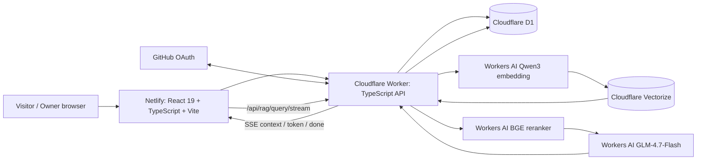

# Kirolos Portfolio

## Table of Contents

- [Project Scope](#project-scope)
- [Current System Architecture](#current-system-architecture)
  - [Deployed portfolio path](#deployed-portfolio-path)
  - [Kiro RAG path](#kiro-rag-path)
- [Repository Layout](#repository-layout)
- [Public Product Surfaces](#public-product-surfaces)
  - [Timeline and milestone stories](#timeline-and-milestone-stories)
  - [Opinions](#opinions)
  - [Skills](#skills)
  - [Kiro RAG](#kiro-rag)
- [Frontend Runtime](#frontend-runtime)
- [Cloudflare Worker and D1](#cloudflare-worker-and-d1)
- [GitHub OAuth Administrator Model](#github-oauth-administrator-model)
- [Admin Workspace](#admin-workspace)
- [D1 Image Storage](#d1-image-storage)
- [API Catalog](#api-catalog)
  - [Public API](#public-api)
  - [Authentication API](#authentication-api)
  - [Administration API](#administration-api)
  - [RAG runtime API](#rag-runtime-api)
- [CLI Milestone Authoring](#cli-milestone-authoring)
- [Database Migration Chain](#database-migration-chain)
- [Install, Verify and Run](#install-verify-and-run)
  - [Local Worker](#local-worker)
- [CI/CD](#cicd)
- [RAG Subsystem Snapshot](#rag-subsystem-snapshot)
- [Documentation Map](#documentation-map)
- [Deployment Ownership](#deployment-ownership)

<a id="project-scope"></a>
## Project Scope

`kirolos.dev` is a full portfolio application, not a standalone RAG repository. The current application is a React + TypeScript frontend deployed to Netlify, backed by a TypeScript Cloudflare Worker and Cloudflare D1. It includes the public career timeline, long-form milestone stories, D1-backed photographs, moderated visitor opinions, an evidence-oriented skills page, a private GitHub-OAuth administration workspace, CI/CD, and the deployed Kiro portfolio-agent chat backed by a Cloudflare-native evidence-aware RAG system.

The RAG subsystem is documented as one subsystem of this larger application. It contains a complete 134-repository evidence corpus, 2,808 evidence-aware retrieval documents, preserved historical retrieval generations, Cloudflare Workers AI embeddings/reranking/generation, Vectorize serving, D1 authoritative evidence, production Worker orchestration, validation artifacts, and a streaming browser chat.

<a id="current-system-architecture"></a>
## Current System Architecture



<a id="deployed-portfolio-path"></a>
### Deployed portfolio path

The deployed application path is:

```text
Browser
  -> kirolos.dev on Netlify (React + TypeScript + Vite)
  -> kirolos-portfolio-api.linc-ministry.workers.dev (Cloudflare Worker)
  -> D1: kirolos-portfolio-db
```

D1 stores milestones, ordered long-form sections, milestone images as Base64 text, moderated opinions, short-lived OAuth exchange-code state, and the authoritative 2,808-document RAG evidence corpus. The Worker decodes stored Base64 photographs and serves ordinary binary image responses.

<a id="kiro-rag-path"></a>
### Kiro RAG path

`/kiro-rag` is now a deployed agent-style chat surface. It calls the Worker streaming endpoint and drives the existing Kiro GLB avatar from real request lifecycle events rather than demo timers.

```text
Question
  -> Worker input validation + per-client rate limit
  -> Qwen3 query embedding
  -> Vectorize top 40
  -> D1 evidence hydration
  -> BGE reranker top 20
  -> evidence-aware / repository-diverse top 8
  -> GLM-4.7-Flash grounded synthesis
  -> SSE context/token/done events
  -> browser answer + E# citations + source cards
```

The chat keeps earlier turns as browser-session presentation state, but the backend currently grounds each question independently. The interface therefore does not claim cross-turn model memory that the Worker does not actually provide.

The older Nomic + Pinecone + Python + local CrossEncoder runtime is preserved as historical/regression material only; it is not the production request path. See [`docs/rag/production-architecture.md`](docs/rag/production-architecture.md) and [`src/features/kiro-rag/README.md`](src/features/kiro-rag/README.md).

<a id="repository-layout"></a>
## Repository Layout

```text
src/                         React + TypeScript frontend
src/admin/                   private GitHub-authenticated admin workspace
src/features/kiro-rag/       live Kiro chat, SSE client, GLB/animation runtime
shared/                      frontend/Worker API contracts
worker/                      Cloudflare Worker API + OAuth + production RAG orchestration
migrations/                  D1 schema migrations, including RAG runtime tables
scripts/                     portfolio authoring CLI + repository policy gates
rag/                         RAG corpus, offline builders, embeddings, validation + history
docs/                        whole-project + canonical RAG architecture / operations / QC
examples/                    milestone payload templates
.github/workflows/           CI/CD
netlify.toml                 Netlify build + SPA routing
wrangler.jsonc               Worker + D1 + AI + Vectorize + rate-limit bindings
```

<a id="public-product-surfaces"></a>
## Public Product Surfaces

<a id="timeline-and-milestone-stories"></a>
### Timeline and milestone stories

The home page loads the chronological timeline from the Worker. Individual `/milestones/:slug` pages load long-form milestone detail. The timeline keeps equal center-to-center milestone spacing rather than compressing short calendar gaps. Reveals are scroll-reversible. The view can be vertical or horizontal; hover/touch behavior exposes additional milestone context.

Season-aware transitions occur when the active milestone crosses seasons rather than at every calendar boundary: restrained leaves in fall, snow in winter, petals in spring, and a short rain-to-sun transition in summer. Motion effects are pointer-transparent and disabled or simplified for `prefers-reduced-motion`.

<a id="opinions"></a>
### Opinions

`/opinions` shows only approved opinions. Visitors may submit a display name, optional relationship/context, the opinion text, and explicit publication consent. New submissions enter D1 as `pending` and require owner moderation. A honeypot is used as a lightweight bot signal without collecting extra visitor identifiers. Approved opinion bubbles use viewport-aware motion based on `requestAnimationFrame` and `ResizeObserver`; reduced-motion users receive a static presentation.

<a id="skills"></a>
### Skills

`/skills` is a static, versioned source-and-commit evidence presentation derived from the LInC One and EurekaVault work. The evidence is stored in `src/data/project-skills.ts`; it does not require a D1 table or public API. Desktop uses a sticky visual evidence panel beside a scrolling capability feed; smaller layouts stack into a single flow. Capability reveals are reversible with scroll and respect reduced-motion preferences.

Public project imagery used by the skills page remains at:

```text
public/media/projects/linc-one/
public/media/projects/eureka-vault/
```

<a id="kiro-rag"></a>
### Kiro RAG

`/kiro-rag` is the live portfolio-intelligence chat. It uses the production SSE RAG endpoint and preserves the Kiro 3D model as the agent-presence layer.

The interaction includes streaming responses, suggested starter questions, a persistent composer, stop/cancel, retry/regenerate, inline `[E#]` citations, cited-vs-considered source cards, repository/source-line provenance, a collapsible retrieval trace, responsive layouts, and reduced-motion behavior.

Kiro's visible states are driven by real request events (`retrieving`, `answering`, `success`, `error`) instead of artificial timers. The browser never receives Cloudflare credentials or direct access to Vectorize/D1.

<a id="frontend-runtime"></a>
## Frontend Runtime

The application uses React `19.1.1`, React DOM `19.1.1`, Three.js `0.185.1`, TypeScript, and Vite. `src/App.tsx` performs lightweight path-based routing for the public portfolio, `/skills`, `/opinions`, `/kiro-rag`, `/admin`, and `/admin/auth/callback`.

The frontend reads `VITE_API_BASE_URL` when provided; production builds set it to the Cloudflare Worker URL. Netlify rewrites all browser paths to `/index.html` with a `200` response so client-side routes can be loaded directly.

The current production build succeeds but emits a Vite large-chunk warning: the main JavaScript bundle is approximately 904 kB minified / 246 kB gzip. Route-level/code splitting, especially around Three.js/Kiro, is a future performance-hardening opportunity rather than a RAG correctness requirement.

<a id="cloudflare-worker-and-d1"></a>
## Cloudflare Worker and D1

The Worker entry point is `worker/index.ts`. It separates public, authentication, administration, and RAG request handling in code and relies on repository modules for persistent application data.

Public routes include health, published milestones, milestone detail, published D1-backed images, approved opinions, opinion submission, and the RAG health/query/streaming endpoints. Authentication routes implement GitHub OAuth and one-time exchange. Administration routes require a signed admin session and support milestone CRUD, section replacement, image management, and opinion moderation.

`wrangler.jsonc` binds:

- `DB` -> `kirolos-portfolio-db`;
- `AI` -> Cloudflare Workers AI;
- `RAG_INDEX` -> `portfolio-career-rag-cloudflare-v1`;
- `RAG_RATE_LIMITER` -> 10 requests / 60 seconds / client IP;
- `FRONTEND_ORIGIN` -> `https://kirolos.dev`.

<a id="github-oauth-administrator-model"></a>
## GitHub OAuth Administrator Model

The private owner interface is `/admin`. There is no public account registration, application password database, Firebase Authentication, or multi-role account system in this portfolio.

The current owner-authentication flow is:

```text
/admin
  -> Sign in with GitHub
  -> Worker creates signed OAuth state
  -> GitHub callback reaches Worker
  -> Worker exchanges GitHub authorization code server-side
  -> Worker fetches authenticated GitHub identity
  -> numeric GitHub user ID must equal ADMIN_GITHUB_USER_ID
  -> Worker creates 2-minute single-use D1 exchange code
  -> browser returns to /admin/auth/callback
  -> React consumes the exchange code once
  -> Worker issues signed 60-minute admin session
  -> browser keeps the session in sessionStorage
```

Authorization is anchored to the immutable numeric GitHub user ID rather than the username. The OAuth handoff code is stored only as a SHA-256 hash and consumed transactionally. The GitHub access token is used during the callback and is not persisted.

Production Worker secrets are `GITHUB_CLIENT_ID`, `GITHUB_CLIENT_SECRET`, `ADMIN_GITHUB_USER_ID`, and `SESSION_SECRET`. They belong in Wrangler secrets, never source control. The local `.dev.vars` file is also secret and must never be committed. Historical/local-only RAG credentials may still be needed only when deliberately exercising the preserved Python/Pinecone reference runtime.

`GITHUB_CALLBACK_URL` is non-secret and is versioned in `wrangler.jsonc` as:

```text
https://kirolos-portfolio-api.linc-ministry.workers.dev/api/auth/github/callback
```

Set the four production secrets through Wrangler rather than source control:

```bash
npx wrangler secret put GITHUB_CLIENT_ID
npx wrangler secret put GITHUB_CLIENT_SECRET
npx wrangler secret put ADMIN_GITHUB_USER_ID
npx wrangler secret put SESSION_SECRET
```

The unavoidable GitHub GUI bootstrap is creation of the OAuth App with:

```text
Homepage URL: https://kirolos.dev
Authorization callback URL: https://kirolos-portfolio-api.linc-ministry.workers.dev/api/auth/github/callback
```

<a id="admin-workspace"></a>
## Admin Workspace

After OAuth is configured, `/admin` provides all of the capabilities documented before this overhaul:

- list draft and published milestones;
- create, edit and delete milestone metadata;
- year/month and deterministic display order;
- publish/draft state;
- short timeline description;
- expanded hover/touch description;
- full-story introduction;
- ordered long-form sections;
- Base64 photograph upload directly to D1;
- existing-image deletion;
- short-lived session copy for CLI use;
- opinion moderation with explicit approve/reject/delete actions.

No application password exists.

<a id="d1-image-storage"></a>
## D1 Image Storage

The portfolio deliberately uses D1 rather than active Cloudflare R2 integration for milestone photographs. `milestone_images` stores MIME type, Base64 image data, raw byte size, alt text, caption, order and cover status. The raw image limit is **1,310,720 bytes (1.25 MiB)** to keep Base64-expanded rows inside D1 limits with margin. Supported formats are AVIF, GIF, JPEG, PNG and WebP.

Public milestone JSON exposes image URLs rather than Base64. `GET /api/images/:id` reads the D1 row, decodes Base64 to an `ArrayBuffer`, sends the stored MIME type, and adds cache/nosniff headers.

<a id="api-catalog"></a>
## API Catalog

<a id="public-api"></a>
### Public API

| Method | Route | Purpose |
|---|---|---|
| `GET` | `/api/health` | Worker and D1 health |
| `GET` | `/api/milestones` | Published chronological timeline |
| `GET` | `/api/milestones/:slug` | Published milestone detail |
| `GET` | `/api/images/:id` | Published D1-backed image |
| `GET` | `/api/opinions` | Approved public opinions |
| `POST` | `/api/opinions` | Submit opinion for moderation |

<a id="authentication-api"></a>
### Authentication API

| Method | Route | Purpose |
|---|---|---|
| `GET` | `/api/auth/github` | Start GitHub OAuth |
| `GET` | `/api/auth/github/callback` | Server-side callback |
| `POST` | `/api/auth/exchange` | Consume one-time handoff and issue session |
| `GET` | `/api/auth/session` | Validate current admin session |

<a id="administration-api"></a>
### Administration API

All administration routes require `Authorization: Bearer <session>` and the expected frontend origin.

| Method | Route | Purpose |
|---|---|---|
| `GET`/`POST` | `/api/admin/milestones` | list/create milestones |
| `GET`/`PUT`/`DELETE` | `/api/admin/milestones/:id` | load/update/delete milestone |
| `PUT` | `/api/admin/milestones/:id/sections` | replace ordered sections |
| `PUT`/`POST` | `/api/admin/milestones/:id/images` | replace/add images |
| `DELETE` | `/api/admin/milestones/:id/images/:imageId` | remove image |
| `GET` | `/api/admin/opinions` | list all submissions |
| `PUT`/`DELETE` | `/api/admin/opinions/:id` | moderate/delete opinion |

<a id="rag-runtime-api"></a>
### RAG runtime API

The production RAG API is served by the deployed Cloudflare Worker:

| Method | Route | Current status |
|---|---|---|
| `GET` | `/api/rag/health` | deployed; validates 2,808-document / 134-repository D1 corpus |
| `POST` | `/api/rag/query` | deployed; synchronous grounded answer + citations + diagnostics; live production acceptance PASS |
| `POST` | `/api/rag/query/stream` | deployed; normalized SSE `context` / `token` / `done` / `error`; consumed by `/kiro-rag` |

The historical Python `rag/runtime/rag-api-pinecone-v1.py` service remains preserved for regression/history but is not a production dependency.

<a id="cli-milestone-authoring"></a>
## CLI Milestone Authoring

The milestone CLI no longer accepts a permanent portfolio administrator secret. The owner signs in through `/admin`, chooses **Copy CLI session**, and places the short-lived OAuth-backed session in `PORTFOLIO_ADMIN_SESSION`.

PowerShell:

```powershell
$env:PORTFOLIO_ADMIN_SESSION='...'
```

Bash:

```bash
export PORTFOLIO_ADMIN_SESSION='...'
```

The preserved command set is:

```bash
npm run milestone -- list
npm run milestone -- create examples/milestone.json
npm run milestone -- update 1 examples/milestone.json
npm run milestone -- sections 1 examples/milestone-sections.json
npm run milestone -- image-add 1 ./photo.jpg --alt="University campus" --cover
npm run milestone -- image-delete 1 42
npm run milestone -- delete 1
```

The session expires after 60 minutes; reauthenticate rather than maintaining a long-lived application credential.

<a id="database-migration-chain"></a>
## Database Migration Chain

```text
0001-initial-portfolio-schema.sql
0002-base64-milestone-images.sql
0003-github-oauth.sql
0004-opinions.sql
0005-rag-runtime.sql
```

Local validation uses `npm run db:migrate:local`; the main-branch deployment workflow applies the production migration command before Worker deployment:

```bash
npm run db:migrate:remote
```

The RAG evidence population is generated separately from the migration schema by `rag/runtime/build-d1-rag-import.mjs`. Do not regenerate/import it for ordinary frontend or Worker-only changes.

<a id="install-verify-and-run"></a>
## Install, Verify and Run

Requirements: Node.js `>=22.13.0`.

```bash
npm install
npm run verify
npm run dev
```

The `verify` chain rejects legacy JavaScript migration files, active R2 integration, and the removed permanent-admin-token mechanism; then runs ESLint, frontend and Worker TypeScript checks, Vitest, and a Wrangler dry-run. CI additionally validates D1 migrations and performs the Vite build.

For local Worker development, authenticate Wrangler, apply local migrations, populate local secrets in `.dev.vars`, and run `npm run worker:dev`.

The production RAG runtime requires no Python process. Python dependencies under `rag/runtime/requirements-rag-api-v1.txt` belong to the preserved historical/reference runtime only.

<a id="local-worker"></a>
### Local Worker

Authenticate Wrangler once:

```bash
npx wrangler login
```

Apply D1 migrations locally:

```bash
npm run db:migrate:local
```

For a local RAG query to use real evidence, also build/import the local corpus as documented under `docs/rag/production-architecture.md`.

Copy `.dev.vars.example` to `.dev.vars`, populate local-only OAuth values, then run:

```bash
npm run worker:dev
```

Never commit `.dev.vars`. It is a local secret file, not a Netlify-managed environment file.

<a id="cicd"></a>
## CI/CD

`.github/workflows/portfolio-ci-cd.yml` runs on pull requests and pushes to `main`. The quality job uses Node 22 and performs the policy gates, lint, type checks, tests, local D1 migrations, frontend build and Worker dry-run. A successful `main` push then applies remote D1 migrations and deploys the Worker, after which the frontend is built and deployed to Netlify.

The quality gate remains explicitly ordered as:

```text
legacy-file gate
  -> no-R2 gate
  -> no-permanent-admin-token gate
  -> ESLint
  -> frontend TypeScript
  -> Worker TypeScript
  -> Vitest
  -> local D1 migration validation
  -> Vite production build
  -> Wrangler dry-run
```

A successful `main` push continues as:

```text
apply remote D1 migrations
  -> deploy Cloudflare Worker
  -> build frontend
  -> deploy prebuilt dist/ to Netlify
```

GitHub Actions deployment secrets are `CLOUDFLARE_API_TOKEN`, `CLOUDFLARE_ACCOUNT_ID`, `NETLIFY_AUTH_TOKEN`, and `NETLIFY_SITE_ID`. OAuth runtime secrets are Worker secrets, not Netlify or Actions secrets.

Netlify also defines `npm run verify && npm run build` as its build command, publishes `dist`, pins Node 22, sets the production Worker API base URL, and performs the SPA rewrite.

The Kiro chat rollout passed 68/68 tests across 12 test files, frontend/Worker typechecks, ESLint, local D1 migrations, Vite production build, Worker dry-run, Cloudflare deployment, and Netlify production deployment.

<a id="rag-subsystem-snapshot"></a>
## RAG Subsystem Snapshot

| Layer | Current status | Authoritative implementation / artifact |
|---|---|---|
| Source analysis | **ACTIVE / COMPLETE** | `rag/other/repositories-*.md`, 134/134 repositories |
| Canonical normalization | **ACTIVE / OUTPUT VALID** | `rag/scripts/prepare-rag-corpus.py` -> `rag/rag-corpus/` |
| Evidence document compiler | **ACTIVE / COMPLETE** | retrieval-documents v2 -> 2,808 documents, schema 2.0.0 |
| Cloudflare document embeddings | **ACTIVE / VALIDATED** | `@cf/qwen/qwen3-embedding-0.6b`, 2,808 x 1,024, `rag/rag-corpus/embeddings-cloudflare-v1/` |
| Dense vector serving | **ACTIVE / VALIDATED** | Vectorize `portfolio-career-rag-cloudflare-v1`, 2,808 exact IDs |
| Dense parity | **PASS** | `rag/rag-corpus/vectorize-cloudflare-v1/` |
| Authoritative RAG text/provenance | **ACTIVE / REMOTE VERIFIED** | D1 `rag_documents` + `rag_corpus_meta` |
| Query embedding | **ACTIVE / PRODUCTION** | Workers AI Qwen3 query mode + validated instruction |
| Reranking | **ACTIVE / PRODUCTION** | `@cf/baai/bge-reranker-base`, top 20 |
| Evidence selection | **ACTIVE / PRODUCTION** | Worker evidence-aware scoring + repository diversity -> top 8 |
| Answer generation | **ACTIVE / PRODUCTION** | `@cf/zai-org/glm-4.7-flash`, thinking disabled, citation-grounded |
| Synchronous RAG API | **ACTIVE / LIVE VALIDATED** | `POST /api/rag/query` |
| Streaming RAG API | **ACTIVE / DEPLOYED** | `POST /api/rag/query/stream`; frontend consumer + parser tests complete; independent live stream QC capture still outstanding |
| Browser chat | **ACTIVE / DEPLOYED** | `/kiro-rag`, `kiro-chat.tsx`, `rag-client.ts`, Kiro GLB lifecycle integration |
| Historical Nomic/Pinecone/Python path | **PRESERVED / NON-PRODUCTION** | legacy/reference artifacts and runtime |

The complete design history, quantitative validation, failure analysis, artifact identifiers, runtime behavior, known issues and regeneration rules are kept under [`docs/rag/`](docs/rag/README.md) and [`docs/qc/rag/`](docs/qc/rag/README.md) rather than flattening the entire portfolio README into an RAG manual.

<a id="documentation-map"></a>
## Documentation Map

Start with [`docs/README.md`](docs/README.md). The most important system-level references are:

- [`docs/architecture/system-overview.md`](docs/architecture/system-overview.md) - whole-project boundaries and diagrams;
- [`docs/architecture/component-interactions.md`](docs/architecture/component-interactions.md) - who calls whom;
- [`docs/operations/change-impact-matrix.md`](docs/operations/change-impact-matrix.md) - what must change/regenerate when a component changes;
- [`docs/versions/component-version-map.md`](docs/versions/component-version-map.md) - ACTIVE / SUPERSEDED / PROPOSED truth table;
- [`docs/rag/README.md`](docs/rag/README.md) - canonical RAG documentation index;
- [`docs/rag/production-architecture.md`](docs/rag/production-architecture.md) - current production RAG architecture;
- [`docs/qc/rag/README.md`](docs/qc/rag/README.md) - RAG validation and incidents;
- [`src/features/kiro-rag/README.md`](src/features/kiro-rag/README.md) - browser-side Kiro agent/GLB implementation.

<a id="deployment-ownership"></a>
## Deployment Ownership

The repository remains the source of truth for application code, D1 migrations, Worker bindings, OAuth behavior, tests, deployment gates and RAG documentation. Service dashboards should be treated primarily as runtime/observability/bootstrap surfaces.

For the live RAG system, external runtime state is reconciled against checked-in contracts and validation artifacts: Vectorize stores the production dense vectors, D1 stores authoritative evidence/provenance, and Workers AI supplies query embedding, reranking and generation. Historical Pinecone state is no longer a production dependency.

## Related Documentation

- [Documentation index](docs/README.md)
- [RAG documentation](docs/rag/README.md)
- [Production RAG architecture](docs/rag/production-architecture.md)
- [RAG QC](docs/qc/rag/README.md)
- [Frontend docs](src/README.md)
- [Worker docs](worker/README.md)
