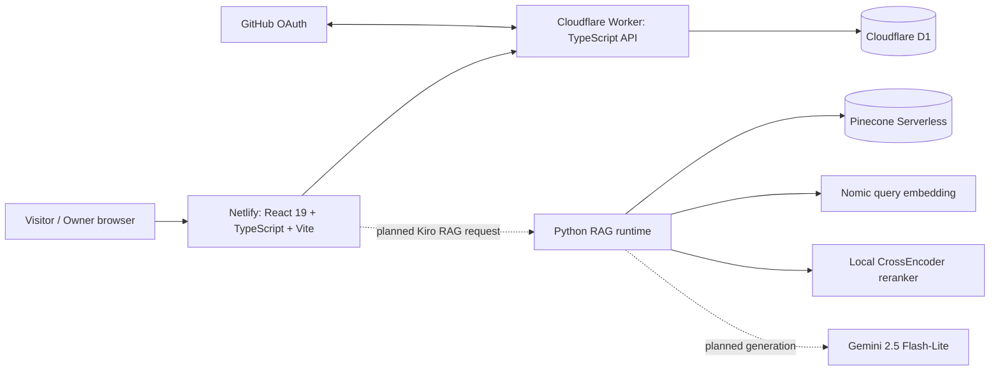

# Technical Documentation Index

## Table of Contents

- [Purpose](#purpose)
- [Documentation Principles](#documentation-principles)
- [Documentation Directory Responsibilities](#documentation-directory-responsibilities)
- [RAG Directory Distinction](#rag-directory-distinction)
- [Whole-Project Map](#whole-project-map)
- [Architecture](#architecture)
- [Operations](#operations)
- [RAG Documentation](#rag-documentation)
- [RAG Deployment Endeavour](#rag-deployment-endeavour)
- [Quality Control](#quality-control)
- [Data and Testing](#data-and-testing)
- [Versions and Evolution](#versions-and-evolution)
- [Subsystem Documentation](#subsystem-documentation)

<a id="purpose"></a>
## Purpose

This directory is the navigation and architecture layer for the entire `my-portfolio` repository. It prevents the unusually deep RAG subsystem from obscuring the fact that this repository is first a deployed portfolio application with a frontend, a Cloudflare Worker, D1 persistence, GitHub OAuth administration, CI/CD and multiple public experiences.

<a id="documentation-principles"></a>
## Documentation Principles

1. **Preserve before reorganizing.** Existing implementation facts are retained; deeper files move detail out of overloaded READMEs without deleting the underlying information.
2. **Status is explicit.** `ACTIVE`, `SUPERSEDED`, and `PROPOSED - NOT APPLIED` are used whenever multiple generations exist.
3. **Paths are executable documentation.** File and directory names are exact repository-relative paths.
4. **Boundaries matter.** Each document says what a component owns and what it does not own.
5. **RAG provenance is first class.** Quantitative results, failed attempts and validation criteria are documented rather than only the happy-path architecture.

<a id="documentation-directory-responsibilities"></a>
## Documentation Directory Responsibilities

| Directory | Primary responsibility | Examples |
|---|---|---|
| [`architecture/`](architecture/README.md) | stable whole-system topology, boundaries and flows | component interactions, trust boundaries |
| [`data/`](data/README.md) | data ownership, persistence and derived-state relationships | D1/Pinecone storage map |
| [`operations/`](operations/README.md) | whole-portfolio build/run/release/maintenance procedures | Netlify/Worker/D1 deployment, local development |
| [`rag/`](rag/README.md) | RAG engineering/design/deployment documentation | Cloudflare integration, migration analysis |
| [`rag/deployment/`](rag/deployment/README.md) | RAG hosting/provider/runtime decision history | Docker/Render/Cloudflare/Qwen evaluations |
| [`qc/`](qc/README.md) | Quality Control records and evidence | validation, acceptance, incidents |
| [`qc/rag/`](qc/rag/README.md) | RAG-specific QC/regression evidence | retrieval incidents and concise returned-result evidence |
| [`testing/`](testing/README.md) | test strategy and automation design | unit/integration/E2E philosophy |
| [`versions/`](versions/README.md) | version truth and historical evolution | component version map |

<a id="rag-directory-distinction"></a>
## RAG Directory Distinction

Three paths must not be conflated:

```text
docs/rag/
  RAG DESIGN / ARCHITECTURE / DEPLOYMENT DOCUMENTATION

docs/qc/rag/
  RAG QUALITY CONTROL / REGRESSION / VALIDATION EVIDENCE

rag/
  ACTUAL RAG IMPLEMENTATION / SCRIPTS / RUNTIME / CORPUS / GENERATED ARTIFACTS
```

A deployment-provider comparison does **not** belong in `docs/qc/rag/`. A retrieval-quality incident does. The top-level `rag/` directory remains an implementation subsystem and is outside this documentation replacement package.

<a id="whole-project-map"></a>
## Whole-Project Map



<a id="architecture"></a>
## Architecture

- [Architecture folder purpose](architecture/README.md)
- [System overview](architecture/system-overview.md)
- [Component interactions](architecture/component-interactions.md)
- [Request and data flows](architecture/request-data-flows.md)
- [Trust boundaries](architecture/trust-boundaries.md)

<a id="operations"></a>
## Operations

- [Operations folder purpose](operations/README.md)
- [Change-impact matrix](operations/change-impact-matrix.md)
- [Local development](operations/local-development.md)
- [Deployment](operations/deployment.md)

<a id="rag-documentation"></a>
## RAG Documentation

- [RAG documentation home](rag/README.md)
- [Active RAG pipeline](rag/pipeline.md)
- [RAG component interactions](rag/component-interactions.md)
- [Chunking/retrieval-document history](rag/chunking-and-document-history.md)
- [Embedding history](rag/embedding-version-history.md)
- [Retrieval history](rag/retrieval-version-history.md)
- [Pinecone backend](rag/pinecone.md)
- [RAG testing/regressions](rag/testing-and-regressions.md)
- [RAG regeneration matrix](rag/regeneration-matrix.md)
- [RAG documentation history](rag/history/README.md)
- [Cloudflare / portfolio integration plan](rag/cloudflare-integration.md)
- [Zero-cost Cloudflare-native migration analysis](rag/cloudflare-native-zero-cost-migration.md)
- [Known RAG issues and caveats](rag/known-issues.md)
- [RAG deployment decision history](rag/deployment/README.md)

<a id="rag-deployment-endeavour"></a>
## RAG Deployment Endeavour

The RAG deployment work has progressed beyond a bare local Python process: the active Pinecone-backed runtime has now been successfully built and exercised inside a Linux Docker container. Production hosting is still unresolved.

The full chronology, exact test evidence and hosting blockers are preserved in:

- [RAG containerization and hosting evaluation](rag/deployment/2026-08-31-containerization-and-hosting-evaluation.md)
- [Zero-cost Cloudflare-native runtime evaluation](rag/deployment/2026-08-31-cloudflare-native-zero-cost-runtime-evaluation.md)
- [Deployment operations update](operations/deployment.md#rag-containerization-and-hosting-evaluation---2026-08-31)
- [RAG provider-integration update](rag/cloudflare-integration.md#deployment-evaluation-history)
- [RAG deployment blockers](rag/known-issues.md#deployment-evaluation-summary)

The checkpoint is intentionally narrow: Dockerization passed, Cloudflare Containers were blocked by the current account plan, Render Free was evaluated against the measured container footprint and found too small for the runtime as currently built. The later zero-cost reassessment identified a Cloudflare-native Qwen candidate, but it remains a candidate until a controlled retrieval benchmark passes.

<a id="quality-control"></a>
## Quality Control

- [QC folder purpose](qc/README.md)
- [RAG QC](qc/rag/README.md)
- [Backend/System-Design Generalization Incident](qc/rag/2026-08-31-backend-system-design-generalization-incident.md)
- [RAG QC evidence](qc/rag/evidence/)
- [Documentation QC](qc/documentation/README.md)

<a id="data-and-testing"></a>
## Data and Testing

- [Data folder purpose](data/README.md)
- [Data and storage map](data/data-and-storage-map.md)
- [Testing folder purpose](testing/README.md)
- [Testing strategy](testing/testing-strategy.md)

<a id="versions-and-evolution"></a>
## Versions and Evolution

- [Versions folder purpose](versions/README.md)
- [Component version map](versions/component-version-map.md)
- [Evolution history](versions/evolution-history.md)

<a id="subsystem-documentation"></a>
## Subsystem Documentation

Code-adjacent implementation READMEs remain useful and are not replaced by this hierarchy:

- [Frontend](../src/README.md)
- [Feature index](../src/features/README.md)
- [Kiro RAG frontend/3D](../src/features/kiro-rag/README.md)
- [Cloudflare Worker](../worker/README.md)
- [Shared contracts](../shared/README.md)
- [Portfolio scripts](../scripts/README.md)
- [RAG implementation root](../rag/README.md)
- Historical implementation-adjacent RAG snapshot remains untouched at `rag/docs/historical-rag-readme-v1.md`; it is not packaged as a top-level `rag/` directory in this documentation replacement.

## Related Documentation

- Parent: [../README.md](../README.md)
- [RAG documentation](rag/README.md)
- [Quality Control](qc/README.md)
