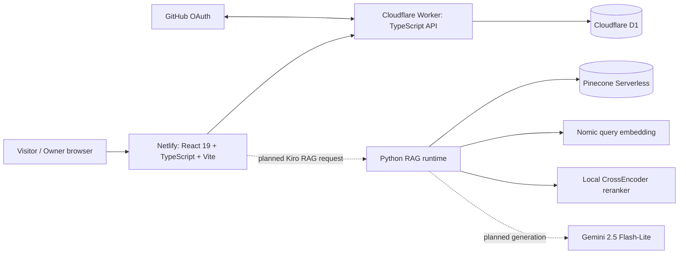

# Technical Documentation Index

## Table of Contents

- [Purpose](#purpose)
- [Documentation Principles](#documentation-principles)
- [Whole-Project Map](#whole-project-map)
- [Architecture](#architecture)
- [Operations](#operations)
- [RAG Deployment Endeavour](#rag-deployment-endeavour)
- [Data and Testing](#data-and-testing)
- [Versions and Evolution](#versions-and-evolution)
- [Subsystem Documentation](#subsystem-documentation)

## Purpose

This directory is the navigation and architecture layer for the entire `my-portfolio` repository. It prevents the unusually deep RAG subsystem from obscuring the fact that this repository is first a deployed portfolio application with a frontend, a Cloudflare Worker, D1 persistence, GitHub OAuth administration, CI/CD and multiple public experiences.

## Documentation Principles

1. **Preserve before reorganizing.** Existing implementation facts are retained; deeper files move detail out of overloaded READMEs without deleting the underlying information.
2. **Status is explicit.** `ACTIVE`, `SUPERSEDED`, and `PROPOSED - NOT APPLIED` are used whenever multiple generations exist.
3. **Paths are executable documentation.** File and directory names are exact repository-relative paths.
4. **Boundaries matter.** Each document says what a component owns and what it does not own.
5. **RAG provenance is first class.** Quantitative results, failed attempts and validation criteria are documented rather than only the happy-path architecture.

## Whole-Project Map

## Architecture

- [System overview](architecture/system-overview.md)
- [Component interactions](architecture/component-interactions.md)
- [Request and data flows](architecture/request-data-flows.md)
- [Trust boundaries](architecture/trust-boundaries.md)

## Operations

- [Change-impact matrix](operations/change-impact-matrix.md)
- [Local development](operations/local-development.md)
- [Deployment](operations/deployment.md)

## Data and Testing

- [Data and storage map](data/data-and-storage-map.md)
- [Testing strategy](testing/testing-strategy.md)

## Versions and Evolution

- [Component version map](versions/component-version-map.md)
- [Evolution history](versions/evolution-history.md)

## Subsystem Documentation

- [Frontend](../src/README.md)
- [Feature index](../src/features/README.md)
- [Kiro RAG frontend/3D](../src/features/kiro-rag/README.md)
- [Cloudflare Worker](../worker/README.md)
- [Shared contracts](../shared/README.md)
- [Portfolio scripts](../scripts/README.md)
- [RAG system](../rag/README.md)
- [Historical RAG README v1.0.0](../rag/docs/historical-rag-readme-v1.md) - complete preserved pre-Pinecone/pre-runtime snapshot

## RAG Deployment Endeavour

The RAG deployment work has progressed beyond a bare local Python process: the active Pinecone-backed runtime has now been successfully built and exercised inside a Linux Docker container. Production hosting is still unresolved.

The full chronology, exact test evidence and hosting blockers are preserved in:

- [RAG containerization and hosting evaluation](qc/rag/2026-08-31-containerization-and-hosting-evaluation.md)
- [Deployment operations update](operations/deployment.md#rag-containerization-and-hosting-evaluation---2026-08-31)
- [RAG provider-integration update](../rag/docs/cloudflare-integration.md#2026-08-31-deployment-evaluation-update)
- [RAG deployment blockers](../rag/docs/known-issues.md#deployment-evaluation-addendum)

The checkpoint is intentionally narrow: Dockerization passed, Cloudflare Containers were blocked by the current account plan, Render Free was evaluated against the measured container footprint and found too small for the runtime as currently built, and no replacement hosting direction has yet been selected.

## Related Documentation

- Parent: [../README.md](../README.md)
- [RAG documentation](../rag/README.md)
