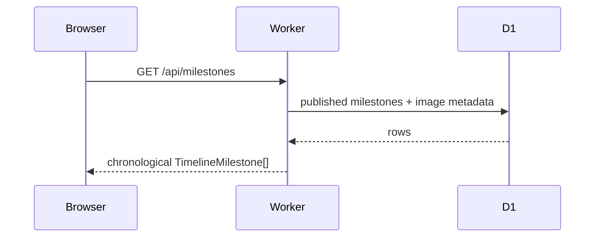

# Request and Data Flows

## Table of Contents

- [Published Timeline Read](#published-timeline-read)
- [Opinion Submission and Moderation](#opinion-submission-and-moderation)
- [Owner Authentication](#owner-authentication)
- [RAG Offline Data Flow](#rag-offline-data-flow)
- [RAG Online Retrieval Flow](#rag-online-retrieval-flow)
- [Future Grounded Generation Flow](#future-grounded-generation-flow)

## Published Timeline Read

Milestone detail follows the same boundary through `/api/milestones/:slug`. Public image URLs then call `/api/images/:id`, where the Worker decodes Base64 and returns the binary body.

## Opinion Submission and Moderation

A visitor submits an opinion through `POST /api/opinions`. Validation runs server-side and the record enters D1 with `pending` status. It does not appear in the public `GET /api/opinions` response until the owner approves it through `/api/admin/opinions/:id`.

## Owner Authentication

GitHub OAuth state is created and verified server-side. The callback exchanges the GitHub authorization code, reads the authenticated identity, compares numeric ID to `ADMIN_GITHUB_USER_ID`, then creates a short-lived one-time exchange code. The browser exchanges it for a signed session. The long-lived GitHub access token is not used as the application session.

## RAG Offline Data Flow

Source repository analysis Markdown -> canonical repository JSON -> evidence-aware retrieval documents -> Nomic embeddings -> local validation -> Pinecone upsert -> parity validation. Each transformation preserves source identifiers/provenance so later retrieval can name the repository, source batch and line ranges.

## RAG Online Retrieval Flow

Question -> query intent/facets -> 512-D Nomic vector -> Pinecone dense candidates, while BM25 and metadata run locally -> RRF/fusion -> primary concept gate -> evidence score -> CrossEncoder rerank -> intent-aware polarity gate -> semantic dedupe -> repository diversity -> top evidence.

Current HTTP output has `generation: null`; it returns retrieval evidence rather than a generated answer.

## Future Grounded Generation Flow

The planned generator receives only the question, carefully selected evidence records and provenance instructions. It must not be asked to discover the portfolio from memory. The answer should return citations/evidence references to the browser, where the Kiro state can move from `retrieving` to `answering` and then `success`/`error` based on actual request lifecycle.

## Related Documentation

- Parent: [../README.md](../README.md)
- [RAG pipeline](../../rag/docs/pipeline.md)
