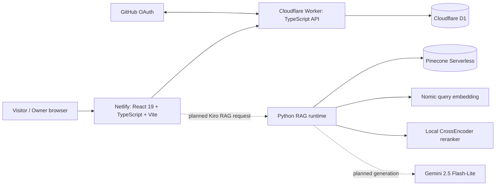
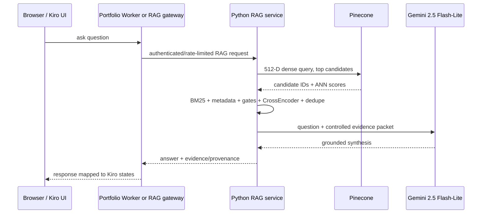

# System Architecture Overview

## Table of Contents

- [Scope](#scope)
- [Current Architecture](#current-architecture)
- [Frontend Boundary](#frontend-boundary)
- [Worker Boundary](#worker-boundary)
- [D1 Boundary](#d1-boundary)
- [RAG Boundary](#rag-boundary)
- [Kiro UI Boundary](#kiro-ui-boundary)
- [Target Integrated Architecture](#target-integrated-architecture)

## Scope

This document describes the complete portfolio, including the deployed portfolio path and the separately implemented RAG path. It deliberately does not present the RAG system as the repository root architecture.

## Current Architecture

## Frontend Boundary

`src/` owns browser rendering and user interaction. It reads public portfolio data from the Worker, manages the owner/admin screens in the browser, renders the timeline/opinions/skills/Kiro surfaces, and contains the Three.js-based Kiro model runtime. It does **not** own durable application persistence, GitHub OAuth secret exchange, Pinecone credentials, Nomic inference or the CrossEncoder.

`src/App.tsx` is a lightweight path router rather than a framework router. It dispatches `/admin/auth/callback`, `/admin`, `/opinions`, `/skills`, and `/kiro-rag`; other paths fall through to the timeline/milestone experience.

## Worker Boundary

`worker/index.ts` owns the public/auth/admin HTTP boundary for the deployed portfolio. It delegates D1 persistence to `milestones-repository.ts` and `opinions-repository.ts`, input validation to `validation.ts`, authentication to `auth.ts`, and response/origin behavior to `http.ts`.

The Worker currently does **not** proxy or execute Python RAG. No RAG route exists in the checked-in Worker entry point. The future RAG integration should add an explicit service boundary instead of attempting to run PyTorch/SentenceTransformers inside the existing Worker.

## D1 Boundary

D1 is authoritative for editable portfolio content: milestones, sections, images, opinions, and OAuth exchange-code records. The static skills evidence page is versioned source data and does not need D1. The RAG corpus and Pinecone vectors are also not D1 data.

## RAG Boundary

The RAG build pipeline is under `rag/scripts/`; generated canonical/retrieval/embedding/validation artifacts are under `rag/rag-corpus/`; online retrieval runtime is under `rag/runtime/`; source reports live under `rag/other/`; obsolete generations are retained under `rag/obsolete/` and `rag/obsolete-folders/`.

The online runtime intentionally keeps BM25, metadata, evidence logic and CrossEncoder local while delegating dense ANN candidate recall and bounded vector fetches to Pinecone. Generation is selected as Gemini 2.5 Flash-Lite but is not integrated in the active runtime.

## Kiro UI Boundary

The `/kiro-rag` frontend is already more than a placeholder, but its current behavior is an interaction/animation scaffold rather than a live RAG client. A real GLB at `/models/kiro/kiro.glb` is inspected for bones, morphs and clips; app state is mapped into bounded behavior targets. The semantic states are already named to match the planned RAG lifecycle, which gives the eventual network integration a stable animation contract.

## Target Integrated Architecture

This is a **target**, not the current deployed state.

## Related Documentation

- Parent: [../README.md](../README.md)
- [Interactions](component-interactions.md)
- [RAG pipeline](../../rag/docs/pipeline.md)
