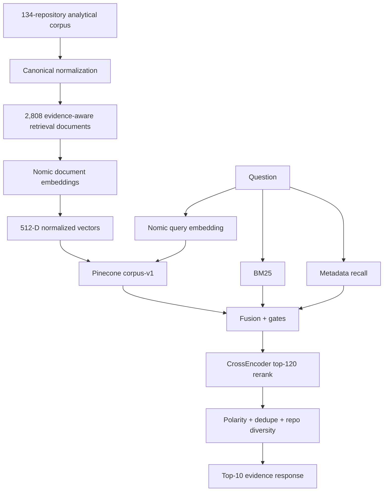
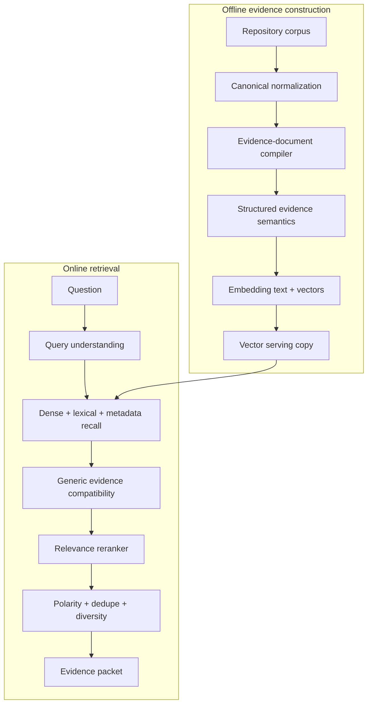

# RAG QC Incident — Backend/System-Design Generalization and Evidence-Semantics Finding

> **QC category:** Retrieval quality / evidence semantics  
> **Incident date:** 2026-08-31  
> **Status:** Documented; implementation intentionally unchanged  
> **Authoritative implementation commit:** `6710a697390858b8dfbcdf7ec3d2e737f34263da`  
> **Commit message:** `feat(rag): reorganize pipeline and add Pinecone-backed runtime`  
> **Tested runtime:** `rag/runtime/rag-api-pinecone-v1.py`  
> **Runtime version:** `1.0.0`  
> **Retrieval schema:** `3.1.0-pinecone`

---

## Table of Contents

1. [Purpose](#purpose)
2. [Executive Conclusion](#executive-conclusion)
3. [Implementation Baseline](#implementation-baseline)
4. [System State Before the Incident](#system-state-before-the-incident)
5. [What Was Being Tested](#what-was-being-tested)
6. [Why the Regression Question Was Changed](#why-the-regression-question-was-changed)
7. [Test Question](#test-question)
8. [Observed Runtime Path](#observed-runtime-path)
9. [What Worked](#what-worked)
10. [What the New Question Exposed](#what-the-new-question-exposed)
11. [Returned Evidence Snapshot](#returned-evidence-snapshot)
12. [False-Positive Pattern 1 — Absence Language](#false-positive-pattern-1--absence-language)
13. [False-Positive Pattern 2 — Negative Backend Mention in Frontend Evidence](#false-positive-pattern-2--negative-backend-mention-in-frontend-evidence)
14. [Why Broad Retrieval Was Not Wrong](#why-broad-retrieval-was-not-wrong)
15. [Why This Was Not a Pinecone Failure](#why-this-was-not-a-pinecone-failure)
16. [Why This Was Not an Embedding Failure](#why-this-was-not-an-embedding-failure)
17. [Why This Was Not a CrossEncoder Failure Alone](#why-this-was-not-a-crossencoder-failure-alone)
18. [The Initially Proposed Tactical Fix](#the-initially-proposed-tactical-fix)
19. [Why the Tactical Fix Was Rejected](#why-the-tactical-fix-was-rejected)
20. [Root Architectural Finding](#root-architectural-finding)
21. [Correct Separation of Responsibilities](#correct-separation-of-responsibilities)
22. [Recommended Structured Evidence Contract](#recommended-structured-evidence-contract)
23. [Examples of the Intended Contract](#examples-of-the-intended-contract)
24. [Correct File Boundary for Future Redesign](#correct-file-boundary-for-future-redesign)
25. [Embedding-Preservation Constraint at the Time of the Incident](#embedding-preservation-constraint-at-the-time-of-the-incident)
26. [What Could Change Without Re-embedding](#what-could-change-without-re-embedding)
27. [What Would Force Re-embedding](#what-would-force-re-embedding)
28. [Current Baseline Decision](#current-baseline-decision)
29. [Future Acceptance Criteria](#future-acceptance-criteria)
30. [Lessons From the Incident](#lessons-from-the-incident)
31. [Evidence Retention Policy](#evidence-retention-policy)
32. [Related Documentation](#related-documentation)
33. [QC Record Summary](#qc-record-summary)

---

<a id="purpose"></a>
## Purpose

This document records a quality-control incident discovered while validating the first locally operational Pinecone-backed runtime of the portfolio RAG system.

The runtime itself was not broken. It accepted a substantially different natural-language question, executed the complete Pinecone/BM25/metadata/CrossEncoder retrieval path and returned plausible evidence. The new question instead exposed a deeper quality problem: a document could be highly relevant to a concept while being invalid **positive evidence** for the claim requested by the user.

The key distinction is:

```text
semantic relevance
        !=
claim/evidence compatibility
```

The immediate temptation was to patch the runtime with another topic-specific keyword rule. That was rejected because it would turn the retrieval system into a growing collection of special cases.

No RAG implementation file was modified as a consequence of this incident.

---

<a id="executive-conclusion"></a>
## Executive Conclusion

The test established:

```text
Arbitrary-question API handling             PASS
Nomic query embedding                       PASS
Pinecone dense recall                       PASS
BM25 recall                                 PASS
Metadata recall                             PASS
Candidate fusion                            PASS
CrossEncoder execution                      PASS
Semantic deduplication                      PASS
Repository diversity                        PASS
Generalization beyond authorization prompt  PASS

Positive-evidence claim compatibility       DESIGN WEAKNESS FOUND
```

The central finding is:

> **A document can be highly relevant to a concept without being valid positive evidence for a claim about that concept.**

For example, a document whose meaning is "this repository does not demonstrate backend maturity" is correctly retrievable for a backend query, but it should not rank as proof that the portfolio demonstrates strong backend maturity.

---

<a id="implementation-baseline"></a>
## Implementation Baseline

The incident occurred against commit:

```text
6710a697390858b8dfbcdf7ec3d2e737f34263da
```

with runtime:

```text
rag/runtime/rag-api-pinecone-v1.py
runtime:          1.0.0
retrieval schema: 3.1.0-pinecone
```

This commit remains the reproducible incident baseline rather than a moving `main` branch.

---

<a id="system-state-before-the-incident"></a>
## System State Before the Incident

Before this test, the active pipeline had reached:



Active corpus/vector state:

```text
Repositories:          134
Retrieval documents:   2,808
Stored vectors:        2,808
Stored dimensions:     512
Embedding model:       nomic-ai/nomic-embed-text-v1.5
Document prefix:       search_document:
Query prefix:          search_query:
Similarity:            cosine
Reranker:              cross-encoder/ms-marco-MiniLM-L6-v2
Pinecone index:        portfolio-career-rag-v1
Namespace:             corpus-v1
```

---

<a id="what-was-being-tested"></a>
## What Was Being Tested

The goal was not to tune the system around another prompt. The goal was to verify that the runtime could accept an arbitrary portfolio question through:

```text
POST /api/rag/retrieve
```

and execute the complete production-shaped retrieval path.

The previously repeated regression question concerned authorization architecture. That prompt was useful, but repeatedly using one question risks optimizing around its wording. A different concept was deliberately selected to test generalization.

---

<a id="why-the-regression-question-was-changed"></a>
## Why the Regression Question Was Changed

The new question had to:

1. remain portfolio/career-evidence oriented;
2. require cross-repository reasoning;
3. exercise concepts different from authorization;
4. explicitly ask for **positive/strong evidence** rather than mere topical matches.

This produced the backend/system-design test.

---

<a id="test-question"></a>
## Test Question

```text
What evidence shows strong backend engineering and system design experience?
```

Semantic requirements included:

```text
facets:           backend engineering + system design
request mode:     evidence
claim direction:  positive/supporting
strength:         strong
scope:            portfolio-wide
```

---

<a id="observed-runtime-path"></a>
## Observed Runtime Path

The request successfully exercised the runtime.

Observed diagnostics:

```text
Pinecone dense candidates: 500
BM25 candidates:           500
Metadata candidates:       400
Fused candidate union:     899
CrossEncoder rerank pool:  120
Final returned results:    10
End-to-end latency:        ~8.17 seconds
```

The important point is that the failure was **not** inability to execute the pipeline. It was a semantic quality weakness visible in some returned evidence.

---

<a id="what-worked"></a>
## What Worked

- The API accepted a new question with no query-specific code change.
- Nomic produced a valid query embedding in the same space as the indexed documents.
- Pinecone returned broad semantic candidates.
- BM25 supplied lexical candidates independently of dense recall.
- Metadata/topic/skill recall contributed structured candidates.
- Fusion unified the three recall channels.
- The concept/evidence gates executed.
- The CrossEncoder executed over the bounded rerank pool.
- Semantic dedupe and repository diversity produced a bounded final result set.
- Strong backend/system-design evidence correctly appeared at the top.

The system therefore generalized operationally. The incident is about **evidence semantics**, not runtime availability.

---

<a id="what-the-new-question-exposed"></a>
## What the New Question Exposed

The query asked for positive evidence, but some documents remained competitive because they mentioned the requested concept while actually expressing an absence, limitation or negative comparison.

The two questions the system must separate are:

```text
Is this passage about backend engineering?
```

and:

```text
Does this passage support the claim that the portfolio demonstrates backend engineering?
```

A robust evidence-oriented RAG must answer both.

---

<a id="returned-evidence-snapshot"></a>
## Returned Evidence Snapshot

The incident preserves the **meaningful returned evidence**, not the entire transport-level JSON response. The retained evidence is the repository identity plus the explanation/passage that made the quality finding observable.

### Rank 1 — Valid positive evidence

| Field | Value |
|---|---|
| Repository | `LInC-Church-Management` |
| Document ID | `repo-123-rd010` |
| Semantic area | `architecture_system_design` |
| Evidence polarity | `positive` |
| QC interpretation | Correct positive evidence |

Returned explanation included backend domain decomposition, governed mutations, Hono/Cloudflare Workers backend engineering, architectural tradeoffs and production responses. This is a legitimate positive match for the query.

### Rank 2 — Valid positive evidence

| Field | Value |
|---|---|
| Repository | `my-portfolio` |
| Document ID | `repo-134-rd005` |
| Semantic area | `architecture_system_design` |
| Evidence polarity | `positive` |
| QC interpretation | Correct positive evidence |

Returned passage:

> The Worker code is separated into authentication, HTTP handling, route dispatch, milestone persistence, opinion persistence, validation and environment contracts. That decomposition supports direct backend TypeScript evidence rather than treating the Worker as one monolithic request handler.

This is direct supporting evidence for backend/system-design capability.

### Rank 4 — False-positive pattern: absence ledger

| Field | Value |
|---|---|
| Repository | `vv11345` |
| Document ID | `repo-001-rd022` |
| Semantic area | `product_responsibility` |
| Evidence polarity | `neutral` |
| QC interpretation | Relevant to backend, but not positive backend proof |

Returned explanation/passage listed:

```text
backend design;
databases;
distributed systems;
automated quality engineering;
DevOps;
security engineering;
team-scale software development.
```

and then explicitly explained that **those absences should remain visible in the corpus** so later repositories can show when the capabilities appear and mature.

The document is topically relevant but semantically describes missing capability.

### Rank 5 — False-positive pattern: negative backend comparison inside frontend evidence

| Field | Value |
|---|---|
| Repository | `George-Sedra-Website` |
| Document ID | `repo-115-rd008` |
| Semantic area | `other_repository_evidence` |
| Evidence polarity | `positive` |
| QC interpretation | Frontend evidence that mentions backend only to deny a backend-maturity claim |

Returned explanation repeatedly described frontend/presentation evidence and included the conclusion:

> Reinforces front-end presentation skill ... a useful visual-product counterpoint but **not a new backend maturity maximum**.

The literal word `backend` increased topical compatibility even though the sentence was deliberately preventing a backend overclaim.

A concise evidence copy of these relevant results is retained in [`evidence/2026-08-31-backend-system-design-relevant-results.txt`](evidence/2026-08-31-backend-system-design-relevant-results.txt).

---

<a id="false-positive-pattern-1--absence-language"></a>
## False-Positive Pattern 1 — Absence Language

Conceptually:

```text
Query:
"What evidence shows strong backend engineering?"

Document meaning:
"These backend/database/distributed-system capabilities are absent here."

Dense relevance:        legitimate
Lexical relevance:      legitimate
Topic relevance:        legitimate
Positive claim support: false
```

The incident proves that `relevant` cannot be treated as synonymous with `supports`.

---

<a id="false-positive-pattern-2--negative-backend-mention-in-frontend-evidence"></a>
## False-Positive Pattern 2 — Negative Backend Mention in Frontend Evidence

The second failure can be summarized as:

```text
"this is NOT backend maturity evidence"
              ↓
contains "backend"
              ↓
backend concept overlap
              ↓
survives too far into positive-evidence ranking
```

This is a claim-direction problem rather than a candidate-recall problem.

---

<a id="why-broad-retrieval-was-not-wrong"></a>
## Why Broad Retrieval Was Not Wrong

A dense retriever or BM25 engine **should** retrieve an explicit statement that backend maturity is absent when the query concerns backend maturity. That material is relevant and is useful for weakness/limitation questions.

The correct fix is therefore not to globally suppress negative passages. It is to distinguish:

```text
mentions/discusses concept
```

from:

```text
supports requested claim about concept
```

later in the pipeline.

---

<a id="why-this-was-not-a-pinecone-failure"></a>
## Why This Was Not a Pinecone Failure

Pinecone owns dense candidate recall. Prior parity validation had already established:

- correct vector count;
- 512-D schema compatibility;
- exact fetched-vector fidelity;
- same top-1 in validation;
- strong overlap at top-10/top-25/top-50.

Pinecone correctly returned semantically related material. It is not responsible for deciding whether a relevant passage supports or contradicts a requested claim.

> **This incident is not a Pinecone data-quality failure.**

---

<a id="why-this-was-not-an-embedding-failure"></a>
## Why This Was Not an Embedding Failure

The active Nomic embeddings encoded semantic relatedness as expected. Statements about presence and absence of the same capability can be close in embedding space.

At the time of the incident, the finding therefore did not by itself justify regenerating embeddings. Subsequent deployment work may independently evaluate another embedding model, but that is a separate decision and must be benchmarked against this quality baseline.

---

<a id="why-this-was-not-a-crossencoder-failure-alone"></a>
## Why This Was Not a CrossEncoder Failure Alone

A generic relevance CrossEncoder can also score a contradiction highly when it is tightly related to the query topic. More reranking does not automatically provide claim-direction semantics.

The system needs an explicit representation of evidence meaning rather than expecting one generic relevance score to encode every distinction.

---

<a id="the-initially-proposed-tactical-fix"></a>
## The Initially Proposed Tactical Fix

A tactical fix was initially designed around stronger backend-specific terms such as:

```text
API
database
distributed
endpoint
REST
Worker
Hono
Spring
server
```

combined with semantic-area, evidence-class, metadata and concrete-signal checks.

Proposed regressions would have:

- rejected frontend evidence with a negative backend mention;
- rejected an explicit backend-absence ledger for positive queries;
- retained genuine Worker/API/persistence evidence.

This would have implied a runtime/retrieval revision around `1.1.0` / `3.1.1-pinecone`.

The proposal was **not applied**.

---

<a id="why-the-tactical-fix-was-rejected"></a>
## Why the Tactical Fix Was Rejected

If every new query family requires another vocabulary patch, the architecture becomes:

```text
backend query    -> backend-specific terms
testing query    -> testing-specific terms
deployment query -> deployment-specific terms
security query   -> security-specific terms
product query    -> product-specific terms
```

That creates hidden special cases, growing regression burden and fragile query behavior. It forces runtime code to rediscover evidence meaning that can be represented durably in the retrieval-document contract.

---

<a id="root-architectural-finding"></a>
## Root Architectural Finding

The deeper problem is insufficient separation between:

1. query understanding;
2. topical relevance;
3. evidence semantics;
4. claim direction.

The retrieval documents already carry useful metadata—retrieval class, semantic area, evidence polarity, specificity, topics, skills and source fragments—but claim compatibility still relied too heavily on prose and query-time lexical heuristics.

---

<a id="correct-separation-of-responsibilities"></a>
## Correct Separation of Responsibilities

Preferred architecture:



The offline compiler should make evidence meaning durable; the online runtime should consume that contract generically.

---

<a id="recommended-structured-evidence-contract"></a>
## Recommended Structured Evidence Contract

Conceptually:

```json
{
  "facets": ["backend_engineering", "system_design"],
  "claim_mode": "supports",
  "evidence_kind": "direct_evidence",
  "evidence_strength": "concrete",
  "technologies": ["Cloudflare Workers", "D1"],
  "limitations": [],
  "provenance": {
    "repository_index": 134,
    "source_document_id": "..."
  }
}
```

Exact field names are not approved by this incident record. The architectural requirement is that claim direction and evidence type become explicit.

Likely generic claim modes include:

```text
supports
contradicts
mixed
neutral
```

---

<a id="examples-of-the-intended-contract"></a>
## Examples of the Intended Contract

### Genuine backend evidence

```json
{
  "facets": ["backend_engineering", "api_design", "system_design"],
  "claim_mode": "supports",
  "evidence_kind": "direct_evidence",
  "evidence_strength": "concrete"
}
```

### Frontend evidence that merely mentions backend

```json
{
  "facets": ["frontend_engineering", "presentation"],
  "claim_mode": "supports",
  "evidence_kind": "interpretation"
}
```

### Explicit backend limitation

```json
{
  "facets": ["backend_engineering"],
  "claim_mode": "contradicts",
  "evidence_kind": "limitation",
  "evidence_strength": "explicit"
}
```

The last document remains retrievable for weakness questions; it simply stops competing as positive proof.

---

<a id="correct-file-boundary-for-future-redesign"></a>
## Correct File Boundary for Future Redesign

The first architectural implementation boundary is the retrieval-document compiler, currently represented by:

```text
rag/scripts/build-rag-retrieval-documents-v2.py
```

or a future versioned successor.

The redesign should not begin by accumulating query-specific rules inside:

```text
rag/runtime/rag-api-pinecone-v1.py
```

The runtime should consume a stronger evidence contract.

---

<a id="embedding-preservation-constraint-at-the-time-of-the-incident"></a>
## Embedding-Preservation Constraint at the Time of the Incident

At the time of this incident, the preferred correction was metadata-additive so the validated Nomic vectors did not need to be regenerated merely to fix claim semantics.

To reuse an existing vector authoritatively, these remain stable:

```text
document ID
embedding_text
embedding model/revision
prefix convention
Matryoshka dimension/normalization recipe
```

This historical constraint does **not** forbid a later deliberate embedding-model bake-off. A later Qwen experiment is a separate architecture/deployment decision with its own regression gates.

---

<a id="what-could-change-without-re-embedding"></a>
## What Could Change Without Re-embedding

Additive structured metadata can change without invalidating an existing Nomic vector when `embedding_text` remains unchanged, including:

```text
facets
claim_mode
evidence_kind
evidence_strength
technologies
limitations
structured compatibility metadata
filterable serving metadata
runtime evidence-selection metadata
```

---

<a id="what-would-force-re-embedding"></a>
## What Would Force Re-embedding

A current vector no longer represents the same embedding contract if any of these change:

```text
embedding_text
embedding model
embedding model revision
query/document prefix convention
Matryoshka truncation dimension
normalization method
vector dimension
new document requiring a new vector
```

A deliberate model migration—such as the later Qwen candidate—therefore creates a separate candidate embedding/index lineage rather than silently reusing Nomic vectors.

---

<a id="current-baseline-decision"></a>
## Current Baseline Decision

For this incident:

```text
Pinecone runtime v1.0.0                 ACTIVE INCIDENT BASELINE
Generalization test                     COMPLETED
Positive-evidence semantics issue       DOCUMENTED
Backend-specific tactical patch         REJECTED / NOT APPLIED
Structured evidence-contract redesign   FUTURE ARCHITECTURAL WORK
Embedding regeneration from incident    NOT REQUIRED
```

The failing baseline is intentionally frozen for reproducible comparison.

---

<a id="future-acceptance-criteria"></a>
## Future Acceptance Criteria

A future fix must demonstrate generic quality improvement, not merely suppress the two observed examples.

### Positive backend query

```text
What evidence shows strong backend engineering and system design experience?
```

Expected:

- genuine backend/system-design support ranks strongly;
- explicit absences do not rank as positive proof;
- frontend evidence that merely negates backend maturity does not qualify as backend support.

### Backend limitation query

```text
What backend engineering weaknesses or limitations appear in the portfolio?
```

Expected:

- the same negative/absence documents become valid useful results;
- negative evidence is not globally suppressed.

### Authorization regression

```text
What evidence shows experience with authorization architecture?
```

Expected:

- strong authorization evidence remains strong;
- unrelated `control` terminology stays disambiguated;
- limitations remain distinct from positive implementation evidence.

### Cross-facet regressions

Also test:

```text
testing / quality
deployment / operations
frontend engineering
security
product responsibility
chronology / growth
```

The solution passes only if it is schema-driven rather than backend-query-specific.

---

<a id="lessons-from-the-incident"></a>
## Lessons From the Incident

1. **Change regression questions.** One repeatedly used prompt can conceal generalization weaknesses.
2. **Retrieval relevance is not evidence validity.** Relevant material may contradict the requested claim.
3. **Negative evidence must remain retrievable.** Classify its relationship to the claim rather than deleting it.
4. **Pinecone is a recall subsystem.** It should not be blamed for claim interpretation.
5. **Embeddings are semantic, not logical-polarity proofs.** Nearby opposition is not inherently a model defect.
6. **Runtime keyword growth is an architectural smell.** Repeated facet-specific patches indicate missing structured semantics.
7. **Offline classification is a cleaner boundary.** Evidence meaning should be encoded when documents are constructed.
8. **Preserve validated artifacts unless the experiment deliberately changes them.** Quality fixes and model migrations are separate decisions.
9. **Freeze a failing baseline.** Reproducible before/after comparison matters more than silently patching the only known example.

---

<a id="evidence-retention-policy"></a>
## Evidence Retention Policy

The original incident document embedded the entire HTTP/JSON response and also retained the same giant raw response as a sibling file. That duplicated transport noise and made the QC record hundreds of kilobytes larger without improving the finding.

The corrected policy is:

```text
KEEP
- test question
- runtime/schema identity
- aggregate diagnostics
- returned rank
- repository name
- document ID when useful
- returned explanation/passage that caused the finding
- QC interpretation

DO NOT DUPLICATE
- the entire API response envelope
- every source-fragment object
- every score-component field
- every unrelated returned result
- hundreds of kilobytes of JSON transport detail
```

This preserves the evidence needed to reproduce and understand the incident while keeping the QC document reviewable.

---

<a id="related-documentation"></a>
## Related Documentation

- [RAG documentation home](../../rag/README.md)
- [RAG pipeline](../../rag/pipeline.md)
- [RAG testing and regressions](../../rag/testing-and-regressions.md)
- [Known RAG issues](../../rag/known-issues.md)
- [Pinecone backend](../../rag/pinecone.md)
- [RAG deployment history](../../rag/deployment/README.md)
- [Relevant returned-result evidence](evidence/2026-08-31-backend-system-design-relevant-results.txt)

---

<a id="qc-record-summary"></a>
## QC Record Summary

```text
Incident baseline:
6710a697390858b8dfbcdf7ec3d2e737f34263da

Question:
What evidence shows strong backend engineering and system design experience?

Operational result:
PASS — arbitrary question traversed the complete retrieval runtime.

Quality result:
DESIGN WEAKNESS — two result patterns exposed insufficient separation between
semantic relevance and positive claim support.

Valid evidence examples:
LInC-Church-Management
my-portfolio

False-positive examples:
vv11345 — absence ledger
George-Sedra-Website — frontend evidence containing a negative backend comparison

Rejected response:
Backend-query-specific runtime keyword patch.

Architectural conclusion:
Represent claim/evidence semantics explicitly in the evidence-document contract
and evaluate compatibility generically at retrieval time.

Implementation change from this incident:
NONE.
```

## Related Documentation

- Parent: [README.md](README.md)
- [RAG docs](../../rag/README.md)
