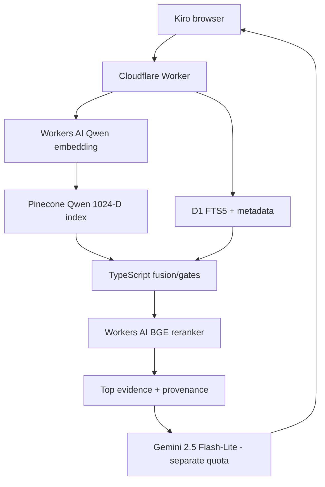

# RAG QC / Architecture Record — Zero-Cost Cloudflare-Native Runtime Evaluation

> **Date:** `2026-08-31`  
> **Status:** `DOCUMENTED CANDIDATE — IMPLEMENTATION NOT STARTED`  
> **Baseline retained:** runtime `1.0.0`, retrieval `3.1.0-pinecone`, Nomic 512-D + Pinecone + Python  
> **Decision:** test Qwen on a parallel Pinecone index before any production runtime rewrite.

## Table of Contents

- [1. Purpose](#1-purpose)
- [2. Trigger](#2-trigger)
- [3. Hard Constraints](#3-hard-constraints)
- [4. Key Findings](#4-key-findings)
- [5. Corrected Capacity Interpretation](#5-corrected-capacity-interpretation)
- [6. Why Vectorize Is Deferred](#6-why-vectorize-is-deferred)
- [7. Why Replacing Nomic Alone Is Insufficient](#7-why-replacing-nomic-alone-is-insufficient)
- [8. Selected Candidate](#8-selected-candidate)
- [9. Next Experiment](#9-next-experiment)
- [10. Explicit Non-Decisions](#10-explicit-non-decisions)
- [11. Evidence / Source Map](#11-evidence-source-map)
- [12. Related Documentation](#12-related-documentation)

<a id="1-purpose"></a>
## 1. Purpose

This record extends the earlier containerization/hosting evaluation. It does not erase the successful Docker work or the measured 1.293 GiB runtime. Instead, it records the subsequent realization that hosting the unchanged Python runtime is not the only architecture available.

The new question is:

> Can the runtime be decomposed so the public path runs on the existing Cloudflare Worker/D1 platform, while serverless hosted models perform embedding/reranking and the current evidence semantics remain validated?

<a id="2-trigger"></a>
## 2. Trigger

The previous deployment checkpoint established:

- Docker works;
- Cloudflare Containers are paid-only under the current account constraint;
- Render Free provides 512 MB / 0.1 CPU and cannot fit the measured 1.293 GiB container as-is.

Further investigation showed that keeping Nomic exactly is what forces an embedding-model runtime somewhere. The same analysis also exposed that the Python service owns more than Nomic: it owns local BM25, metadata recall, fusion/gates, a CrossEncoder reranker and dedupe/diversity logic.

<a id="3-hard-constraints"></a>
## 3. Hard Constraints

- [x] target ongoing cost: `$0` under real free allocations;
- [x] promotional credits are not considered sustainable capacity;
- [x] no production Python service in the target architecture;
- [x] no Docker requirement in the target architecture;
- [x] no 100+ MB model download imposed on portfolio visitors;
- [x] keep secrets server-side;
- [x] preserve evidence/provenance and retrieval-quality gates;
- [x] keep the current Nomic/Pinecone baseline until the replacement passes;
- [x] prefer the existing Cloudflare Worker + D1 platform rather than adding infrastructure without evidence that it is needed.

<a id="4-key-findings"></a>
## 4. Key Findings

| Finding | Consequence |
|---|---|
| Cloudflare hosts `@cf/qwen/qwen3-embedding-0.6b` | query/document embeddings can be serverless without Python |
| Qwen is 1,024-D in current Cloudflare supported-model docs | candidate index must be separate from current 512-D Nomic index |
| Workers AI free allocation is 10,000 neurons/day | embedding capacity is large for portfolio traffic, but shared with reranking |
| Cloudflare hosts `@cf/baai/bge-reranker-base` | there is a serverless candidate to replace the local CrossEncoder |
| existing Worker already has D1 binding | lexical/metadata runtime can potentially move into the existing platform |
| D1 supports FTS5 | plausible replacement for local lexical search, but ranking parity must be tested |
| Pinecone currently returns top 500 for dense recall | keeping Pinecone minimizes retrieval behavior change during the model bake-off |
| Vectorize `topK` is currently 100 without values/metadata and 50 with them | cannot directly reproduce the current top-500 dense candidate stage in one query |
| exact Nomic v1.5 is not hosted by any HF Inference Provider | no obvious permanent-free exact-model endpoint exists there |
| browser Nomic requires roughly 111–137+ MB quantized model transfer | violates the portfolio UX constraint |

<a id="5-corrected-capacity-interpretation"></a>
## 5. Corrected Capacity Interpretation

The previously discussed `~90k–300k queries/day` scale was an **embedding-only** estimate. It must not be presented as the full RAG capacity.

For Qwen embedding alone:

```text
10,000 neurons/day
Qwen cost: 1,075 neurons / 1M input tokens
=> ~9.30M embedding input tokens/day
=> ~93k 100-token embeddings/day
```

But the full query also requires reranking, vector retrieval, lexical/metadata reads and generation. A rough 120-candidate BGE rerank using median-size evidence can consume on the order of ~14 neurons/query, which would make the shared Workers AI budget closer to hundreds rather than tens of thousands of full reranked queries/day. This is an estimate only; exact token counts must be measured.

If Vectorize were used with 2,808 Qwen 1,024-D vectors, the current Free allocation works out to roughly 26,488 queries/month (~883/day in a 30-day month) using Cloudflare's queried-dimension formula. This is still sufficient for likely portfolio traffic but is far below the embedding-only number.

<a id="6-why-vectorize-is-deferred"></a>
## 6. Why Vectorize Is Deferred

Vectorize is a valid vector database, but moving from Pinecone to Vectorize is a separate choice from moving from Nomic to Qwen.

Doing both at once would change:

1. embedding model;
2. vector dimension;
3. ANN backend;
4. candidate ceiling;
5. free-tier accounting.

The first controlled experiment should change only the embedding model/index generation while keeping the serving backend as Pinecone.

<a id="7-why-replacing-nomic-alone-is-insufficient"></a>
## 7. Why Replacing Nomic Alone Is Insufficient

Current Python runtime ownership:

```text
Nomic query embedding
Pinecone dense retrieval
BM25
metadata/topic/skill recall
fusion
concept/evidence gates
polarity logic
CrossEncoder reranking
semantic dedupe
repository diversity
evidence response shaping
```

Therefore:

```text
replace Nomic only
!=
remove Python runtime
```

A complete migration must also port the deterministic ranking logic and replace or externally host the CrossEncoder behavior.

<a id="8-selected-candidate"></a>
## 8. Selected Candidate



Status: **candidate only**. No runtime code, index or corpus artifact has been changed by this documentation update.

<a id="9-next-experiment"></a>
## 9. Next Experiment

1. generate Qwen embeddings for the same 2,808 evidence documents;
2. store them in a new 1,024-D Pinecone index/namespace;
3. preserve the current Nomic index unchanged;
4. run the existing retrieval regression suite against both paths;
5. record Pinecone read units for top-500 candidate retrieval and dedupe fetches;
6. decide whether Qwen passes before touching Worker/D1 production logic.

Acceptance should be based on employer-question retrieval quality, evidence correctness and provenance—not on whether Qwen vectors resemble Nomic vectors numerically.

<a id="10-explicit-non-decisions"></a>
## 10. Explicit Non-Decisions

This record does **not** approve or implement:

- deleting Nomic artifacts;
- deleting the Python runtime;
- deleting Docker/container evidence;
- replacing the current Pinecone index;
- moving to Vectorize;
- reducing rerank candidates from 120;
- replacing the current CrossEncoder without a benchmark;
- changing retrieval weights/gates;
- integrating Gemini;
- wiring the Kiro browser;
- enabling a paid Cloudflare plan.

<a id="11-evidence-source-map"></a>
## 11. Evidence / Source Map

Detailed calculations, provider limits, model limits, rejected pathways and affected-file planning are maintained in:

- [../../../rag/docs/cloudflare-native-zero-cost-migration.md](../../../rag/docs/cloudflare-native-zero-cost-migration.md)

The earlier container evidence remains authoritative for the current Python runtime:

- [2026-08-31-containerization-and-hosting-evaluation.md](2026-08-31-containerization-and-hosting-evaluation.md)

<a id="12-related-documentation"></a>
## 12. Related Documentation

- [RAG root](../../../rag/README.md)
- [Cloudflare integration](../../../rag/docs/cloudflare-integration.md)
- [Pipeline](../../../rag/docs/pipeline.md)
- [Embedding history](../../../rag/docs/embedding-version-history.md)
- [Pinecone](../../../rag/docs/pinecone.md)
- [Regeneration matrix](../../../rag/docs/regeneration-matrix.md)
- [Runtime](../../../rag/runtime/README.md)
