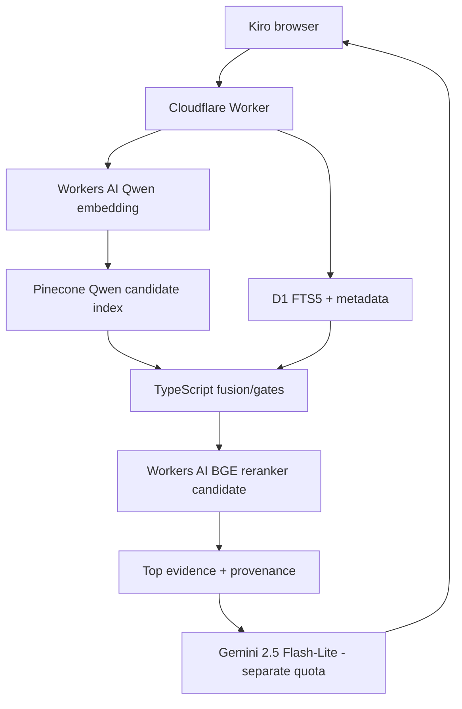

# Cloudflare / Portfolio Integration Plan

## Table of Contents

- [Current State](#current-state)
- [Required Boundary](#required-boundary)
- [Current Runtime Lifecycle](#current-runtime-lifecycle)
- [Why the Existing Worker Does Not Yet Host RAG](#why-the-existing-worker-does-not-yet-host-rag)
- [Deployment Evaluation History](#deployment-evaluation-history)
- [Containerization Outcome](#containerization-outcome)
- [Zero-Cost Cloudflare-Native Reassessment](#zero-cost-cloudflare-native-reassessment)
- [Candidate Pipeline](#candidate-pipeline)
- [Why Pinecone Remains in the First Candidate](#why-pinecone-remains-in-the-first-candidate)
- [Capacity Interpretation](#capacity-interpretation)
- [Recommended Next Step](#recommended-next-step)
- [Documentation Taxonomy](#documentation-taxonomy)

<a id="current-state"></a>
## Current State

The portfolio Worker is deployed and owns the normal portfolio API. The current RAG runtime is a separate Python/Pinecone retrieval service that has been validated locally and in Docker but is not deployed behind the production Worker. The Kiro page remains a frontend/state scaffold rather than a live RAG client. Gemini generation is selected but not integrated.

<a id="required-boundary"></a>
## Required Boundary

The public browser must not receive Pinecone credentials, model-provider secrets or privileged retrieval state. The existing Cloudflare Worker is the appropriate public security/orchestration boundary whether the downstream implementation remains Python or becomes Worker-native.

<a id="current-runtime-lifecycle"></a>
## Current Runtime Lifecycle

```text
Kiro submit
 -> portfolio RAG gateway (not implemented yet)
 -> current Python /api/rag/... runtime
 -> Nomic query embedding
 -> Pinecone + BM25 + metadata + fusion/gates + CrossEncoder + dedupe
 -> future Gemini generation
 -> response + evidence
 -> Kiro UI
```

<a id="why-the-existing-worker-does-not-yet-host-rag"></a>
## Why the Existing Worker Does Not Yet Host RAG

The current runtime depends on Python, PyTorch, SentenceTransformers, Nomic weights, CrossEncoder weights and local ranking logic. `worker/index.ts` currently owns ordinary portfolio routes; there is no live RAG route and no model binding implementing the production retrieval path.

Replacing Nomic alone is insufficient because Python currently owns BM25, metadata recall, fusion/gates, polarity, CrossEncoder reranking, semantic dedupe/diversity and response shaping as well.

<a id="deployment-evaluation-history"></a>
## Deployment Evaluation History

RAG deployment/hosting decision records are maintained under **`docs/rag/deployment/`**, not QC and not the whole-project Operations folder:

- [Containerization and Hosting Evaluation](deployment/2026-08-31-containerization-and-hosting-evaluation.md)
- [Zero-Cost Cloudflare-Native Runtime Evaluation](deployment/2026-08-31-cloudflare-native-zero-cost-runtime-evaluation.md)
- [Deployment history index](deployment/README.md)

Deployment/runtime evidence lives under [`deployment/evidence/`](deployment/evidence/); retrieval-quality evidence remains under [`../qc/rag/evidence/`](../qc/rag/evidence/).

<a id="containerization-outcome"></a>
## Containerization Outcome

The existing Pinecone-backed FastAPI runtime was successfully built and run in Docker on Linux.

Validated:

```text
runtime schema:       1.0.0
retrieval schema:     3.1.0-pinecone
documents:            2,808
repositories:         134
dense backend:        Pinecone
Nomic query model:    loaded
CrossEncoder:         loaded
BM25/metadata:        enabled
local embeddings.npy: NOT LOADED
/health:              PASS
/api/rag/retrieve:    exercised
measured RAM:         ~1.293 GiB
```

Cloudflare Containers remained blocked by the current Free-plan constraint, while Render Free's 512 MB memory allocation is below the measured current runtime footprint.

<a id="zero-cost-cloudflare-native-reassessment"></a>
## Zero-Cost Cloudflare-Native Reassessment

A later architecture review reframed the deployment problem. The target is not “find somewhere free to host this exact Python process at any cost in complexity”; the target is “preserve or improve retrieval quality while making the production path simple, sustainable and `$0` under real free allocations.”

Cloudflare-hosted Qwen embeddings, a serverless reranker candidate and the already-bound D1 database create a credible no-Python candidate, provided parity/regression gates pass.

<a id="candidate-pipeline"></a>
## Candidate Pipeline



Status: **candidate only**.

<a id="why-pinecone-remains-in-the-first-candidate"></a>
## Why Pinecone Remains in the First Candidate

Pinecone vs Vectorize is an independent vector-database decision. The current pipeline requests top-500 dense candidates, while the evaluated Vectorize result ceilings differ materially. Changing embedding model, vector dimension, ANN backend and candidate ceiling simultaneously would make regression attribution much harder.

Therefore the first Qwen experiment keeps Pinecone and creates a separate Qwen index.

<a id="capacity-interpretation"></a>
## Capacity Interpretation

High free capacity for **query embeddings** does not equal the same number of full RAG requests. Complete capacity is bounded by the minimum of:

- Worker requests/CPU constraints;
- Workers AI shared neuron use for embedding + reranking;
- Pinecone read units or Vectorize queried dimensions;
- D1 query/row-read usage;
- generation-model quota.

The canonical migration document contains the detailed deployment-path comparison and caps.

<a id="recommended-next-step"></a>
## Recommended Next Step

1. preserve the current Nomic/Pinecone/Python baseline;
2. generate Qwen embeddings for the existing 2,808 evidence documents;
3. create a new 1,024-D Pinecone candidate index;
4. run the existing retrieval regressions against both paths;
5. measure real Pinecone read units;
6. only after Qwen passes, port BM25/metadata/gates/reranking toward Worker + D1 + Workers AI.

<a id="documentation-taxonomy"></a>
## Documentation Taxonomy

- deployment/provider decision history: [`deployment/`](deployment/README.md)
- QC incidents/evidence: [`../qc/rag/`](../qc/rag/README.md)
- subsystem architecture/cap analysis: [`cloudflare-native-zero-cost-migration.md`](cloudflare-native-zero-cost-migration.md)

## Related Documentation

- Parent: [RAG documentation](README.md)
- [Whole-project documentation](../README.md)
- [Implementation runtime](../../rag/runtime/README.md)
- [Portfolio deployment](../operations/deployment.md)
- [Zero-cost migration decision](cloudflare-native-zero-cost-migration.md)
