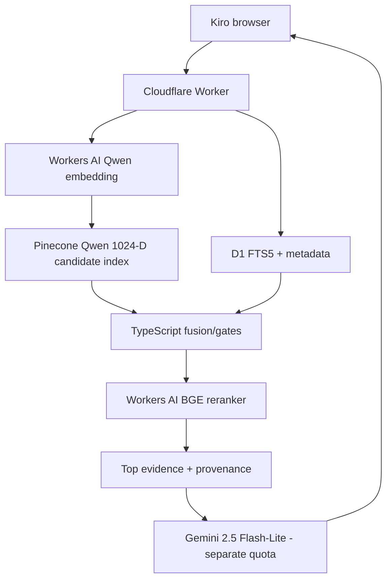
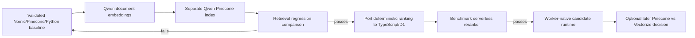

# RAG Deployment Record — Zero-Cost Cloudflare-Native Runtime Evaluation

> **Date:** `2026-08-31`  
> **Status:** `DOCUMENTED CANDIDATE — IMPLEMENTATION NOT STARTED`  
> **Baseline retained:** runtime `1.0.0`, retrieval `3.1.0-pinecone`, Nomic 512-D + Pinecone + Python  
> **Decision:** test Qwen on a parallel Pinecone index before any production runtime rewrite.  
> **Taxonomy:** RAG deployment/runtime architecture decision under `docs/rag/deployment/`, not QC.

## Table of Contents

- [1. Purpose](#1-purpose)
- [2. Why This Record Belongs Under RAG Deployment Documentation](#2-why-this-record-belongs-under-rag-deployment-documentation)
- [3. Trigger](#3-trigger)
- [4. Hard Constraints](#4-hard-constraints)
- [5. Key Findings](#5-key-findings)
- [6. Corrected Capacity Interpretation](#6-corrected-capacity-interpretation)
- [7. Why Vectorize Is Deferred](#7-why-vectorize-is-deferred)
- [8. Why Replacing Nomic Alone Is Insufficient](#8-why-replacing-nomic-alone-is-insufficient)
- [9. Selected Candidate](#9-selected-candidate)
- [10. Migration Boundary](#10-migration-boundary)
- [11. Next Experiment](#11-next-experiment)
- [12. Explicit Non-Decisions](#12-explicit-non-decisions)
- [13. Evidence and Source Map](#13-evidence-and-source-map)
- [14. Related Documentation](#14-related-documentation)

<a id="1-purpose"></a>
## 1. Purpose

This record extends the earlier containerization/hosting evaluation. It preserves the successful Docker work and measured 1.293 GiB runtime while documenting a later realization: hosting the unchanged Python runtime is not the only possible production architecture.

The new question became:

> Can the public RAG path move onto the existing Cloudflare Worker/D1 platform while serverless hosted models perform embedding/reranking and the current evidence semantics remain validated?

<a id="2-why-this-record-belongs-under-rag-deployment-documentation"></a>
## 2. Why This Record Belongs Under RAG Deployment Documentation

The document compares deployment/runtime pathways, provider limits, production responsibilities and migration sequencing. Its primary output is a **deployment architecture decision**, not a QC result.

Retrieval regression results produced by the recommended experiment belong under QC; the decision to run that experiment and the hosting architecture being considered belong here.

<a id="3-trigger"></a>
## 3. Trigger

The preceding deployment checkpoint established:

- Docker works;
- Cloudflare Containers require a paid Workers plan under the current account constraint;
- Render Free provides 512 MB / 0.1 CPU and cannot fit the measured ~1.293 GiB container as-is.

Further analysis showed that keeping Nomic exactly forces Nomic query inference to run somewhere. It also exposed that Python owns much more than Nomic: BM25, metadata recall, fusion/gates, CrossEncoder reranking, polarity and dedupe/diversity logic.

<a id="4-hard-constraints"></a>
## 4. Hard Constraints

- [x] target ongoing infrastructure cost: `$0` within real free allocations;
- [x] promotional credits do not count as sustainable free capacity;
- [x] no production Python service in the target architecture;
- [x] no Docker requirement in the target architecture;
- [x] no 100+ MB model download imposed on portfolio visitors;
- [x] secrets remain server-side;
- [x] evidence/provenance and retrieval-quality gates remain intact;
- [x] current Nomic/Pinecone baseline stays available until a replacement passes;
- [x] reuse the existing Cloudflare Worker + D1 platform when technically sound rather than adding infrastructure by default.

<a id="5-key-findings"></a>
## 5. Key Findings

| Finding | Consequence |
|---|---|
| Cloudflare hosts `@cf/qwen/qwen3-embedding-0.6b` | query/document embeddings can be serverless without Python |
| Qwen uses a different embedding space and current Cloudflare documentation exposes 1,024-D output | candidate index must be separate from the current 512-D Nomic index |
| Workers AI free allocation is shared across AI calls | embedding-only capacity is not full-RAG capacity |
| Cloudflare hosts `@cf/baai/bge-reranker-base` | there is a serverless candidate to replace local CrossEncoder inference |
| existing Worker already binds D1 | lexical/metadata runtime can potentially move into the existing backend |
| D1 supports FTS5 | plausible lexical-search replacement, but ranking parity must be tested |
| current Pinecone runtime requests top 500 dense candidates | retaining Pinecone first minimizes retrieval changes during the embedding bake-off |
| Vectorize top-K limits differ from current top-500 dense recall | Vectorize migration should be evaluated separately rather than bundled with the embedding change |
| exact Nomic v1.5 lacks an obvious permanent-free hosted endpoint matching all constraints | preserving exact Nomic makes zero-cost serverless deployment substantially harder |
| browser-side Nomic requires a large model transfer and client resource use | violates portfolio UX constraints |

<a id="6-corrected-capacity-interpretation"></a>
## 6. Corrected Capacity Interpretation

The previously discussed very high daily query count referred to **Qwen embedding inference alone**. It must not be represented as complete RAG capacity.

Illustrative embedding-only calculation from the evaluated Cloudflare free allocation:

```text
10,000 neurons/day
Qwen embedding cost: 1,075 neurons / 1M input tokens
=> ~9.30M embedding input tokens/day
=> ~93k 100-token query embeddings/day
```

The full RAG path also consumes reranking inference, vector retrieval, lexical/metadata reads and generation. Reranking a large candidate set can dominate the shared Workers AI budget. Full-RAG capacity must therefore be measured end-to-end rather than inferred from query embedding cost.

A Vectorize scenario with 2,808 Qwen 1,024-D vectors was estimated at roughly 26,488 queried-corpus-equivalent operations/month (~883/day in a 30-day month) under the evaluated queried-dimension accounting. That remains likely sufficient for portfolio traffic, but it is far below the embedding-only number and does not resolve the top-K behavior difference.

<a id="7-why-vectorize-is-deferred"></a>
## 7. Why Vectorize Is Deferred

Moving Pinecone to Vectorize is a separate architectural change from moving Nomic to Qwen.

Changing both together would simultaneously change:

1. embedding model;
2. embedding dimension;
3. ANN backend;
4. candidate ceiling;
5. usage accounting.

The first controlled experiment should change the embedding model/index while retaining Pinecone as the serving backend.

<a id="8-why-replacing-nomic-alone-is-insufficient"></a>
## 8. Why Replacing Nomic Alone Is Insufficient

Current Python runtime ownership includes:

```text
Nomic query embedding
Pinecone dense retrieval orchestration
BM25
metadata/topic/skill recall
fusion
concept/evidence gates
polarity logic
CrossEncoder reranking
semantic dedupe
repository diversity
evidence response shaping
```

Therefore:

```text
replace Nomic only
!=
remove Python runtime
```

A complete no-Python migration must port deterministic ranking logic and replace or externally host the CrossEncoder behavior as well.

<a id="9-selected-candidate"></a>
## 9. Selected Candidate



Status: **candidate only**. No runtime code, production index or canonical corpus artifact is changed by this documentation decision.

<a id="10-migration-boundary"></a>
## 10. Migration Boundary

The architecture should migrate in reversible stages:



Pinecone/Vectorize, BM25/FTS5 and CrossEncoder/BGE should not all be changed in a single unmeasured step.

<a id="11-next-experiment"></a>
## 11. Next Experiment

1. generate Qwen embeddings for the same 2,808 evidence documents;
2. store them in a new 1,024-D Pinecone index/namespace;
3. preserve the current Nomic index unchanged;
4. run the existing employer-style retrieval regression suite against both paths;
5. record Pinecone `usage.read_units` for the actual top-500 candidate/fetch pattern;
6. compare result relevance, evidence class/polarity, repo diversity, provenance and failure cases;
7. only if Qwen passes, begin porting BM25/metadata/gates/reranking toward Worker + D1 + Workers AI.

Acceptance is based on retrieval quality and evidence correctness, not numerical similarity between Qwen and Nomic vectors.

<a id="12-explicit-non-decisions"></a>
## 12. Explicit Non-Decisions

This record does **not** approve or implement:

- deleting Nomic artifacts;
- deleting the Python runtime;
- deleting Docker/container evidence;
- replacing the current Pinecone production index;
- moving immediately to Vectorize;
- reducing rerank candidates without measurement;
- replacing the pinned CrossEncoder without benchmark evidence;
- changing existing retrieval weights/gates by assumption;
- integrating Gemini;
- wiring the Kiro browser;
- enabling a paid Cloudflare plan.

<a id="13-evidence-and-source-map"></a>
## 13. Evidence and Source Map

Detailed provider/pathway calculations, rejected approaches, file-change planning and migration gates are maintained in:

- [Canonical zero-cost migration analysis](../cloudflare-native-zero-cost-migration.md)

The earlier operational baseline is:

- [Containerization and hosting evaluation](2026-08-31-containerization-and-hosting-evaluation.md)

Supporting evidence is split by purpose:

- [Deployment/runtime evidence](evidence/) — hosting/runtime feasibility evidence.
- [RAG QC evidence](../../qc/rag/evidence/) — retrieval/generalization evidence and future model-bake-off regression results.

<a id="14-related-documentation"></a>
## 14. Related Documentation

- [Deployment history index](README.md)
- [Portfolio deployment overview](../../operations/deployment.md)
- [RAG root](../README.md)
- [Cloudflare integration](../cloudflare-integration.md)
- [Pipeline](../pipeline.md)
- [Embedding history](../embedding-version-history.md)
- [Pinecone](../pinecone.md)
- [Regeneration matrix](../regeneration-matrix.md)
- [Runtime](../../../rag/runtime/README.md)
