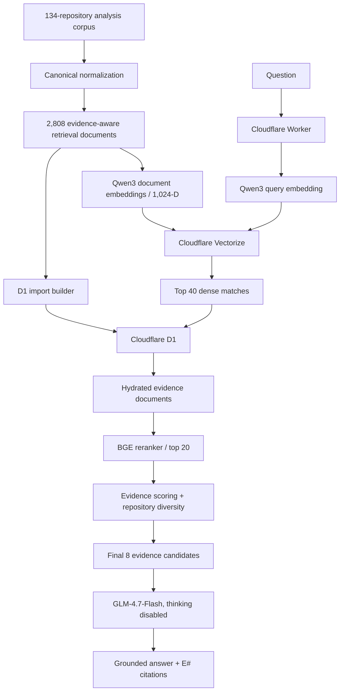

# Active RAG Pipeline — Production End to End

**Status:** Cloudflare-native backend is deployed and validated. Frontend integration remains pending.

## Pipeline contract



## Stage 0 — Repository source analysis

The repository-analysis corpus under `rag/other/` contains chronological, project-specific evidence reports for all 134 repositories. These reports preserve evidence, limitations, ratings and source provenance rather than acting as plain scraped README text.

## Stage 1 — Normalize

The normalization layer converts the source analyses into structured per-repository/combined data. Existing normalized outputs are valid. The normalizer's path-discovery behavior after historical folder moves remains a rebuild caveat; see `known-issues.md` before rerunning a full Stage 1 rebuild.

## Stage 2 — Compile evidence-aware retrieval documents

Current authority:

```text
rag/rag-corpus/retrieval-documents-v2/documents.jsonl
```

Output:

```text
2,808 documents
134 repositories
schema 2.0.0
SHA-256 a10c2b2d9d4e79e8a6e6629cc15b18cb1123513b45df44dc73e668b44c1bee58
```

Documents encode retrieval class, semantic area, evidence polarity/level, specificity, topics, skills, source fragments and authoritative evidence text.

## Stage 3 — Cloudflare Workers AI document embeddings

Implementation:

```text
rag/scripts/03-embeddings/cloudflare/generate-rag-embeddings-v4-cloudflare.mjs
```

Artifacts:

```text
rag/rag-corpus/embeddings-cloudflare-v1/
```

Contract:

```text
model: @cf/qwen/qwen3-embedding-0.6b
dimensions: 1024
document mode: documents
query mode: queries
query instruction: Given a web search query, retrieve relevant passages that answer the query
post-process: L2 normalize
metric: cosine
```

Validation: 2,808/2,808 finite, nonzero, normalized vectors; 134/134 repository coverage.

The previous Nomic embedding generation remains historical/reference only.

## Stage 4 — Publish dense vectors to Cloudflare Vectorize

Implementation:

```text
rag/scripts/05-vector-index/cloudflare-vectorize/publish-vectorize-v1.mjs
```

Index:

```text
portfolio-career-rag-cloudflare-v1
```

Remote inventory validation proved 2,808/2,808 vectors and exact document-ID coverage.

## Stage 5 — Dense-backend parity validation

Implementation:

```text
rag/scripts/06-validation/cloudflare-vectorize/validate-vectorize-dense-parity-v1.mjs
```

Artifacts:

```text
rag/rag-corpus/vectorize-cloudflare-v1/
```

Five canonical regression questions were compared against exact local cosine in the Qwen space. Acceptance passed with 100% overlap@10, minimum 96% overlap@25 and 100% overlap@50.

This stage proves the dense serving backend, not the entire production ranking/generation chain.

## Stage 6 — Build and publish D1 authoritative evidence

Schema:

```text
migrations/0005-rag-runtime.sql
```

Builder:

```text
rag/runtime/build-d1-rag-import.mjs
```

Commands:

```bash
npm run rag:d1:build
npm run db:migrate:local
npm run rag:d1:import:local
npm run db:migrate:remote
npm run rag:d1:import:remote
```

Local and remote validation both passed with 2,808 unique documents across 134 repositories, valid JSON-backed fields and matching corpus metadata SHA-256.

## Stage 7 — Production Worker retrieval

Implementation:

```text
worker/rag-runtime.ts
```

Request sequence:

1. per-client rate limit;
2. D1 corpus readiness check;
3. question validation;
4. Qwen query embedding using the validated query mode/instruction;
5. 1,024-D dimension and vector validity checks;
6. Vectorize top-40 query;
7. D1 evidence hydration by returned IDs;
8. D1/Vectorize mismatch guard.

## Stage 8 — Workers AI reranking and evidence selection

The Worker sends the hydrated candidates to:

```text
@cf/baai/bge-reranker-base
```

It keeps up to 20 usable reranked documents, then performs evidence-aware rescoring and repository-diverse selection to produce the final eight-document evidence packet.

Selection metadata favors concrete/direct evidence and adapts to limitation/weakness intent. Repository diversity prevents a single project from monopolizing the evidence packet unless necessary to fill it.

## Stage 9 — Grounded generation

Generator:

```text
@cf/zai-org/glm-4.7-flash
```

Generation options:

```text
temperature: 0.2
top_p: 0.9
max_completion_tokens: 700
enable_thinking: false
```

The model must use only the evidence packet, preserve limitations and cite claims with request-local `[E#]` labels.

The generator is intentionally permitted to ignore weak tail evidence. It is not required to summarize all eight documents. This is the chosen boundary between approximate retrieval and final answer synthesis.

The parser accepts visible string/text/output-text content and refuses to use `reasoning_content` as an answer.

## Stage 10 — API response shaping

Synchronous route:

```text
POST /api/rag/query
```

returns answer, citations, retrieval diagnostics, cited labels, grounding warning and model identities.

Streaming route:

```text
POST /api/rag/query/stream
```

returns normalized SSE events (`context`, `token`, `done`, `error`). It shares the same retrieval/reranking path but still needs its own live production validation.

Health route:

```text
GET /api/rag/health
```

actively validates the D1 corpus and reports the configured Vectorize index.

## Stage 11 — Kiro browser integration — pending

The current Kiro GLB page already exposes semantic interaction states, but it is not connected to the RAG API.

Frontend integration should replace demo/state timers with real network lifecycle events while preserving the existing model/animation contract.

No corpus, embedding, Vectorize or D1 rebuild is required merely to wire the frontend.

## Historical path

The previous Nomic + Pinecone + Python + local CrossEncoder path was the validated reference architecture before the Cloudflare migration. It remains preserved for history/regression and should not be deleted, but it is no longer the production request path.

## Related documentation

- [Production architecture](production-architecture.md)
- [Testing and regressions](testing-and-regressions.md)
- [Known issues](known-issues.md)
- [Deployment history](deployment/README.md)
- [Implementation scripts](../../rag/scripts/README.md)
- [Worker runtime notes](../../worker/RAG-RUNTIME.md)
