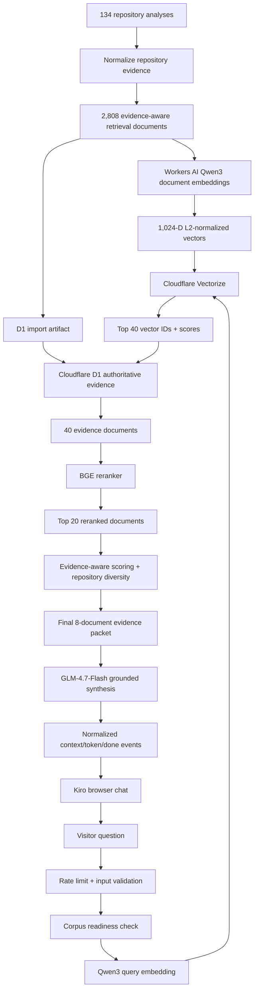

# Production RAG Architecture

**Status:** production backend and Kiro browser chat deployed on 2026-09-06. The synchronous query path has a successful live production acceptance query. The streaming endpoint is implemented, parser-tested and consumed by the deployed frontend; a separate independent live streaming QC capture remains outstanding.

## 1. Purpose

The portfolio RAG subsystem answers employer- and reviewer-style questions about the engineering history represented by 134 GitHub repositories. Its job is not to invent a career narrative from repository names. It retrieves evidence that was already extracted with provenance, ranks that evidence, and asks a generation model to synthesize only what the retrieved evidence supports.

The production design is Cloudflare-native at request time: no Python service, Docker container, Pinecone dependency, locally loaded embedding model, or external generation API key is required by the live query path.

The browser is intentionally chat-shaped, but each question is independently grounded against the portfolio corpus. The current UI preserves conversation history as local presentation state; it does not falsely imply that the backend generator has cross-turn memory.

## 2. Production snapshot

| Property | Production value |
|---|---|
| Repositories represented | 134 |
| Retrieval documents | 2,808 |
| Retrieval-document schema | `2.0.0` |
| Authoritative corpus SHA-256 | `a10c2b2d9d4e79e8a6e6629cc15b18cb1123513b45df44dc73e668b44c1bee58` |
| Embedding model | `@cf/qwen/qwen3-embedding-0.6b` |
| Embedding dimensions | 1,024 |
| Similarity | cosine |
| Vector index | `portfolio-career-rag-cloudflare-v1` |
| Authoritative runtime text store | Cloudflare D1 |
| Reranker | `@cf/baai/bge-reranker-base` |
| Generator | `@cf/zai-org/glm-4.7-flash` |
| Dense candidates | 40 |
| Reranked candidates | 20 |
| Final evidence packet | 8 |
| Browser surface | `/kiro-rag` |
| Browser transport | `POST /api/rag/query/stream` |
| Synchronous API | `POST /api/rag/query` |
| Health endpoint | `GET /api/rag/health` |
| Rate limit | 10 requests / 60 seconds / client IP |
| Worker version after frontend rollout | `28ac8122-62e8-4207-af59-be8e9421e4a3` |
| Netlify deploy | `6a9dfd6efe1cf3d7b3f33455` |

## 3. End-to-end architecture



The offline and online halves are deliberately separable. Regenerating the corpus or embeddings is not required for an ordinary Worker deployment, and frontend work does not require rebuilding the RAG data plane.

## 4. Offline corpus construction

### 4.1 Source analysis

The source material is the longitudinal repository-analysis corpus under `rag/other/`. The analyses preserve chronology, project-specific evidence, limitations, ratings, technologies and source-line provenance. They are not a raw scrape of repository README files.

The corpus covers repositories 1 through 134.

### 4.2 Retrieval-document compilation

The finalized retrieval layer lives at:

```text
rag/rag-corpus/retrieval-documents-v2/
```

Primary artifact:

```text
rag/rag-corpus/retrieval-documents-v2/documents.jsonl
```

The compiler reduces repeated/template-heavy source material into 2,808 evidence-aware documents. Each retrieval document carries fields used for both retrieval and grounding, including:

- document and repository identity;
- retrieval class;
- semantic area;
- evidence polarity;
- evidence level;
- specificity and concrete-signal metadata;
- authoritative evidence text;
- topics and related skill ratings;
- source fragments and provenance.

This matters because similarity alone cannot distinguish a positive implementation claim from an absence statement, limitation, chronology note or broad interpretation.

## 5. Embedding generation

Cloudflare-native document vectors live at:

```text
rag/rag-corpus/embeddings-cloudflare-v1/
```

Generated artifacts:

```text
embeddings.npy
embedding-records.jsonl
embedding-manifest.json
embedding-validation-report.txt
```

Embedding contract:

```text
provider: Cloudflare Workers AI
model: @cf/qwen/qwen3-embedding-0.6b
dimensions: 1024
document mode: documents
query mode: queries
query instruction: Given a web search query, retrieve relevant passages that answer the query
post-processing: L2 normalization
similarity: cosine
dtype: float32
```

Document and query mode are intentionally different. A production query must reproduce the recorded query contract exactly; otherwise a query would be embedded into a space that is not semantically equivalent to the validated document vectors.

Stage 03 validation proved:

- 2,808/2,808 vectors present;
- 134/134 repositories represented;
- shape `(2808, 1024)`;
- no duplicate document IDs;
- no NaN/Inf vectors;
- no zero vectors;
- normalized L2 norms.

The earlier Nomic vectors remain preserved as historical/reference artifacts. They are not production dependencies.

## 6. Vectorize: approximate dense candidate retrieval

The production Vectorize index is:

```text
portfolio-career-rag-cloudflare-v1
```

At query time, Vectorize receives the normalized 1,024-D query vector and returns the top 40 nearest document IDs with cosine scores.

Vectorize is not the authoritative text store. It is the fast similarity index. The Worker uses the returned IDs to fetch the canonical evidence rows from D1.

```text
Vectorize -> which documents are likely relevant?
D1        -> what exactly does each document say, and where did it come from?
```

Stage 05/06 validation proved all 2,808 vectors were present remotely and that the Vectorize dense backend closely reproduced exact local cosine retrieval. Across the five canonical parity questions, overlap@10 was 100%, minimum overlap@25 was 96%, and overlap@50 was 100%.

## 7. D1: authoritative evidence and provenance store

The runtime schema is defined by:

```text
migrations/0005-rag-runtime.sql
```

Main tables:

```text
rag_documents
rag_corpus_meta
```

The generated D1 import artifact is built by:

```text
rag/runtime/build-d1-rag-import.mjs
```

Generated local directory:

```text
rag/rag-corpus/d1-runtime-v1/
```

The directory is generated and gitignored. The source retrieval corpus remains the versioned authority.

The D1 population was validated locally and remotely with these invariants:

- 2,808 rows;
- 2,808 unique document IDs;
- 134 repositories;
- repository indices 1–134;
- one corpus metadata row;
- schema version `2.0.0`;
- zero invalid required rows;
- zero invalid JSON fields;
- zero inconsistent repository mappings;
- corpus SHA-256 matches the source retrieval corpus.

The Worker checks corpus readiness before serving a RAG query. This prevents a valid Vectorize index from being paired silently with an incomplete D1 corpus.

## 8. Online retrieval path

Production request orchestration is implemented in:

```text
worker/rag-runtime.ts
```

### 8.1 Request controls

Before any AI call, the Worker:

1. enforces the RAG rate-limit binding;
2. verifies the D1 corpus metadata is complete;
3. validates the request body and question length.

The configured rate limit is 10 requests per 60 seconds keyed by `CF-Connecting-IP`.

### 8.2 Query embedding

The question is embedded with the same Qwen model as the document corpus, but using the validated query contract:

```text
queries: [question]
instruction: Given a web search query, retrieve relevant passages that answer the query
```

The returned vector is L2-normalized and must contain exactly 1,024 dimensions.

### 8.3 Dense retrieval and D1 hydration

The Worker queries Vectorize for the top 40 IDs. Those IDs are hydrated from `rag_documents` in D1.

A mismatch guard fails the request if too many Vectorize IDs cannot be mapped to D1. This is a deliberate integrity boundary between the vector index and authoritative evidence store.

### 8.4 BGE reranking

The 40 dense candidates are reranked by:

```text
@cf/baai/bge-reranker-base
```

The reranker receives the user question and candidate evidence text and returns a relevance ordering. The Worker keeps the top 20 usable reranked contexts.

Dense retrieval answers “what is semantically nearby?”; reranking answers “which of these candidates most directly answers this question?”

### 8.5 Evidence-aware selection

The final selection layer rescales the reranked candidates using the evidence metadata already compiled into the corpus.

It favors, where appropriate:

- implemented/concrete or repository-specific evidence;
- direct-evidence retrieval classes;
- higher specificity;
- limitation/negative evidence when the question asks about weaknesses, gaps or missing evidence.

It also applies repository diversity. The first selection pass allows at most two selected documents per repository, then relaxes the cap only if necessary to fill the final evidence packet.

The result is at most eight evidence documents.

## 9. Generator responsibility: grounded synthesis, not blind summarization

The final generator is:

```text
@cf/zai-org/glm-4.7-flash
```

GLM receives only the final evidence packet, not the full 2,808-document corpus.

Its system contract requires it to:

- use only supplied portfolio evidence;
- avoid inventing technologies, scale, ownership, dates, outcomes or seniority;
- preserve evidence ceilings and limitations;
- cite factual claims inline using `[E1]`, `[E2]`, etc.;
- state when evidence is insufficient.

### 9.1 Intentional generator filtering policy

The eight selected documents are **candidate context**, not eight documents that the generator is forced to mention.

Approximate retrieval will sometimes include a weak tail result. This is accepted by design. The generator should ignore evidence that does not materially support the answer and cite only the evidence it actually uses.

The boundary is:

- retrieval/reranking must have enough recall to place the important evidence into the final packet;
- generation may filter weak or irrelevant members of that packet;
- generation cannot recover evidence that never reached the packet;
- generation may not replace missing evidence with unsupported claims.

The first successful production query demonstrated this behavior: the final packet contained some low-value tail evidence, but the answer relied primarily on strong LiNC and Prompt-management evidence and did not mechanically summarize every retrieved document.

## 10. GLM reasoning-mode incident and final generation contract

The first live end-to-end synchronous query reached generation but returned:

```text
HTTP 502
generation_invalid
Workers AI returned an unrecognized generation response.
```

The retrieval path had already succeeded. The issue was isolated to the generation response boundary.

GLM-4.7-Flash is reasoning-capable. The original request allowed thinking while also bounding the whole completion to 700 tokens. The production fix disabled thinking explicitly:

```ts
{
  temperature: 0.2,
  top_p: 0.9,
  max_completion_tokens: 700,
  chat_template_kwargs: {
    enable_thinking: false,
  },
}
```

The runtime parser was also hardened to accept legitimate visible text/output-text blocks while never exposing `reasoning_content` as the user-visible answer. A reasoning-only response remains a generation failure.

The corrected live response had ordinary string content, `finish_reason: stop`, and completed successfully with 229 completion tokens.

This keeps GLM in the role intended here: evidence synthesis and citation, not a second unbounded reasoning system after retrieval/reranking has already constrained the problem.

## 11. API and streaming contracts

### `GET /api/rag/health`

Confirms the D1 runtime corpus is populated with the expected 2,808 documents across 134 repositories and reports the configured Vectorize index name.

The health route actively checks D1. Deployment/configuration resolves the AI, Vectorize, D1 and rate-limit bindings, but the health handler itself does not perform a live Vectorize search.

### `POST /api/rag/query`

Returns a synchronous JSON response containing:

- grounded answer;
- citation objects;
- repository/document provenance;
- dense and rerank scores;
- retrieval diagnostics;
- cited evidence labels;
- grounding warning;
- model identities.

This path has a successful production acceptance query.

### `POST /api/rag/query/stream`

Uses the same retrieval/reranking path and emits Server-Sent Events:

- `context` — citations, retrieval diagnostics and model identities;
- `token` — visible generation deltas;
- `done` — cited labels and grounding warning;
- `error` — generation-stream failure information.

The deployed Kiro browser chat consumes this route. The client parser is unit-tested for arbitrary network chunk/frame boundaries. A dedicated independent live production stream capture is still outstanding and should be recorded under `docs/qc/rag/` when performed.

## 12. Browser chat and agent interaction model

The active frontend lives in:

```text
src/kiro-rag-page.tsx
src/features/kiro-rag/kiro-chat.tsx
src/features/kiro-rag/kiro-chat.css
src/features/kiro-rag/rag-client.ts
src/features/kiro-rag/model3d/
```

The previous timer-driven interaction demo is no longer the default `/kiro-rag` product surface.

The deployed chat provides:

- streaming answer text;
- a persistent composer;
- Enter-to-send and Shift+Enter newline behavior;
- stop/cancel using `AbortController`;
- retry/regenerate after cancellation or failure;
- suggested starter questions;
- inline `[E#]` citations;
- source cards that distinguish **Cited** from merely **Considered** evidence;
- repository links and source-analysis line provenance;
- a collapsible retrieval activity trace;
- auto-follow behavior that stops fighting the reader when they scroll away from the bottom;
- responsive desktop/mobile layout;
- reduced-motion support.

The GLB avatar is not a decorative replacement for the chat. It is the agent presence layer. Its semantic states are driven by real request lifecycle events:

```text
question submitted -> retrieving
context event       -> answering
visible token       -> answering/talking
done event          -> success
provider/network    -> error
user stop           -> idle/stopped turn
```

The frontend does not manipulate arbitrary rig bones based on text. It continues to pass bounded semantic state into the existing GLB runtime contract.

### 12.1 Conversation-memory boundary

The UI retains earlier turns so the interaction feels like a modern chat. However, the current Worker receives only the current question for retrieval and generation.

That distinction is explicit in the UI and documentation:

```text
visual chat history != server conversational memory
```

This avoids falsely representing one-turn grounded retrieval as a multi-turn conversational agent with remembered context.

## 13. Citation and provenance model

Every selected evidence item receives a stable request-local label such as `E1`.

The generator sees those labels in the evidence prompt. The API separately returns citation metadata containing:

- document ID;
- repository index/name/URL;
- retrieval class and semantic area;
- polarity and evidence level;
- specificity score;
- dense score;
- rerank score;
- source section/path;
- source line range;
- source text hash.

Inline `[E#]` references in the browser open the relevant source drawer and scroll to the corresponding evidence card. The UI distinguishes evidence the generator actually cited from additional top-eight evidence it considered but did not use.

This is intentionally stronger than returning only generated prose. A reviewer can distinguish the model's wording from the underlying evidence and trace claims back to repository-analysis source lines.

## 14. Production validation summary

Backend acceptance before frontend integration:

- Cloudflare Qwen embedding generation: PASS;
- 2,808/2,808 vectors: PASS;
- Vectorize publication and exact ID inventory: PASS;
- Vectorize dense parity: PASS;
- local D1 build/import: PASS;
- remote D1 migration/import: PASS;
- Worker verification: PASS;
- live health: HTTP 200;
- first generation attempt: HTTP 502, isolated and fixed;
- repeated single production synchronous query after fix: HTTP 200;
- grounded answer with inline citations: PASS;
- grounding warning on successful query: `null`.

Frontend rollout validation on 2026-09-06:

- ESLint: PASS;
- frontend TypeScript: PASS;
- Worker TypeScript: PASS;
- Vitest: **68/68 tests across 12 files**;
- new SSE client parser tests: 4/4 PASS;
- local D1 migration chain: PASS;
- Vite production build: PASS;
- Worker dry-run: PASS;
- Cloudflare Worker deployment: PASS;
- Netlify production deployment: PASS.

The synchronous successful production query observed approximately 10.0 seconds client latency, 9.77 seconds Worker wall time and 22 ms Worker CPU time. This is an initial observation, not yet a latency benchmark.

The frontend production build currently emits a large-chunk warning: the main JavaScript chunk is approximately 904 kB minified / 246 kB gzip. This does not fail the build, but route-level/code-splitting is a future performance-hardening opportunity, especially because Three.js and the Kiro GLB runtime are not needed on every portfolio route.

Detailed RAG acceptance evidence belongs in `docs/qc/rag/`.

## 15. Security, privacy and cost controls

The browser CORS origin is restricted to `https://kirolos.dev`.

The public route is still callable outside a browser, so the rate limiter is the primary abuse/cost control. The generation model receives only the final evidence packet rather than the entire corpus, which limits prompt size and unnecessary disclosure.

Generation-response diagnostics log structure only: key names, content types, finish reason and token counts. They do not log prompts, retrieved evidence, answer text or model reasoning content.

The browser receives citation metadata needed for transparency but never receives Cloudflare credentials or direct Vectorize/D1 access.

The current architecture removes the need for a separately hosted Python inference service. It was designed around Cloudflare serverless primitives and free/low-cost operation, but actual sustainable capacity remains a function of current Cloudflare quotas and per-query model usage and should be measured rather than assumed permanently.

## 16. Historical architecture and preservation rule

Before the Cloudflare-native migration, the validated reference path used:

```text
Nomic local embeddings
+ Pinecone
+ Python BM25/metadata/fusion/gates
+ local CrossEncoder
```

Those artifacts and documents are intentionally preserved as historical/reference material. They are not part of the live Worker request path.

Do not delete or overwrite them simply because production has migrated. They remain useful for regression history, forensic comparison and explaining why the architecture changed.

## 17. Regeneration and deployment boundaries

### Corpus/embedding rebuild

Only required when the authoritative retrieval corpus or embedding contract changes.

```text
rag/other/
rag/rag-corpus/retrieval-documents-v2/
rag/scripts/03-embeddings/cloudflare/
rag/rag-corpus/embeddings-cloudflare-v1/
```

### Vectorize republish

Only required when the vector generation/index generation changes.

```text
rag/scripts/05-vector-index/cloudflare-vectorize/
rag/rag-corpus/vectorize-cloudflare-v1/
```

### D1 rebuild/import

Required when retrieval-document evidence changes.

```bash
npm run rag:d1:build
npm run db:migrate:local
npm run rag:d1:import:local
npm run db:migrate:remote
npm run rag:d1:import:remote
```

### Worker-only change

For request orchestration, reranking, selection, prompting or generation changes, do not rebuild embeddings or Vectorize unless the data contract itself changed.

```bash
npm run verify
npm run worker:deploy
```

### Frontend-only change

For chat layout, streaming presentation, avatar lifecycle wiring or citation UX changes, do not rebuild the corpus, embeddings, Vectorize or D1.

The main-branch CI/CD path rebuilds/verifies the application and redeploys Worker/Netlify after a successful quality gate.

## 18. Important failure modes

1. **Relevant evidence never reaches top 8.** Generator filtering cannot recover what retrieval omitted.
2. **Tail evidence is weak.** Accepted when strong evidence is also present; generator should ignore it.
3. **D1/Vectorize drift.** Guarded by corpus metadata, exact ID validation and runtime mismatch checks.
4. **Embedding contract drift.** Query mode/instruction/dimensions must remain coupled to the document embedding generation.
5. **Uncited generated claims.** The system prompt forbids them, but citation presence is not a formal proof that every clause is supported.
6. **Reasoning-only generation response.** Rejected; reasoning content is never used as the visible answer.
7. **Rate-limit/quota exhaustion.** Public RAG is intentionally bounded; capacity must be monitored.
8. **Streaming behavior regression.** Client SSE parsing is tested, but a dedicated live stream acceptance capture remains outstanding.
9. **Client cancellation race.** The active controller is identity-checked before clearing request state so an older aborted stream cannot clear a newer request.
10. **Hidden citation target.** Inline citation navigation explicitly opens the collapsed source drawer before scrolling to the evidence card.
11. **Large frontend bundle.** Current Vite build warns about the ~904 kB main chunk; code splitting should be considered as a separate performance task rather than mixed into RAG correctness work.
12. **False conversational-memory implication.** Visual chat history is kept separate from backend memory semantics; each turn is currently independently grounded.

## 19. Canonical implementation map

| Responsibility | Path |
|---|---|
| Canonical RAG architecture docs | `docs/rag/` |
| RAG QC/acceptance records | `docs/qc/rag/` |
| Deployment decision history | `docs/rag/deployment/` |
| Retrieval corpus | `rag/rag-corpus/retrieval-documents-v2/` |
| Cloudflare embeddings | `rag/rag-corpus/embeddings-cloudflare-v1/` |
| Vectorize acceptance artifacts | `rag/rag-corpus/vectorize-cloudflare-v1/` |
| D1 import builder | `rag/runtime/build-d1-rag-import.mjs` |
| D1 schema | `migrations/0005-rag-runtime.sql` |
| Worker RAG orchestration | `worker/rag-runtime.ts` |
| Worker implementation notes | `worker/RAG-RUNTIME.md` |
| Shared API types | `shared/rag.ts` |
| Kiro page shell | `src/kiro-rag-page.tsx` |
| Kiro chat state/UI | `src/features/kiro-rag/kiro-chat.tsx` |
| Kiro chat styling | `src/features/kiro-rag/kiro-chat.css` |
| Browser SSE client | `src/features/kiro-rag/rag-client.ts` |
| GLB runtime | `src/features/kiro-rag/model3d/` |
| SSE parser tests | `src/__tests__/rag-client.test.ts` |

## Related documentation

- [RAG documentation index](README.md)
- [Active pipeline](pipeline.md)
- [Testing and regressions](testing-and-regressions.md)
- [Known issues](known-issues.md)
- [Deployment history](deployment/README.md)
- [RAG Quality Control](../qc/rag/README.md)
- [Kiro frontend runtime](../../src/features/kiro-rag/README.md)
- [Historical zero-cost migration analysis](cloudflare-native-zero-cost-migration.md)
