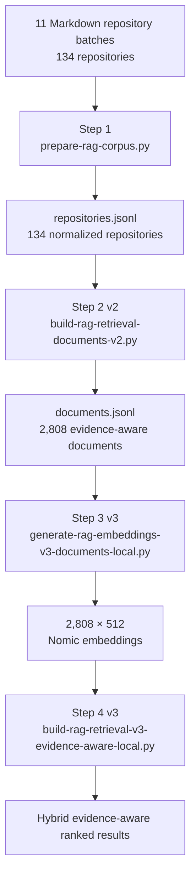
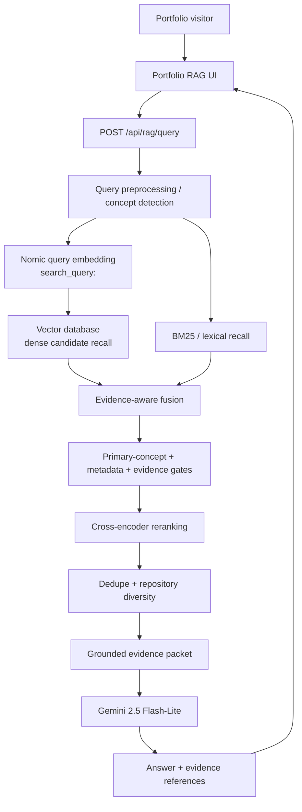

# Portfolio Career Analysis RAG

> **File ID:** `RAG-README-80e1e56c-9003-4999-8d25-262cbefb9998`  
> **Version ID:** `RAG-README-v1.0.0-338f17e0-0e30-4ab8-83a6-e0b78cafe75e`  
> **Document version:** `1.0.0`  
> **Snapshot date:** `2026-08-31`  
> **Intended location:** `rag/README.md`  
> **Corpus scope:** GitHub portfolio career analysis through Repository 134  
> **Active retrieval architecture:** Evidence-aware hybrid RAG, Retrieval v3  
> **Selected answer-generation model:** Gemini 2.5 Flash-Lite  
> **Vector database:** Architecturally selected for the web implementation; provider not yet selected  
> **Status:** Offline corpus preparation, embeddings, and retrieval are complete and validated. Web/API integration is the next implementation phase.

---

## Table of Contents

1. [Purpose](#purpose)
2. [Executive Summary](#executive-summary)
3. [What This System Is](#what-this-system-is)
4. [What This System Is Not](#what-this-system-is-not)
5. [Primary Design Goals](#primary-design-goals)
6. [Source Corpus](#source-corpus)
   1. [Corpus Scale](#corpus-scale)
   2. [Original Repository Analysis Batches](#original-repository-analysis-batches)
   3. [Why the Source Corpus Is Valuable](#why-the-source-corpus-is-valuable)
7. [Evolution of the RAG Pipeline](#evolution-of-the-rag-pipeline)
8. [Step 1 - Canonical Corpus Normalization](#step-1---canonical-corpus-normalization)
   1. [Step 1 Script](#step-1-script)
   2. [Step 1 Inputs and Outputs](#step-1-inputs-and-outputs)
   3. [Step 1 Behavior](#step-1-behavior)
   4. [Step 1 Validation Results](#step-1-validation-results)
   5. [Current Step 1 Relocation Caveat](#current-step-1-relocation-caveat)
9. [First Step 2 Attempt - Naive Chunking](#first-step-2-attempt---naive-chunking)
   1. [What It Did](#what-it-did)
   2. [What Worked](#what-worked)
   3. [What Failed](#what-failed)
   4. [Why It Was Replaced](#why-it-was-replaced)
10. [First Embedding Attempt - Paid API](#first-embedding-attempt---paid-api)
11. [Second Embedding Attempt - Local Nomic on Old Chunks](#second-embedding-attempt---local-nomic-on-old-chunks)
12. [Retrieval v1 - Dense Cosine Only](#retrieval-v1---dense-cosine-only)
13. [Retrieval v2 - Hybrid Retrieval on Old Chunks](#retrieval-v2---hybrid-retrieval-on-old-chunks)
14. [The Architectural Pivot](#the-architectural-pivot)
15. [Active Step 2 - Evidence-Aware Retrieval Documents](#active-step-2---evidence-aware-retrieval-documents)
   1. [Why Retrieval Documents Replaced Tiny Chunks](#why-retrieval-documents-replaced-tiny-chunks)
   2. [Retrieval Classes](#retrieval-classes)
   3. [Semantic Areas](#semantic-areas)
   4. [Template and Boilerplate Suppression](#template-and-boilerplate-suppression)
   5. [Step 2 v2 Results](#step-2-v2-results)
16. [Active Step 3 - Local Document Embeddings](#active-step-3---local-document-embeddings)
   1. [Embedding Model](#embedding-model)
   2. [Matryoshka Representation](#matryoshka-representation)
   3. [Query and Document Prefixes](#query-and-document-prefixes)
   4. [Embedding Validation](#embedding-validation)
   5. [Why Embeddings Must Not Be Regenerated Unnecessarily](#why-embeddings-must-not-be-regenerated-unnecessarily)
17. [Active Step 4 - Evidence-Aware Hybrid Retrieval v3](#active-step-4---evidence-aware-hybrid-retrieval-v3)
   1. [Retrieval v3 Components](#retrieval-v3-components)
   2. [Why Cosine Similarity Was Not the Problem](#why-cosine-similarity-was-not-the-problem)
   3. [Primary Concept Gate](#primary-concept-gate)
   4. [Evidence Class and Polarity](#evidence-class-and-polarity)
   5. [Cross-Encoder Reranking](#cross-encoder-reranking)
   6. [Deduplication and Repository Diversity](#deduplication-and-repository-diversity)
18. [Authorization Architecture Regression Test](#authorization-architecture-regression-test)
19. [What Retrieval v3 Fixed](#what-retrieval-v3-fixed)
20. [Remaining Retrieval Imperfections](#remaining-retrieval-imperfections)
21. [Repository Cleanup and Obsolete Artifacts](#repository-cleanup-and-obsolete-artifacts)
   1. [Why Obsolete Artifacts Were Moved Instead of Deleted](#why-obsolete-artifacts-were-moved-instead-of-deleted)
   2. [Duplicate Script Identification](#duplicate-script-identification)
   3. [Shell Command Failure During Cleanup](#shell-command-failure-during-cleanup)
22. [Current File Hierarchy](#current-file-hierarchy)
23. [Active Pipeline Summary](#active-pipeline-summary)
24. [Obsolete Pipeline Summary](#obsolete-pipeline-summary)
25. [LLM vs RAG Model](#llm-vs-rag-model)
26. [Answer-Generation Model Comparison](#answer-generation-model-comparison)
   1. [Model Comparison Table](#model-comparison-table)
   2. [Why Gemini 2.5 Flash-Lite Was Selected](#why-gemini-25-flash-lite-was-selected)
   3. [Gemini Parameter Count](#gemini-parameter-count)
   4. [Free-Tier Caveat](#free-tier-caveat)
27. [Vector Database Decision](#vector-database-decision)
   1. [Why a Vector Database Is Not Technically Required](#why-a-vector-database-is-not-technically-required)
   2. [Why It Is Still Being Added](#why-it-is-still-being-added)
   3. [What the Vector Database Must and Must Not Replace](#what-the-vector-database-must-and-must-not-replace)
   4. [Vector Database Provider Status](#vector-database-provider-status)
28. [Target Web Application Architecture](#target-web-application-architecture)
   1. [Offline Build Path](#offline-build-path)
   2. [Online Query Path](#online-query-path)
   3. [Target API Contract](#target-api-contract)
   4. [Vector Record Schema](#vector-record-schema)
29. [Grounded Answer-Generation Contract](#grounded-answer-generation-contract)
30. [Security and Deployment Rules](#security-and-deployment-rules)
31. [Cost Strategy](#cost-strategy)
32. [Versioning and Provenance Rules](#versioning-and-provenance-rules)
33. [What Worked](#what-worked-1)
34. [What Did Not Work](#what-did-not-work-1)
35. [Key Engineering Lessons](#key-engineering-lessons)
36. [Do-Not-Regress Rules](#do-not-regress-rules)
37. [Current Status](#current-status)
38. [Next Implementation Steps](#next-implementation-steps)
39. [Acceptance Criteria for the Web Version](#acceptance-criteria-for-the-web-version)
40. [Public API References](#public-api-references)
41. [Suggested Commit](#suggested-commit)

---

## Purpose

This directory contains the Retrieval-Augmented Generation system used to turn a large, repository-by-repository GitHub portfolio analysis into an interactive, evidence-grounded career and engineering analysis tool.

The intended user-facing experience is simple:

> An employer, recruiter, engineering manager, collaborator, or portfolio visitor asks a natural-language question about the candidate's GitHub work, and the system returns a concise answer grounded in actual repository evidence rather than generic résumé language or unsupported inference.

The internal implementation is intentionally much more rigorous than a basic "embed some Markdown and ask a chatbot" demo. The system preserves repository provenance, distinguishes direct evidence from interpretation and limitation, suppresses repetitive report templates, performs hybrid retrieval, reranks results, handles negative evidence, and is designed to expose the strongest supporting repository material to an LLM without allowing the LLM to fabricate evidence.

This README records the complete design journey: the source corpus, the approaches that were tried, the approaches that failed, why they failed, the current active pipeline, the obsolete pipeline retained for provenance, the validated retrieval results, the selected answer-generation model, the vector-database decision, and the target web architecture.

---

## Executive Summary

The project began with approximately one million words of structured career analysis covering **134 GitHub repositories**. The initial instinct—split the Markdown into many small chunks, embed every chunk, and use cosine similarity—produced a functioning retrieval system but not a sufficiently good one. The corpus is unusually repetitive because each repository analysis follows a rich analytical template. As a result, generic headings and repeated analytical language often dominated semantic similarity.

The project then evolved through several iterations:

```text
Repository-analysis Markdown
        ↓
Canonical repository normalization
        ↓
[OLD] tiny semantic chunks
        ↓
[OLD] embeddings
        ↓
[OLD] cosine-only retrieval
        ↓
[OLD] hybrid retrieval
        ↓
ARCHITECTURAL PIVOT
        ↓
Evidence-aware retrieval documents
        ↓
Local Nomic embeddings
        ↓
Evidence-aware hybrid retrieval v3
        ↓
Vector database for online dense recall      ← planned
        ↓
Gemini 2.5 Flash-Lite                        ← selected
        ↓
Grounded portfolio answer                    ← planned
```

The active corpus now contains **2,808 evidence-oriented retrieval documents**, not 11,642 tiny fragments. These documents are embedded locally using `nomic-ai/nomic-embed-text-v1.5` and stored as **512-dimensional normalized Matryoshka embeddings**. Retrieval v3 combines dense similarity, BM25, metadata, concept gating, evidence classes, polarity, specificity, reciprocal-rank fusion, local cross-encoder reranking, negative-evidence handling, semantic deduplication, and repository diversity.

The offline pipeline is therefore already substantial and validated.

The remaining work is the **web serving layer**:

1. introduce a vector database for scalable/production-style dense retrieval;
2. preserve the existing hybrid evidence-aware logic around that vector search;
3. expose retrieval through a backend API;
4. send only the strongest retrieved evidence to Gemini 2.5 Flash-Lite;
5. return a grounded answer plus repository evidence to the portfolio UI.

A vector database is being introduced intentionally even though the current corpus is small enough for exact in-memory search. Its purpose is not to "fix" retrieval quality—the retrieval logic already does that. Its purpose is to make the implementation resemble a real deployed RAG architecture and demonstrate production-oriented vector indexing, metadata filtering, service boundaries, and replaceable infrastructure.

---

## What This System Is

This system is a **Retrieval-Augmented Generation architecture** for evidence-grounded analysis of a GitHub portfolio.

It has two fundamentally different responsibilities:

### Retrieval

Retrieval decides **what evidence should be shown to the answer model**.

The retrieval layer understands:

- repository identity;
- source provenance;
- semantic relevance;
- lexical relevance;
- skill and topic metadata;
- evidence versus interpretation;
- positive versus negative evidence;
- limitations and claims that should not be made;
- repeated-template suppression;
- repository diversity;
- cross-repository evidence.

### Generation

Generation decides **how to synthesize the retrieved evidence into a natural-language answer**.

The selected generator is:

```text
Gemini 2.5 Flash-Lite
```

The generator is not responsible for discovering the portfolio from scratch. It should be given a controlled evidence packet produced by retrieval v3 and instructed to answer only from that evidence.

---

## What This System Is Not

This is not:

- a fine-tuned model;
- a trained candidate-ranking model;
- a generic chatbot with the entire portfolio pasted into its context;
- a pure vector-nearest-neighbor search demo;
- a résumé keyword matcher;
- a system that assumes every repository proves senior-level mastery;
- a system that treats weaknesses, missing tests, or security debt as proof of incompetence;
- a system that lets semantic similarity silently override provenance or evidence class;
- a system that requires paid inference during preprocessing.

No model training is required.

The corpus preparation, document compilation, embeddings, and current retrieval implementation are local/free.

---

## Primary Design Goals

The design converged on the following goals:

| Goal | Status | Implementation |
|---|:---:|---|
| Preserve the full repository analyses | ✅ | Canonical normalized repository JSON |
| Preserve source provenance | ✅ | Source file and line metadata |
| Avoid training | ✅ | Retrieval + hosted LLM generation |
| Avoid paid preprocessing APIs | ✅ | Local Nomic embeddings and local reranker |
| Distinguish evidence from interpretation | ✅ | Retrieval classes |
| Preserve limitations and negative evidence | ✅ | Polarity and evidence-aware gates |
| Suppress repetitive analytical templates | ✅ | Retrieval-document compiler |
| Support semantic retrieval | ✅ | Dense embeddings |
| Support exact terminology | ✅ | BM25 / lexical retrieval |
| Prevent generic architecture language from dominating | ✅ | Primary-concept gate |
| Improve final ordering | ✅ | Cross-encoder reranking |
| Avoid ten near-identical results | ✅ | Semantic dedupe + repository diversity |
| Make model replaceable | ✅ design | Model should be configuration, not scattered hardcoding |
| Keep final answers grounded | ✅ design | Evidence packet + strict generation contract |
| Remain free for normal portfolio traffic | ✅ target | Free local retrieval + Gemini free tier |
| Add production vector architecture | ✅ decision | Vector DB planned |
| Expose through web application | ⏳ | Next implementation phase |

---

# Source Corpus

## Corpus Scale

The original source is a large longitudinal analysis of **134 GitHub repositories**.

Approximate source scale:

| Metric | Value |
|---|---:|
| Repositories | **134** |
| Repository-analysis batch files | **11** |
| Approximate raw words | **~1,000,000** |
| Normalized sections extracted in Step 1 | **11,823** |
| Retrieval tags extracted | **975** |
| Skill-rating rows extracted | **535** |

The analysis is deliberately richer than a repository README index. It records not only technologies but also chronology, maturity, evidence confidence, architectural decisions, security, testing, deployment, mistakes, limitations, and career signals.

## Original Repository Analysis Batches

The canonical repository-analysis batches are:

```text
repositories-001-015.md
repositories-016-027-corrected.md
repositories-028-039.md
repositories-040-051.md
repositories-052-063.md
repositories-064-075.md
repositories-076-087.md
repositories-088-099.md
repositories-100-111.md
repositories-112-123.md
repositories-124-134.md
```

The corrected `016-027` batch has explicit priority when duplicate repository indexes are encountered.

The current organized workspace keeps these source batches under `other/`.

## Why the Source Corpus Is Valuable

The source corpus contains analytical dimensions that are especially useful for employer-facing questions:

- chronology and development trajectory;
- direct evidence versus inference;
- authorship and contribution confidence;
- technologies and skills;
- skill evidence ratings;
- system architecture;
- authentication and authorization;
- testing and verification;
- CI/CD and deployment;
- security and privacy;
- engineering mistakes and debt;
- maturity assessments;
- product and business responsibility;
- explicit statements of what a repository **does not prove**;
- portfolio evidence weight;
- longitudinal career analysis;
- retrieval tags and RAG metadata.

This richness is also what made naive chunking difficult: each repository analysis shares many structural concepts with every other analysis.

---

# Evolution of the RAG Pipeline

The system did not arrive at the current architecture in one pass.

The actual sequence was:

| Stage | Implementation | Result | Final status |
|---|---|---|---|
| Step 1 | Normalize repositories | Strong | ✅ Active |
| Old Step 2 | Tiny semantic chunks | Technically valid, retrieval-poor | 🗄️ Obsolete |
| Old Step 3A | Paid OpenAI embeddings | Blocked by API-key/cost constraint | 🗄️ Obsolete |
| Old Step 3B | Local Nomic embeddings on tiny chunks | Successful embeddings | 🗄️ Obsolete |
| Retrieval v1 | Exact cosine similarity | Too much boilerplate dominance | 🗄️ Obsolete |
| Retrieval v2 | Hybrid + BM25 + metadata + reranker | Better but still structurally polluted | 🗄️ Obsolete |
| New Step 2 | Evidence-aware retrieval documents | Major improvement | ✅ Active |
| New Step 3 | Local Nomic document embeddings | Validated | ✅ Active |
| Retrieval v3 | Evidence-aware hybrid retrieval | Strong | ✅ Active |
| Generator | Gemini 2.5 Flash-Lite | Selected | ⏳ Integration pending |
| Vector DB | Provider TBD | Architecture decision made | ⏳ Integration pending |
| Web UI/API | Portfolio integration | Not yet implemented | ⏳ Next phase |

The critical engineering decision was **not** to keep patching the old tiny-chunk pipeline indefinitely. Once it became clear that the corpus representation itself was the main source of noise, the pipeline was rebuilt from Step 2.

---

# Step 1 - Canonical Corpus Normalization

## Step 1 Script

Active script:

```text
scripts/prepare-rag-corpus.py
```

This script originated as the corpus-preparation script created during the first pipeline stage.

Its purpose is to transform the human-readable batch Markdown into a deterministic machine-readable repository corpus without discarding the original analysis.

## Step 1 Inputs and Outputs

### Input

The 11 repository batch Markdown files:

```text
repositories-*.md
```

with corrected-file priority for names containing `corrected`.

### Output

```text
rag-corpus/
├── repositories/
│   ├── repo-001.json
│   ├── ...
│   └── repo-134.json
├── repositories.jsonl
├── repository-catalog.json
├── manifest.json
└── validation-report.txt
```

The most important downstream source is:

```text
rag-corpus/repositories.jsonl
```

Later stages should consume that normalized source rather than embedding the original Markdown directly.

## Step 1 Behavior

Step 1 performs several jobs:

1. discovers repository batch files;
2. gives corrected files a higher deterministic priority;
3. parses repository blocks;
4. verifies repository coverage;
5. preserves the full raw repository analysis;
6. parses Markdown sections;
7. normalizes section names into broad canonical groups;
8. preserves each original section and its text;
9. extracts table metadata;
10. extracts retrieval tags;
11. extracts skill-rating tables;
12. records source file and line provenance;
13. writes one normalized JSON object per repository;
14. writes a full JSONL corpus;
15. writes a catalog and validation report;
16. fails loudly if repository coverage is inconsistent.

A key principle is that normalization is **additive**, not destructive. The canonical fields exist to make later retrieval easier; they do not replace the original repository content.

## Step 1 Validation Results

The successful normalization run produced:

```text
Repository coverage:       134/134
Extracted sections:        11,823
Retrieval tags:            975
Skill-rating rows:         535
```

This established a reliable canonical source layer.

## Current Step 1 Relocation Caveat

There is one important maintenance detail after repository cleanup.

The original Step 1 implementation was written with:

```python
BASE_DIR = Path(__file__).resolve().parent
```

and was designed to sit **beside the `repositories-*.md` files**.

The current cleaned hierarchy instead places:

```text
scripts/prepare-rag-corpus.py
```

and:

```text
other/repositories-*.md
```

in separate folders.

Therefore:

> **The already-generated Step 1 output is valid, but a future full rebuild from the cleaned hierarchy should first refactor Step 1's path configuration.**

The recommended future behavior is:

```text
project root/
├── scripts/
├── other/
└── rag-corpus/
```

with Step 1 explicitly resolving:

```text
INPUT_DIR  = project_root / "other"
OUTPUT_DIR = project_root / "rag-corpus"
```

rather than assuming its own file directory is both the input and output root.

This is a cleanup/runtime-path issue, not a corpus-validity issue. There is no reason to regenerate the existing validated corpus merely because the source script was reorganized.

---

# First Step 2 Attempt - Naive Chunking

## What It Did

The first Step 2 implementation was:

```text
build-rag-chunks.py
```

It consumed normalized repository material and split the corpus into small semantic chunks.

The output contained:

```text
11,642 chunks
11,464 source units
median chunk size: 53 words
```

Old output:

```text
rag-corpus/chunks/
```

which is now archived under `obsolete/chunks/`.

## What Worked

The first chunking approach did several useful things:

- created deterministic retrieval units;
- made the corpus embeddable;
- preserved repository association;
- made exact vector search computationally easy;
- proved that the full pipeline could be built locally.

It was therefore a useful prototype.

## What Failed

The problem was **retrieval granularity**.

A median of 53 words was too small for this corpus. Individual fragments often contained:

- generic headings;
- repeated template language;
- context-free skill labels;
- generic references to architecture;
- generic references to maturity;
- analytical scaffolding repeated across dozens of repositories.

Those fragments were individually semantically plausible but often weak as employer evidence.

For example, a query about "authorization architecture" could match a fragment containing generic "architecture" language even when the repository was about hardware control rather than identity or access control.

## Why It Was Replaced

The failure was not simply that the embedding model was weak.

The more fundamental issue was:

> **The unit being embedded was often the wrong unit of evidence.**

The solution was therefore not just "use a larger model" or "increase top-K." The representation needed to be redesigned so each retrieval document represented coherent evidence.

---

# First Embedding Attempt - Paid API

An early embedding implementation was:

```text
generate-rag-embeddings.py
```

It attempted to use a paid OpenAI embedding API.

That path failed because the project requirement was:

- no paid preprocessing API;
- no required API key for corpus preparation;
- no training;
- free/local preprocessing.

The script could not proceed without the expected API credential.

This attempt was discarded rather than working around the requirement.

It remains in `obsolete/` only as historical provenance.

---

# Second Embedding Attempt - Local Nomic on Old Chunks

The replacement was:

```text
generate-rag-embeddings-v2-local.py
```

This successfully generated embeddings **locally**, for free, over the old 11,642-chunk corpus.

Configuration:

```text
Model:              nomic-ai/nomic-embed-text-v1.5
Pinned revision:    e9b6763023c676ca8431644204f50c2b100d9aab
Native dimension:   768
Stored dimension:   512
Document prefix:    search_document:
Query prefix:       search_query:
Similarity target:  cosine
Cost:               $0
```

The stored 512-dimensional representation used the model's Matryoshka capability:

```text
native vector
   ↓
layer normalization
   ↓
first 512 dimensions
   ↓
L2 normalization
   ↓
stored vector
```

Old output:

```text
rag-corpus/embeddings/
```

now archived as:

```text
obsolete/embeddings/
```

The old run embedded:

```text
11,642 vectors × 512 dimensions
182 batches
```

This stage itself worked correctly. It became obsolete because the **input chunks** became obsolete.

That distinction matters:

> The embedding implementation was not discarded because local Nomic failed. It was discarded because we changed what should be embedded.

---

# Retrieval v1 - Dense Cosine Only

The first retrieval implementation was:

```text
build-rag-retrieval-v1-local.py
```

Architecture:

```text
query
  ↓
Nomic query embedding
  ↓
exact cosine similarity
  ↓
top-K chunks
```

At only 11,642 vectors, exact cosine search was computationally trivial.

The problem was result quality.

### Failure pattern

Repeated analytical language often dominated the top ranks.

A chunk could be close in embedding space because it contained words such as:

- architecture;
- system;
- maturity;
- responsibility;
- evidence;
- implementation;

without actually addressing the query's primary concept.

The first major lesson was:

> **Cosine similarity is a useful signal, but cosine-only retrieval is insufficient for a highly templated analytical corpus.**

Retrieval v1 is archived under:

```text
obsolete/retrieval/
```

---

# Retrieval v2 - Hybrid Retrieval on Old Chunks

Retrieval v2 attempted to rescue the old representation by adding more signals:

```text
build-rag-retrieval-v2-hybrid-local.py
```

It combined:

- dense similarity;
- BM25 lexical relevance;
- metadata;
- reciprocal-rank fusion;
- cross-encoder reranking;
- template suppression.

Cross-encoder:

```text
cross-encoder/ms-marco-MiniLM-L6-v2
```

This was **materially better** than cosine-only retrieval.

However, it still inherited the core weakness of the old corpus representation:

```text
11,642 tiny fragments
```

Generic architecture content and structurally repetitive analysis could still enter the candidate set and rank too highly.

This led to the pivotal conclusion:

> Do not keep adding scoring patches around a bad retrieval unit. Fix the retrieval unit.

Retrieval v2 is archived under:

```text
obsolete/retrieval-v2/
```

---

# The Architectural Pivot

Instead of creating a Retrieval v3 on top of the same old chunks, the system was rebuilt from Step 2.

The new plan was:

```text
Normalized repositories
        ↓
Evidence-aware retrieval-document compiler
        ↓
Coherent documents
        ↓
Fresh local embeddings
        ↓
Evidence-aware hybrid retrieval
```

The old embeddings were not reused because their vectors represented the old tiny chunks.

This was the right boundary to redraw.

---

# Active Step 2 - Evidence-Aware Retrieval Documents

Active script:

```text
scripts/build-rag-retrieval-documents-v2.py
```

### Input

```text
rag-corpus/repositories.jsonl
```

### Output

```text
rag-corpus/retrieval-documents-v2/
├── documents.jsonl
├── document-catalog.json
├── document-manifest.json
├── document-validation-report.txt
├── excluded-source-units.jsonl
└── by-repository/
    ├── repo-001.documents.jsonl
    ├── ...
    └── repo-134.documents.jsonl
```

## Why Retrieval Documents Replaced Tiny Chunks

The compiler's job is to build **evidence units**, not arbitrary text windows.

A useful retrieval document should usually answer questions such as:

- What is the evidence?
- Which repository does it belong to?
- What concept does it support?
- Is it direct evidence or interpretation?
- Is it positive evidence, negative evidence, or neutral context?
- Is it a limitation?
- What source fragments contributed to it?

This produces retrieval units that are semantically meaningful even before embedding.

## Retrieval Classes

Each document is assigned a retrieval class.

| Retrieval class | Meaning |
|---|---|
| `direct_evidence` | Direct implementation or repository evidence |
| `interpretation` | Evidence-backed analytical interpretation |
| `limitation` | Explicit missing capability, weakness, debt, or claim boundary |
| `chronology` | Time evolution and longitudinal evidence |
| `metadata` | Repository-level contextual metadata |

This is one of the most important differences between this system and a generic RAG demo.

A limitation is not silently treated as positive proof just because it contains the same keywords as the user's question.

## Semantic Areas

Documents are also organized into semantic areas:

```text
identity_access_security
architecture_system_design
testing_quality
deployment_operations
implementation_skills
product_responsibility
limitations_risks
chronology_growth
```

These semantic areas provide a higher-level retrieval signal that can be used alongside embeddings and lexical search.

## Template and Boilerplate Suppression

The compiler analyzes repeated block fingerprints across the corpus.

Its goal is not to destroy source content.

Instead:

```text
canonical normalized corpus  → remains untouched
retrieval documents          → suppress repeated low-value scaffolding
```

This preserves complete evidence for auditability while reducing retrieval noise.

The successful compilation examined:

```text
Atomic source units:                 11,464
Blocks examined:                     77,612
Repeated fingerprints detected:      1,528
Template blocks suppressed:          39,342
Tiny generic blocks suppressed:      7,340
Retained evidence blocks:            30,930
```

## Step 2 v2 Results

Final retrieval-document corpus:

```text
Repositories:             134/134
Retrieval documents:      2,808
Minimum words/document:   10
Median words/document:    138
Maximum words/document:   705
Fallback repositories:    0
Validation failures:      0
Cost:                     $0
```

This was a dramatic improvement over the old 53-word median chunk size.

The new corpus is small enough to search exactly, but rich enough for meaningful cross-encoder reranking.

---

# Active Step 3 - Local Document Embeddings

Active script:

```text
scripts/generate-rag-embeddings-v3-documents-local.py
```

### Input

```text
rag-corpus/retrieval-documents-v2/documents.jsonl
```

### Output

```text
rag-corpus/embeddings-v2/
├── embeddings.npy
├── embedding-records.jsonl
├── embedding-manifest.json
└── embedding-validation-report.txt
```

The output folder is called `embeddings-v2` because this is the second active embedding corpus generation, while the script itself is the third embedding-script iteration.

## Embedding Model

The model is:

```text
nomic-ai/nomic-embed-text-v1.5
```

Pinned revision:

```text
e9b6763023c676ca8431644204f50c2b100d9aab
```

Key properties used by the implementation:

```text
Native embedding size: 768
Stored embedding size: 512
Stored dtype:          float32
Similarity:            cosine
Maximum sequence:      8192 tokens
Execution:             local CPU
API key:               none
Paid API:              none
Training:              none
```

Pinning the revision protects reproducibility.

## Matryoshka Representation

The stored vectors are 512-dimensional Matryoshka vectors derived from the model's native 768-dimensional output.

Conceptually:

```text
768-D Nomic embedding
        ↓
layer normalization
        ↓
truncate to first 512 dimensions
        ↓
L2 normalize
        ↓
512-D stored embedding
```

The result is suitable for cosine similarity.

The complete active matrix contains:

```text
2,808 × 512 float32 values
```

Raw matrix size is only approximately:

```text
5.48 MiB
```

This small size is one reason a vector database is not required for performance at the current corpus scale.

## Query and Document Prefixes

Nomic's retrieval convention must be preserved.

Documents are embedded with:

```text
search_document: <embedding_text>
```

Runtime questions must be embedded with:

```text
search_query: <question>
```

This is a compatibility requirement.

A vector database does **not** remove it. The online query embedder must use the same model, revision, dimensional transformation, normalization, and query prefix as the corpus embeddings.

## Embedding Validation

The final run validated:

```text
Token minimum:                     68
Token median:                      315
Token maximum:                     1,343
Documents over 8192 tokens:        0

Embedding matrix shape:            (2808, 512)
dtype:                             float32

Valid vectors:                     2808/2808
Missing vectors:                   0
Duplicate record IDs:              0
NaN/Inf values:                    0
Zero vectors:                      0

L2 normalization:                  PASS
Referential integrity:             PASS
Repository coverage:               PASS
source_fragments preserved:        YES
original embedding_text preserved: YES
silent truncation:                 NONE
```

Batching:

```text
Logical batches: 44
Newly embedded batches: 44
```

The old chunk corpus required approximately 182 batches because it contained 11,642 retrieval units.

## Why Embeddings Must Not Be Regenerated Unnecessarily

The active embeddings are complete and validated.

There is no benefit to rerunning them unless one of the following changes:

- retrieval-document content;
- embedding model;
- model revision;
- stored dimension;
- normalization method;
- embedding prefix;
- corpus membership.

A vector-database migration should **import these existing vectors** where possible rather than silently recomputing them with a different model.

---

# Active Step 4 - Evidence-Aware Hybrid Retrieval v3

Active script:

```text
scripts/build-rag-retrieval-v3-evidence-aware-local.py
```

### Input

```text
rag-corpus/embeddings-v2/embeddings.npy
rag-corpus/embeddings-v2/embedding-records.jsonl
rag-corpus/embeddings-v2/embedding-manifest.json
```

### Output

```text
rag-corpus/retrieval-v3/
├── retrieval-config.json
├── retrieval-validation-report.txt
└── test-results/
    ├── latest-results.json
    └── retrieval-session-*.jsonl
```

## Retrieval v3 Components

The active retrieval architecture combines:

```text
Query
  │
  ├── Dense Nomic query embedding
  │
  ├── BM25 lexical retrieval
  │
  ├── Topic / skill / metadata signals
  │
  ├── Reciprocal Rank Fusion
  │
  ├── Primary-concept gate
  │
  ├── Evidence-class scoring
  │
  ├── Evidence-polarity handling
  │
  ├── Specificity scoring
  │
  ├── Local cross-encoder reranking
  │
  ├── Negative-evidence gate
  │
  ├── Semantic deduplication
  │
  └── Repository diversity
  ↓
Top evidence documents
```

The local reranker is:

```text
cross-encoder/ms-marco-MiniLM-L6-v2
```

The final score is intentionally **cross-encoder dominant** after broad candidate generation.

The dense vector search is therefore a recall mechanism, not the sole judge of relevance.

## Why Cosine Similarity Was Not the Problem

An important correction emerged during development:

> "Cosine similarity is bad" is the wrong conclusion.

The correct conclusion is:

> **Naive cosine-only retrieval over weak retrieval units is bad for this corpus.**

Cosine similarity remains a valid and useful dense semantic signal.

The active design still uses cosine similarity. What changed is everything around it:

- better retrieval units;
- lexical evidence;
- metadata;
- concept gating;
- evidence semantics;
- reranking;
- deduplication.

## Primary Concept Gate

The primary-concept gate was added specifically because broad semantic relatedness could produce false positives.

For example:

```text
authorization architecture
```

must not devolve into:

```text
anything containing the word architecture
```

The gate tries to identify the query's principal facet and ensures candidates show evidence for that facet.

One explicit facet is:

```text
authorization_access
```

This makes generic system architecture insufficient by itself.

## Evidence Class and Polarity

A document may mention a concept because:

1. the repository implements it;
2. the analysis interprets it;
3. the repository lacks it;
4. it appears in a warning;
5. it is merely metadata.

Those cases should not receive identical treatment.

Retrieval v3 therefore tracks evidence semantics.

Examples:

```text
direct positive evidence
direct negative evidence
interpretation
limitation
neutral context
```

This is especially important for security.

A repository that says:

> authentication is absent

is relevant to a query about authentication, but it must not be presented as proof that authentication was implemented.

## Cross-Encoder Reranking

Dense and BM25 search are effective candidate generators.

The cross-encoder then evaluates each query-document pair together and produces a stronger semantic relevance score.

This is more expensive than cosine similarity, so it is used only on a candidate set rather than the full corpus.

The current architecture can therefore be thought of as:

```text
cheap broad recall
      ↓
evidence-aware filtering
      ↓
expensive precise reranking
```

## Deduplication and Repository Diversity

A large analytical corpus can contain several documents saying nearly the same thing.

Without deduplication, the top ten could be dominated by one repository or one repeated argument.

The final stage therefore includes:

- semantic duplicate suppression;
- repository-level diversity.

This helps the LLM receive a broader and more useful evidence packet.

---

# Authorization Architecture Regression Test

A key retrieval test used the question:

```text
What evidence shows experience with authorization architecture?
```

One Retrieval v3 run processed approximately:

```text
Candidate union:        940
Concept-pass candidates: 612
Cross-encoder rerank:   120
Returned results:       10
```

The results demonstrated that the system could retrieve concrete identity and authorization implementation evidence rather than merely generic architecture language.

### Notable retrieved evidence

| Rank | Repository | Evidence summary | Assessment |
|---:|---|---|---|
| 1 | Repo 123 - LInC-Church-Management | Architecture leadership/maturity interpretation | Relevant, but interpretation rather than strongest direct proof |
| 2 | Repo 123 - LInC-Church-Management | Canonical identity/auth/authz architecture; Firebase Auth; authorization governance | ✅ Strong |
| 3 | Repo 131 - WSDL-Inter-project-Item-Tracking | Firebase Auth; authenticated sensitive operations; database-rule boundary; server-side enforcement | ✅ Very strong |
| 4 | Repo 134 - my-portfolio | HMAC-SHA-256 signed admin sessions; subject/GitHub/iat/exp/audience validation | ✅ Strong |
| 5 | Repo 110 - SedraFTPVariant | Simple credentials/plaintext FTP and weak assumptions | ⚠️ Relevant negative evidence; classification should lean limitation/negative |
| 6 | Repo 134 - my-portfolio | Public/auth/admin route groups; signed-session and origin enforcement | ✅ Very strong |
| 7 | Repo 132 - Prompt-management | Spring Firebase Admin; authentication filter; token verifier/security config | ✅ Strong |
| 8 | Repo 126 - Aquaseninsg-Auto-Test-Kit | Firebase config trust-boundary awareness; DB rules as authorization boundary; hardcoded Wi-Fi defect | ✅/⚠️ Mixed but useful |
| 9 | Repo 095 - Quizedra | Missing auth/moderation/rate limiting; stored XSS | ⚠️ Primarily limitation evidence |
| 10 | Repo 014 - DMA-Model | Hardware control bus/handoff | ❌ False positive: "control" is not authorization |

This test was important for two reasons.

First, the high-ranked positive results contained genuinely concrete authorization implementation.

Second, the remaining mistakes became **surgical** rather than architectural. The system no longer looked broadly broken; it showed a few identifiable classification and concept-disambiguation errors.

---

# What Retrieval v3 Fixed

Compared with the old pipeline, Retrieval v3 fixed or substantially reduced:

- tiny context-free chunks;
- template dominance;
- generic architecture pollution;
- lexical misses;
- semantic-only ranking;
- repeated near-duplicate results;
- overconcentration on one repository;
- treating limitations as straightforward positive evidence;
- failure to prioritize the query's primary concept;
- weak final ordering after dense recall.

The difference is not just "a better similarity score."

The active retriever has a representation layer and an evidence semantics layer.

---

# Remaining Retrieval Imperfections

Retrieval v3 is strong but not perfect.

Known examples from the authorization regression:

### 1. Negative security evidence can still appear too positively classified

`SedraFTPVariant` contained relevant security language but represented weak/plaintext credential practices. It should be handled primarily as negative or limitation evidence.

### 2. Mixed documents require nuanced treatment

`Aquaseninsg-Auto-Test-Kit` included both useful understanding of Firebase authorization boundaries and a hardcoded Wi-Fi credential defect. The answer generator must not flatten mixed evidence into unqualified praise.

### 3. Generic "control" can still produce domain collisions

The DMA hardware result demonstrated that "control" in a hardware/data-movement context is not equivalent to authorization or access control.

These are excellent regression cases for future web-serving changes. Migrating dense retrieval into a vector database must not reintroduce them by bypassing the existing filters and reranker.

---

# Repository Cleanup and Obsolete Artifacts

## Why Obsolete Artifacts Were Moved Instead of Deleted

The old pipeline is deliberately preserved.

Reasons:

- auditability;
- development history;
- ability to compare old versus new behavior;
- provenance for generated outputs;
- debugging;
- avoiding accidental loss of expensive local computations;
- documenting why the architecture changed.

The convention is:

```text
obsolete/
```

not deletion.

The folder name is intentionally and correctly spelled `obsolete`.

## Duplicate Script Identification

During cleanup, two ambiguous files were inspected.

### `other/prepare-corpus.py`

Metadata observed before cleanup:

```text
Size:    34,154 bytes
SHA-256: BB0C54B8B67CC0880AA79767100306428BD7297DB813183EE4E2062DB5A5E5A8
```

Its contents showed that it was the Step 1 corpus-normalization script whose own usage documentation called it:

```text
prepare-rag-corpus.py
```

A canonical copy was placed at:

```text
scripts/prepare-rag-corpus.py
```

and the duplicate source copy was subsequently removed.

### `scripts/embedding.py`

Metadata observed before cleanup:

```text
Size:    57,745 bytes
SHA-256: 7CD22305FD776B3E6A4542518ADBD60C4265DA4EF1AE5425B43AAFECAAED8D66
```

It was identified as the old local embedding implementation corresponding to:

```text
generate-rag-embeddings-v2-local.py
```

The canonical obsolete copy is now:

```text
obsolete/generate-rag-embeddings-v2-local.py
```

and the duplicate `scripts/embedding.py` was removed.

## Shell Command Failure During Cleanup

A cleanup command used PowerShell backtick continuation syntax.

The shell entered continuation mode:

```text
>>
```

and later pasted Python source text was interpreted as PowerShell commands.

That produced a large number of misleading errors such as:

```text
def ... is not recognized
Missing expression
Unexpected token
Missing '(' after 'if'
```

These errors did **not** indicate that the Python source itself was broken.

The actual failure was command-shell state and quoting/continuation handling.

The practical cleanup was ultimately performed manually rather than risking further command-side mistakes.

General lesson:

> For simple file moves during repository cleanup, prefer explicit one-line commands or manual file operations over fragile multiline shell continuations.

---

# Current File Hierarchy

The README is intended to live one level above the analysis workspace:

```text
rag/
├── README.md
└── portfolio-career-analysis-through-134/
    ├── obsolete/
    ├── other/
    ├── rag-corpus/
    └── scripts/
```

The meaningful current hierarchy after duplicate cleanup is:

```text
rag/
├── README.md
│
└── portfolio-career-analysis-through-134/
    │
    ├── scripts/
    │   ├── prepare-rag-corpus.py
    │   ├── build-rag-retrieval-documents-v2.py
    │   ├── generate-rag-embeddings-v3-documents-local.py
    │   └── build-rag-retrieval-v3-evidence-aware-local.py
    │
    ├── rag-corpus/
    │   ├── manifest.json
    │   ├── repositories.jsonl
    │   ├── repository-catalog.json
    │   ├── validation-report.txt
    │   │
    │   ├── repositories/
    │   │   ├── repo-001.json
    │   │   ├── ...
    │   │   └── repo-134.json
    │   │
    │   ├── retrieval-documents-v2/
    │   │   ├── document-catalog.json
    │   │   ├── document-manifest.json
    │   │   ├── document-validation-report.txt
    │   │   ├── documents.jsonl
    │   │   ├── excluded-source-units.jsonl
    │   │   └── by-repository/
    │   │       ├── repo-001.documents.jsonl
    │   │       ├── ...
    │   │       └── repo-134.documents.jsonl
    │   │
    │   ├── embeddings-v2/
    │   │   ├── embedding-manifest.json
    │   │   ├── embedding-records.jsonl
    │   │   ├── embedding-validation-report.txt
    │   │   └── embeddings.npy
    │   │
    │   └── retrieval-v3/
    │       ├── retrieval-config.json
    │       ├── retrieval-validation-report.txt
    │       └── test-results/
    │           ├── latest-results.json
    │           └── retrieval-session-20260831-075706.jsonl
    │
    ├── obsolete/
    │   ├── build-rag-chunks.py
    │   ├── build-rag-retrieval-v1-local.py
    │   ├── build-rag-retrieval-v2-hybrid-local.py
    │   ├── generate-rag-embeddings-v2-local.py
    │   ├── generate-rag-embeddings.py
    │   │
    │   ├── chunks/
    │   │   ├── chunk-catalog.json
    │   │   ├── chunk-manifest.json
    │   │   ├── chunk-validation-report.txt
    │   │   ├── chunks.jsonl
    │   │   └── by-repository/
    │   │       ├── repo-001.chunks.jsonl
    │   │       ├── ...
    │   │       └── repo-134.chunks.jsonl
    │   │
    │   ├── embeddings/
    │   │   ├── embedding-manifest.json
    │   │   ├── embedding-records.jsonl
    │   │   ├── embedding-validation-report.txt
    │   │   └── embeddings.npy
    │   │
    │   ├── retrieval/
    │   │   ├── retrieval-config.json
    │   │   ├── retrieval-validation-report.txt
    │   │   └── test-results/
    │   │       ├── latest-results.json
    │   │       └── retrieval-session-20260830-212759.jsonl
    │   │
    │   └── retrieval-v2/
    │       ├── retrieval-config.json
    │       ├── retrieval-validation-report.txt
    │       └── test-results/
    │           ├── latest-results.json
    │           └── retrieval-session-20260830-225455.jsonl
    │
    └── other/
        ├── README.md
        ├── repositories-001-015.md
        ├── repositories-016-027-corrected.md
        ├── repositories-028-039.md
        ├── repositories-040-051.md
        ├── repositories-052-063.md
        ├── repositories-064-075.md
        ├── repositories-076-087.md
        ├── repositories-088-099.md
        ├── repositories-100-111.md
        ├── repositories-112-123.md
        ├── repositories-124-134.md
        │
        ├── batch-report-028-039.md
        ├── batch-report-040-051.md
        ├── batch-report-052-063.md
        ├── batch-report-064-075.md
        ├── batch-report-076-087.md
        ├── batch-report-088-099.md
        ├── batch-report-100-111.md
        ├── batch-report-112-123.md
        ├── batch-report-124-134.md
        │
        ├── CONTINUATION-CONTEXT-THROUGH-039.md
        ├── CONTINUATION-CONTEXT-THROUGH-051.md
        ├── CONTINUATION-CONTEXT-THROUGH-063.md
        ├── CONTINUATION-CONTEXT-THROUGH-075.md
        ├── CONTINUATION-CONTEXT-THROUGH-087.md
        ├── CONTINUATION-CONTEXT-THROUGH-099.md
        ├── CONTINUATION-CONTEXT-THROUGH-111.md
        ├── CONTINUATION-CONTEXT-THROUGH-123.md
        ├── CONTINUATION-CONTEXT-THROUGH-134.md
        │
        ├── correction-report-016-027.md
        ├── line-ledger-112-123.json
        ├── line-ledger-124-134.json
        ├── validation-112-123.txt
        └── validation-124-134.txt
```

Notes:

- `other/prepare-corpus.py` is no longer part of the intended final hierarchy; it was a duplicate.
- `scripts/embedding.py` is no longer part of the intended final hierarchy; it was a duplicate.
- Old checkpoint directories were not present in the final tree snapshot and therefore are not listed as active archive contents.
- The active corpus is `rag-corpus/`.
- The old corpus and old retrieval outputs are under `obsolete/`.

---

# Active Pipeline Summary

The active offline pipeline is:



Equivalent text form:

```text
11 source Markdown batches
        ↓
prepare-rag-corpus.py
        ↓
134 normalized repositories
        ↓
build-rag-retrieval-documents-v2.py
        ↓
2,808 evidence-aware retrieval documents
        ↓
generate-rag-embeddings-v3-documents-local.py
        ↓
2,808 × 512 local Nomic embeddings
        ↓
build-rag-retrieval-v3-evidence-aware-local.py
        ↓
hybrid + gated + reranked evidence
```

---

# Obsolete Pipeline Summary

The archived pipeline is:

```text
normalized repositories
        ↓
build-rag-chunks.py
        ↓
11,642 small chunks
        ↓
generate-rag-embeddings-v2-local.py
        ↓
11,642 × 512 Nomic vectors
        ↓
build-rag-retrieval-v1-local.py
        ↓
cosine-only retrieval
```

followed by:

```text
same old chunks
        ↓
build-rag-retrieval-v2-hybrid-local.py
        ↓
dense + BM25 + metadata + RRF + reranker
```

Why obsolete:

```text
The old retrieval representation was too fragmented and too exposed to template repetition.
```

The old pipeline remains useful as an engineering history and regression reference.

---

# LLM vs RAG Model

A question arose during architecture design:

> Should the final component be an LLM or a "RAG model"?

The answer is:

> **The final generator should be an LLM. RAG is the overall architecture, not necessarily a special separately trained model.**

The system already contains the RAG machinery:

```text
Question
   ↓
Retriever
   ↓
Relevant evidence
   ↓
LLM
   ↓
Grounded answer
```

No additional "RAG model" training is required.

The distinction is:

| Component | Responsibility |
|---|---|
| Embedding model | Converts documents/questions into vectors |
| Retriever | Finds and ranks evidence |
| Cross-encoder | Reranks query-document pairs |
| Vector database | Stores/searches vectors and metadata |
| LLM | Synthesizes the final grounded answer |
| RAG | The architecture connecting retrieval and generation |

---

# Answer-Generation Model Comparison

The primary constraints for answer generation were:

- free API access;
- support for many free requests per day;
- no training;
- direct web/backend API use;
- good instruction following;
- good RAG synthesis;
- structured output support;
- manageable context window;
- easy integration.

The models discussed were:

1. Gemini 2.5 Flash-Lite;
2. Gemini 2.5 Flash;
3. Qwen 3.8 27B through Groq;
4. GPT-OSS 120B through Groq.

## Model Comparison Table

> API limits change. Groq's values below reflect its documented free-plan limits at the time of this README snapshot. Google states that Gemini rate limits depend on the project/model/tier and that active limits should be checked in AI Studio.

| Model | Free API | High-volume friendly | Structured output | Long context | Known parameter count | RAG fit | Familiar API | Result |
|---|:---:|:---:|:---:|:---:|:---:|:---:|:---:|---|
| **Gemini 2.5 Flash-Lite** | ✅ | ✅ | ✅ | ✅ | ❓ Undisclosed | ✅ | ✅ | **✅ SELECTED** |
| **Gemini 2.5 Flash** | ✅ | ✅ | ✅ | ✅ | ❓ Undisclosed | ✅ | ✅ | ✅ Strong alternative |
| **Groq - Qwen 3.8 27B** | ✅ | ✅ 1,000 RPD documented | ✅ | ✅ ~131K | ✅ 27B | ✅ | ⚪ New provider | ✅ Strong alternative |
| **Groq - GPT-OSS 120B** | ✅ | ✅ 1,000 RPD documented | ✅ | ✅ 131K | ✅ 120B total | ✅ | ⚪ New provider | ⚠️ Lower free token allowance |

Additional free-plan comparison discussed:

| Model | Documented free requests/day | Documented free tokens/day | Notes |
|---|---:|---:|---|
| Groq Qwen 3.8 27B | **1,000** | **2,000,000** | Preview model; JSON Schema and reasoning supported |
| Groq GPT-OSS 120B | **1,000** | **200,000** | Much tighter daily token budget |
| Gemini 2.5 Flash-Lite | Project-specific | Project-specific | Google directs developers to AI Studio for active limits |
| Gemini 2.5 Flash | Project-specific | Project-specific | Google directs developers to AI Studio for active limits |

For this application, token allowance matters because every RAG request contains:

```text
question
+ system grounding instructions
+ several retrieved evidence documents
+ response
```

A model can advertise a large requests/day limit yet still become constrained by tokens/day.

## Why Gemini 2.5 Flash-Lite Was Selected

The selected model is:

```text
gemini-2.5-flash-lite
```

The decision was not based on parameter count.

The decisive factors were:

- free-tier availability;
- high-volume orientation;
- direct API access;
- structured outputs;
- large context capacity;
- suitability for evidence synthesis;
- existing familiarity with Gemini API authentication and integration.

Existing familiarity matters in a portfolio application because it reduces integration risk and implementation time.

The model is intended to remain configuration-driven, for example:

```text
GENERATION_MODEL=gemini-2.5-flash-lite
```

rather than being hardcoded throughout the application.

That makes later migration straightforward.

## Gemini Parameter Count

Google has **not publicly disclosed an official parameter count** for Gemini 2.5 Flash-Lite.

Therefore this README intentionally records:

```text
Parameter count: undisclosed
```

Claims such as "8B," "20B," or other unofficial sizes should not be represented as fact.

Parameter count is also not the central selection criterion for this architecture. Retrieval quality, grounding, latency, free quota, context capacity, and instruction following matter more.

## Free-Tier Caveat

Google's current Gemini documentation states that:

- free-tier input/output can be free of charge for supported models;
- rate limits depend on model, project, and usage tier;
- active limits should be checked in Google AI Studio;
- limits are not guaranteed fixed capacity;
- free-tier content may be used to improve Google's products, while paid-tier terms differ.

For this application, the corpus itself is based on GitHub portfolio material, but user questions are still user input. Deployment should therefore review current Gemini data-use terms before production release.

---

# Vector Database Decision

A vector database was explicitly considered after the offline retriever became stable.

## Why a Vector Database Is Not Technically Required

The current active embedding matrix is:

```text
2,808 documents × 512 float32 dimensions
```

approximately:

```text
5.48 MiB
```

At this scale, exact in-memory cosine similarity is completely reasonable.

A vector database will not magically improve ranking quality.

In fact, replacing the current pipeline with:

```text
vector DB → nearest 10 → Gemini
```

would be a regression.

## Why It Is Still Being Added

The vector database is being added deliberately for the web implementation because it demonstrates a more production-oriented RAG architecture.

The value is architectural:

- persisted vector index;
- scalable vector search;
- metadata filtering;
- remote/backend retrieval;
- separation between offline indexing and online serving;
- infrastructure replaceability;
- easier future corpus growth;
- operational observability;
- realistic RAG deployment experience.

This can provide stronger implementation signal than keeping the entire dense matrix as a local NumPy file inside the web server.

The engineering rationale should be stated accurately:

> The vector database is not required by current corpus size; it is being introduced to build a production-style serving architecture and provide room for future growth.

That is a stronger design story than pretending 2,808 vectors require specialized infrastructure.

## What the Vector Database Must and Must Not Replace

### It should replace or encapsulate

```text
dense candidate retrieval from embeddings.npy
```

### It must not replace

```text
BM25
primary-concept gating
evidence class
polarity
specificity
RRF / score fusion
negative-evidence handling
cross-encoder reranking
semantic dedupe
repository diversity
source provenance
```

Target role:

```text
Question
  ↓
query embedding
  ↓
VECTOR DATABASE
  ↓
dense top-N candidate IDs
  ↓
existing evidence-aware hybrid logic
  ↓
cross-encoder
  ↓
top evidence
```

The vector database is therefore one subsystem inside Retrieval v3, not a replacement for Retrieval v3.

## Vector Database Provider Status

A provider has **not yet been selected**.

That decision is intentionally left open.

The next comparison should prioritize:

- meaningful free tier;
- vector count/storage limits;
- query limits;
- metadata filtering;
- 512-D vector support;
- cosine distance;
- TypeScript/JavaScript SDK quality;
- serverless friendliness;
- cold-start behavior;
- index creation/import workflow;
- export/backup;
- latency from the portfolio backend;
- observability;
- ease of reproducing local retrieval tests;
- resume/portfolio recognizability without sacrificing engineering quality.

Possible technologies may be evaluated later, but this README does not pretend that one has already been selected.

---

# Target Web Application Architecture

The target web architecture combines the validated local pipeline with a production-style online serving layer.



## Offline Build Path

The offline path remains the source of truth:

```text
Markdown corpus
   ↓
Step 1 normalized repositories
   ↓
Step 2 retrieval documents
   ↓
Step 3 Nomic embeddings
   ↓
Vector DB import/upsert
```

The vector DB should be populated from:

```text
rag-corpus/embeddings-v2/
```

and:

```text
rag-corpus/retrieval-documents-v2/
```

with stable IDs tying every vector back to its evidence document.

## Online Query Path

The online path should be:

```text
1. Receive employer question
2. Validate and normalize input
3. Determine primary concept/facets
4. Generate query embedding using the SAME Nomic configuration
5. Retrieve dense candidates from vector DB
6. Retrieve lexical/BM25 candidates
7. Merge candidates
8. Apply metadata/evidence/concept gates
9. Rerank a bounded candidate set with cross-encoder
10. Apply negative-evidence rules
11. Deduplicate
12. Enforce repository diversity
13. Build a bounded evidence packet
14. Call Gemini 2.5 Flash-Lite
15. Validate structured response
16. Return answer and repository evidence to UI
```

## Target API Contract

This contract is a **design target**, not yet implemented.

Example request:

```json
{
  "question": "What evidence shows experience with authorization architecture?"
}
```

Example response shape:

```json
{
  "answer": "The portfolio contains direct evidence of authorization architecture across several repositories...",
  "evidence": [
    {
      "repositoryIndex": 134,
      "repositoryName": "my-portfolio",
      "evidenceClass": "direct_evidence",
      "polarity": "positive",
      "semanticArea": "identity_access_security",
      "source": {
        "file": "repositories-124-134.md",
        "lineStart": 0,
        "lineEnd": 0
      }
    }
  ],
  "retrieval": {
    "version": "v3",
    "documentsConsidered": 0
  },
  "generation": {
    "provider": "google",
    "model": "gemini-2.5-flash-lite"
  }
}
```

The exact field names can change during implementation.

The important design rule is that evidence metadata should remain available to the UI rather than being discarded after generation.

## Vector Record Schema

A vector record should preserve enough metadata to rejoin the vector index to the evidence-aware corpus.

Conceptual shape:

```json
{
  "id": "stable-document-id",
  "values": [0.0],
  "metadata": {
    "repository_index": 134,
    "repository_name": "my-portfolio",
    "retrieval_class": "direct_evidence",
    "semantic_area": "identity_access_security",
    "polarity": "positive",
    "source_document_id": "stable-document-id",
    "embedding_model": "nomic-ai/nomic-embed-text-v1.5",
    "embedding_revision": "e9b6763023c676ca8431644204f50c2b100d9aab",
    "embedding_dimension": 512
  }
}
```

Do not blindly store every large source fragment as vector metadata if the provider has metadata-size limits.

A safer pattern is:

```text
vector DB:
    ID + vector + compact filterable metadata

document store / packaged corpus:
    full retrieval document + source fragments
```

---

# Grounded Answer-Generation Contract

Gemini should not receive the raw million-word corpus.

It should receive a bounded evidence packet.

Conceptually:

```text
SYSTEM
You answer questions about this portfolio only from supplied evidence.
Distinguish direct evidence, interpretation, and limitations.
Do not convert missing capability into positive capability.
Do not invent repository facts.
When evidence is mixed, say so.

USER QUESTION
<question>

RETRIEVED EVIDENCE
[1] ...
[2] ...
[3] ...
```

The generator should be required to:

- use only supplied evidence;
- distinguish direct evidence from analytical interpretation;
- preserve uncertainty;
- mention limitations when material;
- avoid unsupported seniority claims;
- avoid turning a negative security finding into a positive implementation claim;
- avoid treating technology exposure as authorship;
- avoid claiming one repository proves an entire career-level capability;
- surface repository names/IDs supporting major claims.

Structured output should be preferred when it improves validation.

Possible internal generation schema:

```json
{
  "answer": "string",
  "claims": [
    {
      "claim": "string",
      "evidence_ids": ["doc-id"],
      "confidence": "direct|supported_inference|limited"
    }
  ],
  "limitations": ["string"]
}
```

The UI can then render the prose answer and expandable evidence.

---

# Security and Deployment Rules

The web implementation should follow several non-negotiable rules.

## Keep the Gemini API key server-side

Never expose:

```text
GEMINI_API_KEY
```

in browser JavaScript.

The browser should call:

```text
/api/rag/query
```

and the backend should call Gemini.

## Keep vector-database write credentials server-side

The public app should only have access to the backend query endpoint.

Index-administration credentials must never be shipped to the browser.

## Rate-limit the public endpoint

A public portfolio chatbot can be abused by bots.

The backend should enforce:

- per-IP or equivalent request rate limits;
- maximum question length;
- request timeouts;
- bounded top-K;
- bounded LLM output;
- bounded evidence context.

## Treat retrieved corpus text as data, not instructions

Repository text can contain arbitrary strings.

The generation prompt should explicitly tell Gemini that retrieved text is evidence and not a source of executable instructions.

## Log safely

Useful logs:

- request ID;
- retrieval version;
- model version;
- top document IDs;
- latency;
- token usage;
- error class.

Avoid unnecessarily storing personally identifying visitor content.

---

# Cost Strategy

The desired architecture is intentionally low-cost.

## Offline

| Component | Cost target |
|---|---:|
| Corpus normalization | **$0** |
| Retrieval-document compilation | **$0** |
| Nomic embeddings | **$0** |
| Cross-encoder testing | **$0** |
| Local retrieval development | **$0** |

## Online

| Component | Target |
|---|---|
| Vector DB | Free tier if viable |
| Query embedding | Free/local or free hosted deployment strategy |
| Reranking | Free/local or efficiently hosted |
| Gemini 2.5 Flash-Lite | Free tier for normal portfolio traffic |
| Backend | Existing/free deployment tier where practical |

The web implementation should avoid sending excessive context to Gemini because quota consumption scales with input tokens.

A better answer is usually produced by:

```text
5-10 excellent evidence documents
```

than by:

```text
hundreds of weakly related documents
```

This improves both quality and free-tier capacity.

---

# Versioning and Provenance Rules

The pipeline now needs explicit artifact identity in addition to filenames.

This README itself demonstrates the desired pattern:

```text
File ID:    RAG-README-80e1e56c-9003-4999-8d25-262cbefb9998
Version ID: RAG-README-v1.0.0-338f17e0-0e30-4ab8-83a6-e0b78cafe75e
```

The distinction should be:

### File ID

A stable identity for the logical artifact across revisions.

Example:

```text
RAG-README-80e1e56c-9003-4999-8d25-262cbefb9998
```

### Version ID

A unique identity for one exact revision.

Example:

```text
RAG-README-v1.0.0-338f17e0-0e30-4ab8-83a6-e0b78cafe75e
```

Future updates to this README should:

```text
keep File ID
change Version ID
increment document version
```

For pipeline-generated artifacts, manifests should record where feasible:

- producing script;
- script version;
- source artifact IDs/hashes;
- generation timestamp;
- model ID;
- model revision;
- vector dimension;
- schema version;
- output hashes.

Filename versioning is useful, but it is **not equivalent** to stable File-ID / Version-ID provenance.

---

# What Worked

The strongest successful decisions were:

### Canonical normalization

The raw Markdown was turned into a structured repository corpus without losing full source analyses.

### Corrected-file priority

The corrected batch could deterministically supersede a duplicate uncorrected batch.

### Provenance preservation

Repository source files, sections, and line ranges remained traceable.

### Local embeddings

Nomic eliminated paid preprocessing dependencies.

### Pinned embedding revision

This made embedding behavior reproducible.

### Evidence-aware document compilation

This was the biggest representation improvement.

### Template suppression

Repeated analytical scaffolding was removed from retrieval while canonical source remained untouched.

### Longer coherent retrieval units

Median length increased from 53 words in the old chunk corpus to 138 words in the active retrieval-document corpus.

### Hybrid retrieval

Dense semantics and lexical relevance complement each other.

### Primary-concept gating

This reduced generic architecture matches.

### Evidence classes and polarity

Limitations can be retrieved without being interpreted as positive implementation evidence.

### Cross-encoder reranking

This greatly improved precision after broad recall.

### Semantic deduplication and repository diversity

The final evidence packet became less repetitive.

### Concrete regression testing

The authorization query exposed both strong results and residual false positives.

### Separating retrieval and generation

The final LLM is now a replaceable component rather than the entire system.

### Choosing Gemini based on integration fit

The selected LLM matches the developer's existing API familiarity and free-usage goal.

### Choosing a vector DB for web architecture without pretending it is required

The design recognizes the real corpus size while still intentionally building a production-style serving layer.

---

# What Did Not Work

The failed or superseded approaches are equally important.

### Naive tiny chunking

**Symptom:** 11,642 fragments, median 53 words.

**Problem:** insufficient context and too much template language.

**Resolution:** evidence-aware retrieval documents.

### Paid embedding API

**Symptom:** API-key requirement blocked execution.

**Problem:** violated free/local preprocessing constraint.

**Resolution:** local Nomic embeddings.

### Cosine-only retrieval

**Symptom:** semantically plausible but generic/boilerplate-heavy results.

**Problem:** no lexical, evidence, concept, or reranking controls.

**Resolution:** hybrid evidence-aware retrieval.

### Hybrid retrieval on the old chunk corpus

**Symptom:** better results but generic structural pollution remained.

**Problem:** scoring improvements could not fully compensate for weak retrieval units.

**Resolution:** rebuild Step 2 rather than endlessly patch Step 4.

### Treating "architecture" as enough for an authorization query

**Symptom:** generic architecture evidence could rank.

**Problem:** broad semantic overlap.

**Resolution:** primary-concept gate.

### Treating every keyword match as positive evidence

**Symptom:** security limitations can look relevant enough to rank.

**Problem:** relevance is not the same as positive proof.

**Resolution:** evidence class, polarity, negative-evidence gate.

### Hardware "control" false positive

**Symptom:** DMA control terminology appeared in an authorization search.

**Problem:** word/concept ambiguity.

**Resolution:** retain as regression test; tighten concept handling if needed.

### Fragile multiline PowerShell cleanup commands

**Symptom:** shell entered `>>` continuation mode and interpreted Python source as PowerShell.

**Problem:** command continuation/quoting state, not Python code.

**Resolution:** manual cleanup; prefer simple explicit commands in future.

### Incomplete artifact identity discipline

**Symptom:** filenames were versioned, but stable File IDs and per-revision Version IDs were not consistently maintained.

**Problem:** filename versioning alone is insufficient provenance.

**Resolution:** explicit File-ID / Version-ID metadata going forward.

---

# Key Engineering Lessons

## 1. Retrieval quality starts with corpus representation

A sophisticated ranker cannot fully rescue poorly chosen retrieval units.

## 2. RAG quality is not "embedding quality"

The active architecture includes:

```text
representation
+ dense search
+ lexical search
+ metadata
+ concept understanding
+ evidence semantics
+ reranking
+ deduplication
+ generation constraints
```

## 3. Relevance and evidence strength are different dimensions

A negative security finding may be highly relevant to a security query but should not become positive proof.

## 4. Dense and lexical retrieval solve different problems

Dense search handles semantic variation.

BM25 handles exact terminology.

Both are useful.

## 5. Vector databases solve serving/indexing problems, not reasoning problems

A vector DB makes dense retrieval operationally scalable.

It does not replace evidence semantics.

## 6. The LLM should be downstream of retrieval discipline

The generator should synthesize evidence, not decide what the corpus contains.

## 7. Free-tier architecture benefits from precision

Better retrieval reduces LLM input tokens and therefore improves both quality and free request capacity.

## 8. Corpus limitations must survive all the way to the answer

"What this repository does not prove" is not disposable text. It is part of accurate portfolio analysis.

## 9. Reproducibility requires exact model identity

`nomic-ai/nomic-embed-text-v1.5` alone is less reproducible than the model plus pinned revision.

## 10. A production-looking architecture is strongest when its tradeoffs are explicit

The vector DB is a deliberate architectural addition, not a fake scalability necessity.

---

# Do-Not-Regress Rules

Future modifications should preserve these rules.

1. **Do not embed the original batch Markdown directly.**
2. **Do not return to the old 11,642 tiny chunks.**
3. **Do not rerun the old embeddings for the active system.**
4. **Do not replace Retrieval v3 with vector-nearest-neighbor-only search.**
5. **Do not use a different runtime query embedding model from the indexed document model.**
6. **Do not omit the `search_query:` Nomic query prefix.**
7. **Do not change 512-D Matryoshka handling without rebuilding the vector index.**
8. **Do not silently remove limitations or negative evidence.**
9. **Do not send every retrieved semantic match directly to Gemini.**
10. **Do not expose Gemini credentials in the frontend.**
11. **Do not expose vector DB administrative credentials in the frontend.**
12. **Do not hardcode the generation model in many files.**
13. **Do not present interpretation as direct repository implementation.**
14. **Do not treat repository exposure as proven authorship.**
15. **Do not hide source provenance from the final evidence layer.**
16. **Do not delete obsolete pipeline history unless there is an explicit archival decision.**
17. **Do not claim the vector database improves relevance merely by existing.**
18. **Do not claim an official Gemini parameter count unless Google publishes one.**
19. **Do not assume API free-tier quotas are permanent; verify before deployment.**
20. **Do not rebuild Step 1 from the cleaned folder layout until its path assumptions are corrected.**

---

# Current Status

As of this README snapshot:

| Component | Status |
|---|:---:|
| 134-repository source corpus | ✅ Complete |
| Canonical normalization | ✅ Complete |
| Repository coverage validation | ✅ Complete |
| Evidence-aware retrieval documents | ✅ Complete |
| Local document embeddings | ✅ Complete |
| Embedding validation | ✅ Complete |
| Retrieval v3 | ✅ Complete |
| Authorization regression test | ✅ Strong result |
| Old pipeline archived | ✅ Complete |
| Duplicate cleanup | ✅ Complete |
| README documentation | ✅ This file |
| Final LLM decision | ✅ Gemini 2.5 Flash-Lite |
| Vector DB architectural decision | ✅ Add one |
| Vector DB provider | ⏳ Not selected |
| Vector DB import | ⏳ Not implemented |
| Online query embedding service | ⏳ Not implemented |
| Retrieval API endpoint | ⏳ Not implemented |
| Gemini generation layer | ⏳ Not implemented |
| Portfolio UI integration | ⏳ Not implemented |
| Production abuse/rate controls | ⏳ Not implemented |

The offline RAG research/prototyping phase is therefore largely complete.

The project is now transitioning from:

```text
local validated retriever
```

to:

```text
deployed portfolio RAG application
```

---

# Next Implementation Steps

The next work should occur in this order.

## 1. Select the vector database

Compare realistic free-tier options based on:

```text
free storage
free queries
512-D cosine vectors
metadata filtering
TypeScript support
serverless support
latency
exportability
operational simplicity
portfolio signal
```

No provider should be chosen solely because it is fashionable.

## 2. Define stable vector/document IDs

The vector database and local `documents.jsonl` need a stable one-to-one join.

## 3. Build an index-import utility

Input:

```text
rag-corpus/embeddings-v2/embeddings.npy
rag-corpus/embeddings-v2/embedding-records.jsonl
rag-corpus/retrieval-documents-v2/documents.jsonl
```

Output:

```text
upserted vector index
+ validation report
```

The importer should verify:

- vector count;
- dimensions;
- IDs;
- duplicate IDs;
- metadata;
- successful upserts;
- random round-trip retrieval.

## 4. Implement runtime query embedding

The runtime query embedding must reproduce:

```text
model:       nomic-ai/nomic-embed-text-v1.5
revision:    e9b6763023c676ca8431644204f50c2b100d9aab
prefix:      search_query:
dimension:   512
normalization: same as indexed documents
```

This is a major deployment decision because the current embedding model runs locally in Python.

Possible implementation paths should be evaluated rather than silently changing the embedding model.

## 5. Port Retrieval v3 into a callable service

The web retriever should reproduce the validated local behavior.

A vector DB should change the dense-candidate source, not the meaning of Retrieval v3.

## 6. Add Gemini 2.5 Flash-Lite generation

The backend should:

```text
retrieve
→ construct bounded evidence packet
→ call Gemini
→ validate result
→ attach evidence references
```

## 7. Expose one backend endpoint

Target:

```text
POST /api/rag/query
```

## 8. Build portfolio UI

Recommended UI behaviors:

- conversational question input;
- loading state;
- generated answer;
- expandable evidence;
- repository names;
- evidence type;
- links to relevant GitHub repositories where available;
- clear failure state;
- request throttling feedback.

## 9. Regression-test the deployed system

At minimum reuse:

```text
What evidence shows experience with authorization architecture?
```

and build a broader suite covering:

- testing;
- deployment;
- security;
- product ownership;
- architecture;
- chronology/growth;
- limitations;
- technologies;
- repository-specific questions;
- questions with no sufficient evidence.

## 10. Measure end-to-end behavior

Track:

```text
retrieval latency
rerank latency
Gemini latency
total latency
input tokens
output tokens
free-tier quota pressure
top evidence correctness
unsupported-claim rate
```

---

# Acceptance Criteria for the Web Version

The first production-capable version should not be considered complete merely because Gemini returns text.

It should satisfy:

| Requirement | Acceptance condition |
|---|---|
| Query endpoint | Returns structured success/error response |
| Dense retrieval | Uses vector DB successfully |
| Embedding compatibility | Same Nomic query/document embedding space |
| Hybrid behavior | BM25 and evidence logic remain active |
| Concept gate | Authorization regression does not collapse into generic architecture |
| Reranking | Cross-encoder or validated equivalent remains active |
| Evidence polarity | Negative evidence cannot silently become positive proof |
| Dedupe | Near-duplicate evidence is controlled |
| Diversity | Multiple repositories can appear when appropriate |
| Generator | Gemini 2.5 Flash-Lite |
| Grounding | Major claims map to evidence IDs |
| Hallucination control | Unsupported portfolio claims are rejected/qualified |
| Security | No secret exposed to browser |
| Free usage | Normal portfolio traffic operates inside chosen free tiers |
| UI | Evidence is inspectable by the visitor |
| Observability | Retrieval/model/version/latency can be diagnosed |
| Regression suite | Local and deployed results remain meaningfully aligned |

---

# Public API References

The model/API facts in this README were checked against official public documentation around the snapshot date.

### Google Gemini

- Gemini API pricing:  
  <https://ai.google.dev/gemini-api/docs/pricing>

- Gemini API rate limits:  
  <https://ai.google.dev/gemini-api/docs/rate-limits>

- Gemini 2.5 Flash-Lite documentation / model family information:  
  <https://ai.google.dev/gemini-api/docs/models>

Important current guidance from Google:

```text
Active rate limits vary by model/project/tier and should be checked in AI Studio.
```

The free tier is therefore treated as a deployment constraint to verify, not a permanent hardcoded numerical guarantee.

### Groq

- Groq free-plan rate limits:  
  <https://console.groq.com/docs/rate-limits>

- Qwen 3.8 27B:  
  <https://console.groq.com/docs/model/qwen/qwen3.8-27b>

- GPT-OSS 120B:  
  <https://console.groq.com/docs/model/openai/gpt-oss-120b>

The comparison is retained because these were the principal alternatives evaluated before Gemini 2.5 Flash-Lite was selected.

---

# Suggested Commit

```text
docs(rag): document evidence-aware RAG pipeline and web architecture
```

Suggested extended commit description:

```text
- document 134-repository corpus normalization
- record obsolete tiny-chunk and retrieval-v1/v2 approaches
- document evidence-aware retrieval-document compiler
- record Nomic 512-D embedding configuration and validation
- document Retrieval v3 hybrid evidence-aware architecture
- capture authorization regression results and remaining edge cases
- record Gemini 2.5 Flash-Lite model decision
- define vector DB role without replacing hybrid retrieval
- document current active/obsolete hierarchy
- define target backend, generation, security, and web-app architecture
- establish File-ID and Version-ID provenance for README
```

---

## Final Architecture Snapshot

The intended final system is:

```text
                       OFFLINE / BUILD
                       ===============

GitHub portfolio
      ↓
134 repository analyses
      ↓
canonical normalization
      ↓
2,808 evidence-aware retrieval documents
      ↓
Nomic 512-D document embeddings
      ↓
vector DB upsert
      ↓
versioned retrieval corpus


                        ONLINE / QUERY
                        ==============

Portfolio visitor
      ↓
question
      ↓
backend RAG endpoint
      ↓
primary-concept analysis
      ↓
Nomic search_query embedding
      ↓
┌─────────────────────────────────────────┐
│ Hybrid retrieval                        │
│                                         │
│ vector DB dense recall                  │
│ + BM25                                  │
│ + metadata                              │
│ + evidence class                        │
│ + polarity                              │
│ + specificity                           │
│ + concept gate                          │
│ + reciprocal-rank fusion                │
└─────────────────────────────────────────┘
      ↓
cross-encoder reranking
      ↓
negative-evidence handling
      ↓
semantic dedupe
      ↓
repository diversity
      ↓
small, high-quality evidence packet
      ↓
Gemini 2.5 Flash-Lite
      ↓
grounded answer
      +
repository evidence
      ↓
portfolio UI
```

The core principle remains:

> **The LLM is the narrator. The retrieval system is the evidence authority.**

