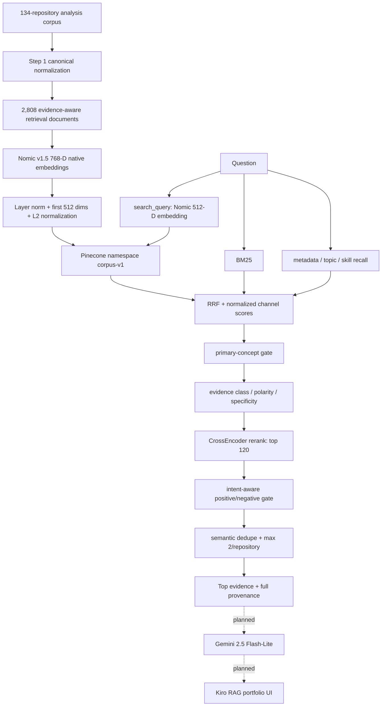

# Portfolio Career Analysis RAG

> **File ID:** `RAG-README-80e1e56c-9003-4999-8d25-262cbefb9998`  
> **Version ID:** `RAG-README-v2.0.0-93c96268-ca03-40bd-93c3-149a73bd9699`  
> **Document version:** `2.0.0`  
> **Snapshot date:** `2026-08-31`  
> **Corpus scope:** 134 GitHub repositories  
> **Active HTTP runtime on GitHub main:** `1.0.0` / retrieval `3.1.0-pinecone`  
> **Selected generator:** Gemini 2.5 Flash-Lite, not yet integrated  
> **Documentation rule:** preserve failed/superseded attempts and quantitative validation rather than documenting only the final path.

## Table of Contents

- [Purpose and Relationship to the Portfolio](#purpose-and-relationship-to-the-portfolio)
- [Current Status at a Glance](#current-status-at-a-glance)
- [End-to-End Architecture](#end-to-end-architecture)
- [Design Principles](#design-principles)
- [Source Corpus](#source-corpus)
  - [Canonical source batches](#canonical-source-batches)
  - [Corpus methodology preserved from the analysis phase](#corpus-methodology-preserved-from-the-analysis-phase)
- [Step 1 - Canonical Corpus Normalization (ACTIVE OUTPUT)](#step-1-canonical-corpus-normalization-active-output)
  - [Step 1 relocation caveat - important](#step-1-relocation-caveat-important)
- [Old Step 2 - Tiny Semantic Chunks (SUPERSEDED)](#old-step-2-tiny-semantic-chunks-superseded)
- [First Embedding Attempt - Paid OpenAI API (SUPERSEDED / FAILED CONSTRAINT)](#first-embedding-attempt-paid-openai-api-superseded-failed-constraint)
- [Second Embedding Attempt - Local Nomic on Old Chunks (SUPERSEDED DATA, VALID MODEL CHOICE)](#second-embedding-attempt-local-nomic-on-old-chunks-superseded-data-valid-model-choice)
- [Retrieval v1 - Exact Dense Cosine (SUPERSEDED)](#retrieval-v1-exact-dense-cosine-superseded)
- [Retrieval v2 - Hybrid on Old Chunks (SUPERSEDED)](#retrieval-v2-hybrid-on-old-chunks-superseded)
- [Active Step 2 v2 - Evidence-Aware Retrieval Documents](#active-step-2-v2-evidence-aware-retrieval-documents)
  - [Retrieval classes](#retrieval-classes)
  - [Semantic areas](#semantic-areas)
  - [Quantitative result](#quantitative-result)
- [Active Step 3 - Nomic Document Embeddings](#active-step-3-nomic-document-embeddings)
  - [Exact embedding contract](#exact-embedding-contract)
  - [Validation](#validation)
  - [Why 44 is not the Pinecone batch count](#why-44-is-not-the-pinecone-batch-count)
  - [Do-not-regenerate rule](#do-not-regenerate-rule)
- [Active Offline Retrieval v3 - Evidence-Aware Hybrid Ranking](#active-offline-retrieval-v3-evidence-aware-hybrid-ranking)
  - [Candidate sizes and final weights](#candidate-sizes-and-final-weights)
- [Authorization Regression Query](#authorization-regression-query)
- [Known Retrieval Imperfections](#known-retrieval-imperfections)
- [Pinecone Vector Database Decision](#pinecone-vector-database-decision)
  - [Why a vector DB was not required for scale](#why-a-vector-db-was-not-required-for-scale)
  - [Why Pinecone was added anyway](#why-pinecone-was-added-anyway)
  - [Pinecone configuration](#pinecone-configuration)
  - [What Pinecone replaces](#what-pinecone-replaces)
- [Pinecone Upsert v1](#pinecone-upsert-v1)
- [Pinecone Dense Parity v1 - Validator Criterion Was Wrong](#pinecone-dense-parity-v1-validator-criterion-was-wrong)
- [Pinecone Dense Parity v2 - Corrected and PASS](#pinecone-dense-parity-v2-corrected-and-pass)
- [Active Python Runtime API v1.0.0](#active-python-runtime-api-v100)
  - [Runtime contract](#runtime-contract)
  - [Important exact-parity caveat](#important-exact-parity-caveat)
  - [HTTP and CORS](#http-and-cors)
  - [Runtime was actually exercised locally](#runtime-was-actually-exercised-locally)
- [Positive Backend/System-Design Gate Proposal v1.1 - NOT APPLIED](#positive-backendsystem-design-gate-proposal-v11-not-applied)
- [Generator Selection - Gemini 2.5 Flash-Lite](#generator-selection-gemini-25-flash-lite)
- [Grounded Generation Contract](#grounded-generation-contract)
- [Kiro RAG Frontend Integration Status](#kiro-rag-frontend-integration-status)
- [Production Serving Architecture](#production-serving-architecture)
- [Cost Strategy](#cost-strategy)
- [Repository Cleanup and Provenance](#repository-cleanup-and-provenance)
- [Preserved Historical README v1.0.0](#preserved-historical-readme-v100)
- [Current Directory Responsibilities](#current-directory-responsibilities)
- [Do-Not-Regress Rules](#do-not-regress-rules)
- [Detailed Documentation Map](#detailed-documentation-map)
- [Commit History Note](#commit-history-note)

<a id="purpose-and-relationship-to-the-portfolio"></a>
## Purpose and Relationship to the Portfolio

This directory contains the evidence-grounded RAG subsystem used to make the GitHub portfolio queryable by employers, recruiters, engineering managers, collaborators and other portfolio visitors. It is **one subsystem of `my-portfolio`**, not the whole project. The deployed portfolio already has a React/Netlify frontend, Cloudflare Worker, D1 persistence, GitHub OAuth administration, opinions, skills and timeline features.

The RAG objective is stronger than a résumé chatbot: answer natural-language questions about engineering work while preserving repository provenance, chronology, direct-vs-inferred evidence, limitations, authorship boundaries, testing/security/deployment evidence and the explicit absence of proof where the corpus does not support a claim.

<a id="current-status-at-a-glance"></a>
## Current Status at a Glance


| Layer | Current status | Authoritative implementation / artifact |
|---|---|---|
| Source analysis | **ACTIVE / COMPLETE** | `rag/other/repositories-*.md`, 134/134 repositories |
| Canonical normalization | **ACTIVE / OUTPUT VALID** | `rag/scripts/prepare-rag-corpus.py` -> `rag/rag-corpus/` |
| Evidence document compiler | **ACTIVE / COMPLETE** | `build-rag-retrieval-documents-v2.py` -> 2,808 documents |
| Document embeddings | **ACTIVE / COMPLETE; DO NOT REGENERATE WITHOUT CAUSE** | `generate-rag-embeddings-v3-documents-local.py`, 2,808 x 512 |
| Offline evidence-aware retrieval | **ACTIVE / VALIDATED** | `build-rag-retrieval-v3-evidence-aware-local.py` |
| Dense vector serving | **ACTIVE / VALIDATED** | Pinecone `portfolio-career-rag-v1`, namespace `corpus-v1` |
| Pinecone parity | **ACTIVE / PASS** | `dense-parity-validation-v2.json` |
| Python HTTP retrieval runtime | **ACTIVE CODE; LOCALLY EXERCISED** | `rag/runtime/rag-api-pinecone-v1.py`, schema 1.0.0 / retrieval 3.1.0-pinecone |
| Answer generation | **SELECTED / NOT INTEGRATED** | Gemini 2.5 Flash-Lite |
| Browser-to-RAG API wiring | **NOT YET INTEGRATED** | `/kiro-rag` currently drives a simulated state flow and 3D avatar |
| Positive-backend hardening patch | **PROPOSED - NOT APPLIED TO `main`** | local proposal `rag-backend-positive-gate-v1`, runtime schema 1.1.0 |


The important status correction relative to the older README is that Pinecone is no longer merely planned: the serverless index exists, all 2,808 vectors were uploaded, remote counts passed, and corrected dense parity v2 passed. Likewise, the Python HTTP runtime is no longer only generated code: a local HTTP retrieval request returned `status=ok` with real ranked evidence. What remains unintegrated is answer generation and browser/gateway wiring.

<a id="end-to-end-architecture"></a>
## End-to-End Architecture





<a id="design-principles"></a>
## Design Principles

- **Evidence strength is not human worth.** The system ranks support for claims, not the value of a person.
- **No training is required.** This is retrieval plus hosted generation, not candidate-model fine-tuning.
- **Preprocessing stays local/free.** Nomic embedding and the CrossEncoder run locally; no paid embedding API is required.
- **Source behavior outranks names.** Repository titles and technology-looking labels are not automatically treated as implementation proof.
- **Provenance survives every stage.** A result should be traceable back to repository, source batch and source lines/fragments.
- **Negative evidence is retained.** Missing tests, debt, absent implementation and limits are information; they are not deleted merely because a positive employer question was asked.
- **Retrieval and generation are distinct.** Retrieval selects evidence; the LLM synthesizes only the selected evidence.
- **Vector similarity is one signal.** Dense recall does not override lexical fit, concept gates, evidence class or reranking.
- **Superseded artifacts are preserved.** Failed attempts explain the current architecture and provide regression evidence.

<a id="source-corpus"></a>
## Source Corpus

The source is a cumulative chronological analysis of **134/134 GitHub repositories**. The final corpus validation reports no missing or duplicate repository indexes and records **135,371 physical lines** across the split repository files. The analysis is approximately one million words.

<a id="canonical-source-batches"></a>
### Canonical source batches

```text
rag/other/repositories-001-015.md
rag/other/repositories-016-027-corrected.md
rag/other/repositories-028-039.md
rag/other/repositories-040-051.md
rag/other/repositories-052-063.md
rag/other/repositories-064-075.md
rag/other/repositories-076-087.md
rag/other/repositories-088-099.md
rag/other/repositories-100-111.md
rag/other/repositories-112-123.md
rag/other/repositories-124-134.md
```

The corrected `016-027` batch has priority if duplicate repository indexes are encountered.

<a id="corpus-methodology-preserved-from-the-analysis-phase"></a>
### Corpus methodology preserved from the analysis phase

1. early-corpus analytical richness remains the reference standard;
2. the 32-part evaluation schema is a minimum coverage checklist, not a fixed-length template or ceiling;
3. section/analysis length follows repository evidence rather than a numerical line target;
4. source behavior outranks repository name/comments/language heuristics;
5. direct authored evidence, team/course/reference exposure and overall system capability remain distinct;
6. chronology says “first observed in corpus,” not “first learned”;
7. missing dimensions are marked N/A/insufficient evidence rather than invented;
8. failures, defects, empty/abandoned repositories and provenance limits remain career evidence;
9. production/scale/security/hardware/research-validity claims require artifacts;
10. private/research operational identifiers are not intentionally copied into derivative career claims.

High-value analytical dimensions include chronology, evidence vs inference, authorship/provenance, skill ratings, architecture, auth/security, testing, CI/CD, deployment, mistakes/debt, maturity, product responsibility, “what this repo does not prove,” retrieval tags and longitudinal career synthesis.

<a id="step-1-canonical-corpus-normalization-active-output"></a>
## Step 1 - Canonical Corpus Normalization (ACTIVE OUTPUT)

**Script:** `rag/scripts/prepare-rag-corpus.py`  
**Input:** the eleven repository-analysis Markdown batches  
**Output root:** `rag/rag-corpus/`

Outputs include `repositories/repo-001.json` through `repo-134.json`, `repositories.jsonl`, `repository-catalog.json`, `manifest.json`, and `validation-report.txt`.

Validated results:

| Metric | Result |
|---|---:|
| repositories | 134/134 |
| normalized sections | 11,823 |
| retrieval tags | 975 |
| skill-rating rows | 535 |

<a id="step-1-relocation-caveat-important"></a>
### Step 1 relocation caveat - important

The script was originally written to live beside the source Markdown and sets its base directory from `Path(__file__).resolve().parent`. During repository cleanup it moved to `rag/scripts/`, while input Markdown moved to `rag/other/` and generated output remains `rag/rag-corpus/`. Existing generated data is valid. **Do not rerun Step 1 unchanged from the reorganized location**; first refactor input/output path discovery. This is a maintenance issue, not a corpus-validity issue.

<a id="old-step-2-tiny-semantic-chunks-superseded"></a>
## Old Step 2 - Tiny Semantic Chunks (SUPERSEDED)

`rag/obsolete/build-rag-chunks.py` produced **11,642 chunks** from **11,464 source units**, with a median of only **53 words**. The mechanics worked, but the retrieval unit was wrong for this corpus. Rich repeated report templates were fragmented into small pieces, so generic phrases about architecture, evidence or capability became semantically similar across unrelated repositories.

This old dataset remains under `rag/obsolete/chunks/` for provenance. It should not feed the active embedding/retrieval pipeline.

<a id="first-embedding-attempt-paid-openai-api-superseded-failed-constraint"></a>
## First Embedding Attempt - Paid OpenAI API (SUPERSEDED / FAILED CONSTRAINT)

`rag/obsolete/generate-rag-embeddings.py` represented the initial hosted-embedding idea. It was abandoned because the project requirement became **free/local preprocessing** and there was no appropriate paid API key path for this stage. The failure is architectural evidence: it caused the embedding layer to become provider-local and reproducible rather than silently requiring paid preprocessing.

<a id="second-embedding-attempt-local-nomic-on-old-chunks-superseded-data-valid-model-choice"></a>
## Second Embedding Attempt - Local Nomic on Old Chunks (SUPERSEDED DATA, VALID MODEL CHOICE)

`rag/obsolete/generate-rag-embeddings-v2-local.py` successfully embedded all 11,642 old chunks using:

```text
model: nomic-ai/nomic-embed-text-v1.5
revision: e9b6763023c676ca8431644204f50c2b100d9aab
native dimensions: 768
stored dimensions: 512
recipe: layer_norm -> first 512 -> L2 normalize
retrieval document prefix: search_document:
runtime query prefix: search_query:
device: CPU
embedding batches: 182
cost: $0
```

This stage is obsolete **because its input chunks were obsolete**, not because Nomic failed. The same embedding model/recipe was deliberately retained for the active evidence-aware documents.

<a id="retrieval-v1-exact-dense-cosine-superseded"></a>
## Retrieval v1 - Exact Dense Cosine (SUPERSEDED)

The first interactive retrieval used exact cosine over the 11,642 local vectors. It was fast and technically correct: one captured query embedded in `0.055s` and exact search took roughly `0.0012s`. But the top authorization result was a database-administration repository whose text mainly stated the **absence** of implemented technology. Other generic architecture/template sections also ranked highly.

The lesson is precise: **cosine similarity itself was not the problem**. Dense similarity over overly small, repetitive retrieval units was the problem.

<a id="retrieval-v2-hybrid-on-old-chunks-superseded"></a>
## Retrieval v2 - Hybrid on Old Chunks (SUPERSEDED)

`rag/obsolete/build-rag-retrieval-v2-hybrid-local.py` added exact dense recall, BM25, metadata, RRF/normalized fusion, query-aware template suppression, negative-evidence handling, repository/chronology diversity, and a local CrossEncoder `cross-encoder/ms-marco-MiniLM-L6-v2` with an 80-candidate rerank pool.

It materially improved the authorization query and ranked LInC evidence near the top, but generic architecture/limitation material still polluted results because the source units themselves were weak. That result caused the architectural pivot: fix retrieval documents first rather than stacking more ranking heuristics onto tiny chunks.

<a id="active-step-2-v2-evidence-aware-retrieval-documents"></a>
## Active Step 2 v2 - Evidence-Aware Retrieval Documents

**Script:** `rag/scripts/build-rag-retrieval-documents-v2.py`  
**Input:** `rag/rag-corpus/repositories.jsonl`  
**Output:** `rag/rag-corpus/retrieval-documents-v2/`

Outputs include `documents.jsonl`, `document-catalog.json`, `document-manifest.json`, `document-validation-report.txt`, `excluded-source-units.jsonl`, and per-repository JSONL files.

<a id="retrieval-classes"></a>
### Retrieval classes

- `direct_evidence`
- `interpretation`
- `limitation`
- `chronology`
- `metadata`

<a id="semantic-areas"></a>
### Semantic areas

- `identity_access_security`
- `architecture_system_design`
- `testing_quality`
- `deployment_operations`
- `implementation_skills`
- `product_responsibility`
- `limitations_risks`
- `chronology_growth`

Template/boilerplate suppression occurs only while constructing retrieval documents; the canonical repository source is never deleted.

<a id="quantitative-result"></a>
### Quantitative result

| Metric | Result |
|---|---:|
| repositories | 134/134 |
| atomic source units | 11,464 |
| blocks examined | 77,612 |
| repeated fingerprints | 1,528 |
| template blocks suppressed | 39,342 |
| tiny generic blocks suppressed | 7,340 |
| retained evidence blocks | 30,930 |
| active retrieval documents | **2,808** |
| min / median / max words | 10 / 138 / 705 |
| fallback repositories | 0 |
| failures | 0 |
| preprocessing cost | $0 |

The active corpus is therefore not “11,642 chunks with different ranking.” It is a new retrieval-document architecture.

<a id="active-step-3-nomic-document-embeddings"></a>
## Active Step 3 - Nomic Document Embeddings

**Script:** `rag/scripts/generate-rag-embeddings-v3-documents-local.py`  
**Input:** `rag/rag-corpus/retrieval-documents-v2/documents.jsonl`  
**Output:** `rag/rag-corpus/embeddings-v2/`

Artifacts: `embeddings.npy`, `embedding-records.jsonl`, `embedding-manifest.json`, `embedding-validation-report.txt`.

<a id="exact-embedding-contract"></a>
### Exact embedding contract

```text
model = nomic-ai/nomic-embed-text-v1.5
revision = e9b6763023c676ca8431644204f50c2b100d9aab
native dimension = 768
stored dimension = 512
transform = layer_norm -> first 512 -> L2 normalize
max sequence length = 8192
document prefix = search_document:
query prefix = search_query:
dtype = float32
training = none
```

<a id="validation"></a>
### Validation

- token min/median/max: **68 / 315 / 1343**;
- documents over 8192 tokens: **0**;
- matrix: **(2808, 512)** float32;
- valid records: **2808/2808**;
- missing/duplicate/NaN/Inf/zero vectors: **0**;
- all norms: 1.0 within validation tolerance;
- embedding computation batches: **44** at batch size **64**;
- referential integrity: PASS;
- repository coverage: PASS;
- source fragments + original `embedding_text`: preserved;
- silent truncation: none;
- raw matrix size: approximately **5.48 MiB**;
- paid requests: 0.

<a id="why-44-is-not-the-pinecone-batch-count"></a>
### Why 44 is not the Pinecone batch count

The 44 batches describe **local embedding computation**: ceil(2808 / 64). Pinecone uses a separate network upsert batch size of 100, yielding **29 upload batches**. Both stages process the same 2,808 vectors.

<a id="do-not-regenerate-rule"></a>
### Do-not-regenerate rule

The active embeddings are already validated. Retrieval-weight/gate/reranker changes do not require new embeddings. Regenerate only when retrieval-document text or the embedding model/revision/dimension/recipe changes.

<a id="active-offline-retrieval-v3-evidence-aware-hybrid-ranking"></a>
## Active Offline Retrieval v3 - Evidence-Aware Hybrid Ranking

**Script:** `rag/scripts/build-rag-retrieval-v3-evidence-aware-local.py`  
**Output:** `rag/rag-corpus/retrieval-v3/`

The offline implementation uses exact dense scores over all 2,808 vectors and then combines:

1. exact dense cosine recall;
2. BM25 lexical recall;
3. topic/skill/metadata recall;
4. Reciprocal Rank Fusion;
5. a primary-concept gate;
6. evidence class, polarity, level and specificity scoring;
7. a pinned CrossEncoder rerank pool;
8. CrossEncoder-dominant final scoring;
9. positive-vs-negative evidence gating appropriate to query intent;
10. semantic duplicate suppression;
11. maximum two final results per repository.

The reranker is `cross-encoder/ms-marco-MiniLM-L6-v2`, pinned revision `4bebbd56fc380a66525f95b03d4ec1a4b41a4f1e`.

<a id="candidate-sizes-and-final-weights"></a>
### Candidate sizes and final weights

```text
dense candidates: 500
BM25 candidates: 500
metadata candidates: 400
rerank pool: 120
final top K: 10
max per repository: 2
semantic duplicate threshold: 0.955

CrossEncoder: 0.64
dense:        0.10
BM25:         0.07
metadata:     0.06
RRF:          0.04
evidence:     0.09
```

The original exact implementation computes `dense_all = matrix @ qvec`. Semantic duplicate checks also use exact normalized-vector dot products.

<a id="authorization-regression-query"></a>
## Authorization Regression Query

The important comparison query is:

> What evidence shows experience with authorization architecture?

Retrieval v3 captured:

```text
union candidates: 940
primary-concept pass: 612
CrossEncoder rerank: 120
final results: 10
```

Strong repositories include 123 (LInC-Church-Management), 131, 134 (my-portfolio), 132 and 126. This is a major improvement over v1, which allowed absence/template material to dominate.

<a id="known-retrieval-imperfections"></a>
## Known Retrieval Imperfections

The pipeline is strong but intentionally not described as perfect. Previously observed surgical issues include:

- Repository 110 security debt can be interpreted too positively;
- Repository 095 is largely limitation evidence and must not be promoted as positive proof;
- Repository 014 contains DMA hardware “control” vocabulary that can false-match software authorization/control questions;
- broad positive backend/system-design questions can still benefit from an explicit backend-positive support gate so a stray “backend” or “architecture” mention in a negative/comparative section cannot qualify by itself.

See [`docs/known-issues.md`](docs/known-issues.md).

<a id="pinecone-vector-database-decision"></a>
## Pinecone Vector Database Decision

<a id="why-a-vector-db-was-not-required-for-scale"></a>
### Why a vector DB was not required for scale

2,808 x 512 float32 vectors are tiny. Exact in-memory search is fast and was already working. Pinecone was **not** added to repair retrieval quality or because the corpus exceeded local capacity.

<a id="why-pinecone-was-added-anyway"></a>
### Why Pinecone was added anyway

The goal is a production-style portfolio architecture: external vector indexing, ANN candidate recall, metadata-carrying vector records, remote serving, explicit provider boundary and a replaceable dense backend. That architecture is a meaningful engineering signal even when the current dataset is small.

<a id="pinecone-configuration"></a>
### Pinecone configuration

```text
provider: Pinecone Serverless Starter
index: portfolio-career-rag-v1
type: dense
dimensions: 512
metric: cosine
cloud: AWS
region: us-east-1
namespace: corpus-v1
deletion protection: enabled
environment variable: PINECONE_API_KEY
local secret source: repository-root .dev.vars (never committed)
```

The Pinecone Python package was installed with `python -m pip install pinecone`. Authentication/index description succeeded before upsert.

<a id="what-pinecone-replaces"></a>
### What Pinecone replaces

Only the dense serving role:

- dense candidate selection that was exact matrix search offline;
- bounded vector fetches needed by runtime semantic dedupe.

It does **not** replace BM25, metadata recall, concept gates, evidence class/polarity/specificity, RRF, negative-evidence handling, CrossEncoder reranking, repository diversity or provenance.

<a id="pinecone-upsert-v1"></a>
## Pinecone Upsert v1

**Script:** `rag/scripts/upsert-pinecone-v1.py`

The script uploaded all **2,808** vectors using compact metadata, batch size **100**, therefore **29 network batches** (28 x 100 + 8). It validated local 2808/512 alignment, expected index shape, remote freshness/count and final corpus coverage.

Result:

```text
existing namespace before initial upload: 0
batches: 29/29
remote freshness/count: 2808/2808
remote corpus verification: PASS
```

Validation report: `rag/rag-corpus/pinecone-v1/pinecone-upsert-validation-v1.json`.

Uploader artifact identity:

```text
File ID: RAG-PINECONE-UPLOADER-a2749bcb-b781-4e82-af03-24889097b52a
Version ID: RAG-PINECONE-UPLOADER-v1.0.0-31799700-4c06-4f27-8d69-b3acc2fc71d0
SHA-256: d4bb4d294ac692ea3d40ce74f7a8a1cec0d7095cb7a6a1b46f08a88b8ddeb929
```

Upsert validation artifact:

```text
File ID: RAG-PINECONE-VALIDATION-bbc35b3d-320b-412a-b692-4a1b0ebcdb23
Version ID: RAG-PINECONE-VALIDATION-v1.0.0-bc2bd587-371c-409f-9ea7-eb71df1bdb35
```

<a id="pinecone-dense-parity-v1-validator-criterion-was-wrong"></a>
## Pinecone Dense Parity v1 - Validator Criterion Was Wrong

`validate-pinecone-dense-parity-v1.py` required `einops` for the pinned Nomic model. `einops` is an internal tensor-rearrangement dependency; it is not a new model and has nothing to do with Pinecone indexing.

After dependencies were installed, v1 produced:

```text
Nomic query embedding: PASS (512-D, norm about 0.99999994)
local exact cosine: PASS
Pinecone search: PASS
same top-1: true
overlap@10: 10/10 = 100%
overlap@25: 24/25 = 96%
overlap@50: 49/50 = 98%
max shared ANN-reported score delta: 0.0025883320
```

The script nevertheless marked validation failed because it demanded a max ANN score delta <= 0.001. That criterion incorrectly treated approximate ANN reported scores as if they had to numerically equal exact local cosine.

**This was a validator failure, not a Pinecone backend failure.**

The v1 top ten set included LInC-Church-Management, Aquaseninsg-Auto-Test-Kit, Door-Lock-System, DMA-Model, RobohubDemo, AQS-BLE-PE, LogicApp, test3, another Aquaseninsg result, and kirolossedra; Pinecone returned the same top-ten set with only positions 9/10 swapped.

<a id="pinecone-dense-parity-v2-corrected-and-pass"></a>
## Pinecone Dense Parity v2 - Corrected and PASS

`validate-pinecone-dense-parity-v2.py` splits two different questions:

1. **ANN candidate parity:** same top-1 and >=90% overlap at 10/25/50;
2. **stored-vector fidelity:** fetch remote vectors, compare values to local vectors, and recompute exact cosine locally.

Actual result:

```text
same top-1: true
overlap@10: 100%
overlap@25: 96%
overlap@50: 98%
max fetched-vector absolute delta: 0
max recomputed cosine delta: 0
PINECONE DENSE BACKEND VALIDATION: PASS
```

This approved Pinecone to replace the exact dense **candidate-search portion** of Retrieval v3.

Validator artifact:

```text
File ID: RAG-PINECONE-PARITY-a53761c3-2c45-4f54-beb6-2f1658adce6f
Version ID: RAG-PINECONE-PARITY-v2.0.0-5b97bdb9-7bd0-478f-8d4a-8f823cc98161
SHA-256: 6c1e787aa84090acfbc44da555af1f2842e187e67274528558d79f9040d1f542
```

Report artifact:

```text
File ID: RAG-PINECONE-DENSE-PARITY-6719c1c8-9cfb-4874-8869-1ace284ba6ae
Version ID: RAG-PINECONE-DENSE-PARITY-v2.0.0-9acf3a39-0d56-4185-8c1d-56ef709857e9
```

<a id="active-python-runtime-api-v100"></a>
## Active Python Runtime API v1.0.0

**Files:**

```text
rag/runtime/rag-api-pinecone-v1.py
rag/runtime/requirements-rag-api-v1.txt
```

Runtime file identity:

```text
File ID: RAG-PINECONE-API-de9841ed-372d-4111-aabf-3b470529bbc6
Version ID: RAG-PINECONE-API-v1.0.0-50de3f8b-ca98-4730-be0e-575e7afa3bc8
SHA-256: f5b0f7ca105f181a17a896d57fe83ad377fa0c6fadc41e6d5c5a4fd62f5b3b0d
```

Requirements identity:

```text
File ID: RAG-PINECONE-API-REQ-8ede040d-c3b7-49f6-8443-8131a214914b
Version ID: RAG-PINECONE-API-REQ-v1.0.0-15d1af4e-5e9e-45dd-ba7b-9a421090d8a7
SHA-256: 49683f0b5d439772fa72cde0e46564bfc15ceba449af4c373bb38b4fc307300b
```

Original generated runtime ZIP SHA-256: `1c4be109d0d1b3c4c83918b84031f66d913055424ea01006678321acf9010a15`.

<a id="runtime-contract"></a>
### Runtime contract

The runtime locates project root by walking upward until it finds `rag-corpus/embeddings-v2/embedding-records.jsonl`, so it is independent of current working directory when placed under `rag/runtime/`.

It loads `embedding-records.jsonl` and the embedding manifest. It deliberately **does not load `embeddings.npy`**. Local records remain required for BM25, metadata/topic/skill recall, concept gates, evidence logic, CrossEncoder passages, provenance and final evidence text.

The runtime uses:

```text
Nomic query embedding -> Pinecone top 500 dense
BM25 top 500
metadata top 400
RRF/fusion
primary concept gate (pre-gate limit 800)
evidence scoring
CrossEncoder top 120
final weights 0.64/0.10/0.07/0.06/0.04/0.09
intent-aware evidence gate
semantic dedupe threshold 0.955
max 2 results per repo
top 10
```

For semantic dedupe it fetches candidate vectors from Pinecone in bounded batches and computes exact local dot products.

<a id="important-exact-parity-caveat"></a>
### Important exact-parity caveat

In offline Retrieval v3, `dense_all` exists for every document in the BM25/metadata/dense union. In the Pinecone runtime, a document that enters only through BM25/metadata and is **not** among Pinecone's dense top 500 receives dense score `0.0` rather than an exact query cosine. This is a small but real behavior difference. Therefore Pinecone dense backend parity is proven; complete end-to-end rank identity with offline exact-matrix v3 is **not** claimed.

A stricter future runtime could fetch union vectors and recompute exact query cosine or widen dense recall if that parity becomes necessary.

<a id="http-and-cors"></a>
### HTTP and CORS

```text
GET /health
POST /api/rag/retrieve
body: {"question": "..."}
```

Default allowed origins include `https://kirolos.dev`, `https://www.kirolos.dev`, `http://localhost:5173`, and `http://127.0.0.1:5173`; override with `RAG_ALLOWED_ORIGINS`. `PINECONE_INDEX_NAME` and `PINECONE_NAMESPACE` are configurable. The API key is read from process environment first, then nearest parent `.dev.vars`, and is never returned/printed.

Nomic query inference uses `trust_remote_code=True` in the runtime because that was required by the local model environment. Model revisions remain pinned. This should be treated as a deployment supply-chain consideration.

<a id="runtime-was-actually-exercised-locally"></a>
### Runtime was actually exercised locally

A captured local request to `http://127.0.0.1:8000/api/rag/retrieve` asked:

> What evidence shows strong backend engineering and system design experience?

It returned:

```text
status: ok
runtime_schema_version: 1.0.0
retrieval_schema_version: 3.1.0-pinecone
elapsed_seconds: ~8.1717
generation: null
rank 1: LInC-Church-Management
rank 2: my-portfolio
... top 10 evidence serialized with provenance/scoring ...
```

That moves the runtime status from “static code only” to **locally exercised retrieval service**. It still does not prove production deployment or generation.

<a id="positive-backendsystem-design-gate-proposal-v11-not-applied"></a>
## Positive Backend/System-Design Gate Proposal v1.1 - NOT APPLIED

A separate local proposal package `rag-backend-positive-gate-v1/` contains modified copies of the runtime and offline Retrieval v3 script. It is **not present in GitHub `main`**, whose runtime remains schema 1.0.0 / retrieval 3.1.0-pinecone.

The proposal adds `backend_positive_support(...)` to prevent a stray word such as “backend” or “architecture” in unrelated/negative material from satisfying a broad positive backend/system-design facet. It adds regression cases that:

- reject a frontend statement whose only backend mention says it is “not a new backend maturity maximum”;
- reject an absence/weakness ledger that merely lists missing backend/database/distributed-system capability;
- keep a true Worker/API/persistence backend-architecture record.

The proposed runtime identifies itself as **runtime schema 1.1.0 / retrieval schema 3.1.1-pinecone**. The modified offline script still contains `RETRIEVAL_SCHEMA_VERSION = "3.0.0"`, so its version identity should be reconciled before any future application. Until merged and retested, documentation must say **PROPOSED - NOT APPLIED**.

<a id="generator-selection-gemini-25-flash-lite"></a>
## Generator Selection - Gemini 2.5 Flash-Lite

RAG is an architecture, not a special “RAG model.” Retrieval selects evidence; an LLM generates the final natural-language answer.

Models considered included Gemini 2.5 Flash-Lite, Gemini 2.5 Flash, Groq-hosted Qwen options and GPT-OSS-class alternatives. Gemini 2.5 Flash-Lite was selected because the intended portfolio traffic is modest, API familiarity already exists, and free/high-volume availability was a priority.

Its parameter count is officially undisclosed; no documentation should invent a parameter number.

Recommended configuration keeps the model replaceable, for example:

```text
GENERATION_MODEL=gemini-2.5-flash-lite
```

The current runtime intentionally returns `generation: null`; Gemini is **selected but not integrated**.

<a id="grounded-generation-contract"></a>
## Grounded Generation Contract

The future generator should receive a bounded packet containing question, top retrieved evidence, repository identity, evidence class/polarity/level, source fragments/line provenance and instructions not to exceed the evidence. It should distinguish direct evidence from interpretation and limitations and should surface uncertainty when retrieved material is mixed.

The generator must not be allowed to turn “repository contains a limitation about X” into “candidate demonstrates X,” and it must not infer scale/production/security guarantees absent from the corpus.

<a id="kiro-rag-frontend-integration-status"></a>
## Kiro RAG Frontend Integration Status

The current React `/kiro-rag` page already defines a semantic lifecycle and GLB runtime:

```text
idle -> thinking -> retrieving -> answering -> success/error
```

But `kiro-interaction-demo.tsx` currently uses timers to simulate those states. It does not call the Python runtime. The GLB contract expects `/models/kiro/kiro.glb`, inspects bones/morphs/clips, maps semantic state to bounded head/gaze/face/body/board/thruster behavior, and reports missing capabilities rather than inventing geometry.

The correct integration is therefore to keep this UI/model work and replace only the timer-driven behavior probe with actual request lifecycle events.

<a id="production-serving-architecture"></a>
## Production Serving Architecture

Python does not run “inside” the React browser. The target is:

```text
React / Kiro UI
  -> browser-facing HTTP gateway
  -> persistent Python RAG service
       -> Nomic
       -> Pinecone
       -> BM25 / metadata / gates
       -> CrossEncoder
       -> Gemini 2.5 Flash-Lite
  -> grounded answer + evidence
  -> Kiro UI
```

The Python service is model-heavy and should run where persistent processes and model memory/startup are supported. The current Netlify static frontend and TypeScript Worker should not be described as capable of running this runtime unchanged.

<a id="cost-strategy"></a>
## Cost Strategy

Corpus normalization, retrieval-document compilation, active embeddings, BM25, gates and CrossEncoder inference are local/free. Pinecone was selected on the serverless Starter path for this small corpus. Gemini 2.5 Flash-Lite was selected with free/high-volume usage in mind. Free-tier policies can change, so implementation should treat quotas as external operational constraints, not architectural guarantees.

<a id="repository-cleanup-and-provenance"></a>
## Repository Cleanup and Provenance

The workspace was reorganized so active scripts/runtime/generated corpus, original analysis material and obsolete generations are visibly separated. Obsolete artifacts were moved instead of deleted so the architectural evolution remains auditable.

An attempted cleanup command using PowerShell backtick/multiline handling caused the shell to enter continuation mode (`>>`) and interpret Python source as PowerShell, producing many command/regex errors. A later complex `python -c` quoting attempt also proved fragile. The operational lesson was to prefer simple one-line shell commands for environment actions and versioned Python scripts for complex file manipulation.

The current RAG root is `P:\Github\my-portfolio\rag`, not the earlier nested `rag\portfolio-career-analysis-through-134` workspace. Any documentation or script path assumptions that still reference the nested root are historical.

<a id="preserved-historical-readme-v100"></a>
## Preserved Historical README v1.0.0

The documentation overhaul intentionally does **not** discard the previous 83,762-byte RAG README. Its complete v1.0.0 text, including the original pre-Pinecone planning state, model-comparison tables, target API/vector-record schemas, security/deployment rules, acceptance criteria, next-step plan, detailed “what worked / what did not work” analysis, duplicate-file hashes, cleanup history and public-reference section, is retained at [`docs/historical-rag-readme-v1.md`](docs/historical-rag-readme-v1.md).

That snapshot is historical evidence, not current operational truth. The current README updates the status of Pinecone and the Python runtime while the historical file preserves exactly what was known and planned at the earlier point in the project.

<a id="current-directory-responsibilities"></a>
## Current Directory Responsibilities

```text
rag/
  README.md               canonical RAG documentation
  scripts/                active build/validation/upsert scripts
  runtime/                online Python retrieval service
  rag-corpus/             active generated corpus/embeddings/retrieval/Pinecone reports
  other/                  original source-analysis batches and validation/continuation material
  obsolete/               superseded scripts + their generated outputs
  obsolete-folders/       archived whole-workspace snapshots
  docs/                    deep technical documentation
```

<a id="do-not-regress-rules"></a>
## Do-Not-Regress Rules

1. Do not collapse evidence/interpretation/limitation into a single undifferentiated relevance score.
2. Do not delete negative evidence from the source corpus.
3. Do not revert to old 53-word tiny chunks as active units.
4. Do not blame cosine similarity for problems caused by poor retrieval units.
5. Do not regenerate the validated embeddings for retrieval-only tuning.
6. Do not change the Nomic query/document prefixes independently.
7. Do not change 512-D Pinecone shape without a compatible index migration.
8. Do not describe ANN reported-score drift as vector corruption; verify stored vector fidelity separately.
9. Do not let Pinecone replace BM25/gates/CrossEncoder/provenance.
10. Do not call the v1 parity result a Pinecone failure.
11. Do not claim complete offline-v3/runtime rank identity without testing the dense-score behavior difference.
12. Do not claim Gemini generation is integrated while `generation` is null.
13. Do not call the Kiro timer demo a live RAG request.
14. Do not apply the positive-backend v1.1 proposal in documentation before code is merged and regression-tested.
15. Never expose `.dev.vars` secret values.

<a id="detailed-documentation-map"></a>
## Detailed Documentation Map

- [`scripts/README.md`](scripts/README.md) - active script-by-script inputs, outputs, risk and rerun rules;
- [`runtime/README.md`](runtime/README.md) - HTTP runtime internals and operational startup;
- [`rag-corpus/README.md`](rag-corpus/README.md) - artifact lineage;
- [`other/README.md`](other/README.md) - source corpus methodology/provenance;
- [`obsolete/README.md`](obsolete/README.md) - superseded algorithms and lessons;
- [`obsolete-folders/README.md`](obsolete-folders/README.md) - archive snapshots;
- [`docs/pipeline.md`](docs/pipeline.md) - complete active pipeline;
- [`docs/component-interactions.md`](docs/component-interactions.md) - data exchanged between stages;
- [`docs/retrieval-version-history.md`](docs/retrieval-version-history.md) - v1/v2/v3/Pinecone/runtime evolution;
- [`docs/historical-rag-readme-v1.md`](docs/historical-rag-readme-v1.md) - complete preserved pre-Pinecone/pre-runtime README v1.0.0;
- [`docs/chunking-and-document-history.md`](docs/chunking-and-document-history.md) - retrieval-unit pivot;
- [`docs/embedding-version-history.md`](docs/embedding-version-history.md) - paid attempt, old local run and active run;
- [`docs/pinecone.md`](docs/pinecone.md) - index/upsert/parity details;
- [`docs/regeneration-matrix.md`](docs/regeneration-matrix.md) - exact rebuild impact;
- [`docs/testing-and-regressions.md`](docs/testing-and-regressions.md) - validations and regression queries;
- [`docs/known-issues.md`](docs/known-issues.md) - unresolved/proposed hardening;
- [`docs/cloudflare-integration.md`](docs/cloudflare-integration.md) - deployment integration boundary.

<a id="commit-history-note"></a>
## Commit History Note

The most recent documentation-era recommended commit name for the folder reorganization + Pinecone runtime work was:

```text
feat(rag): reorganize pipeline and add Pinecone-backed runtime
```

That historical recommendation is recorded here for context; this documentation package itself should use a documentation-focused commit message when applied.

## Related Documentation

- Parent: [../README.md](../README.md)
- [RAG docs index](docs/pipeline.md)
- [Historical RAG README v1.0.0 — complete preserved snapshot](docs/historical-rag-readme-v1.md)
- [Whole project docs](../docs/README.md)
