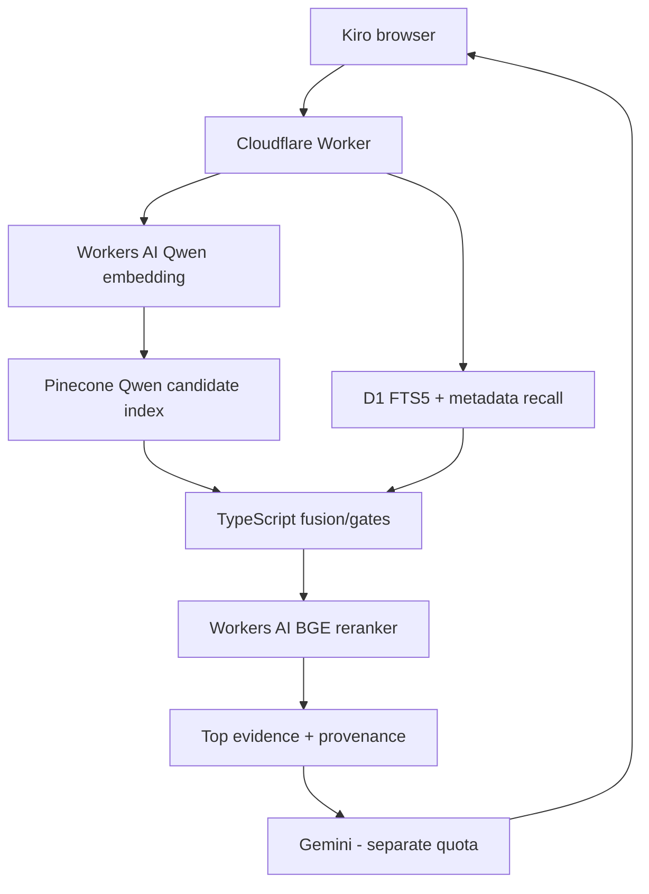

# Cloudflare / Portfolio Integration Plan

## Table of Contents

- [Current State](#current-state)
- [Required Boundary](#required-boundary)
- [Recommended Request Lifecycle](#recommended-request-lifecycle)
- [Why Not Run Python in the Browser](#why-not-run-python-in-the-browser)
- [Why Not Pretend the Existing Worker Already Does It](#why-not-pretend-the-existing-worker-already-does-it)
- [Production Concerns](#production-concerns)
- [2026-08-31 Deployment Evaluation Update](#2026-08-31-deployment-evaluation-update)
- [2026-08-31 Zero-Cost Cloudflare-Native Reassessment](#2026-08-31-zero-cost-cloudflare-native-reassessment)

<a id="current-state"></a>
## Current State

The portfolio Worker is deployed and owns the normal portfolio API. The Python RAG runtime is local/separate. The browser Kiro page is a GLB/state scaffold. There is no active Worker RAG route and no Gemini call.

<a id="required-boundary"></a>
## Required Boundary

The public browser should never call Pinecone with a secret or attempt to load Nomic/CrossEncoder. A browser-facing endpoint should enforce rate limits/request limits and call the Python RAG service server-to-server.

<a id="recommended-request-lifecycle"></a>
## Recommended Request Lifecycle

```text
Kiro submit
 -> portfolio RAG gateway
 -> Python /api/rag/... service
 -> retrieval
 -> Gemini generation
 -> response + evidence
 -> Kiro answering/success state
```

<a id="why-not-run-python-in-the-browser"></a>
## Why Not Run Python in the Browser

The runtime depends on Python, PyTorch, SentenceTransformers, model weights and Pinecone server credentials. React runs in the user's browser and cannot be treated as a secret-holding persistent Python environment.

<a id="why-not-pretend-the-existing-worker-already-does-it"></a>
## Why Not Pretend the Existing Worker Already Does It

`worker/index.ts` currently contains public/auth/admin portfolio routes only. Documentation must remain truthful until a RAG route/service binding is added.

<a id="production-concerns"></a>
## Production Concerns

- persistent process/model warmup;
- memory footprint for Nomic + CrossEncoder;
- timeout and retry policy around Pinecone/Gemini;
- server-side rate limiting;
- CORS/gateway ownership;
- observability for retrieval/generation latency separately;
- secret injection;
- health/readiness distinction;
- grounding/error schema understood by the Kiro UI.

<a id="2026-08-31-deployment-evaluation-update"></a>
## 2026-08-31 Deployment Evaluation Update

This update **adds subsequent deployment evidence without removing the integration plan above**.

### Containerization outcome

The existing Pinecone-backed FastAPI runtime was successfully built and run in Docker on Linux.

Validated inside the container:

```text
runtime schema:       1.0.0
retrieval schema:     3.1.0-pinecone
documents:            2,808
repositories:         134
dense backend:        Pinecone
Nomic query model:    loaded
CrossEncoder:         loaded
BM25/metadata:        enabled
local embeddings.npy: NOT LOADED
/health:              PASS
/api/rag/retrieve:    exercised
```

The first Docker build accidentally pulled CUDA/NVIDIA dependencies through generic PyTorch resolution. The deployment Dockerfile was corrected to install the CPU-only PyTorch wheel explicitly. The corrected image built and started successfully.

### Cloudflare Containers was evaluated, not deployed

The architecture originally proposed in this document remained technically coherent:

```text
portfolio Worker
  -> Cloudflare Container
  -> Python RAG runtime
  -> Pinecone
```

Wrangler authentication succeeded, but the account-level feasibility probe:

```text
npx wrangler containers list
```

returned:

```text
Unauthorized: You do not have access to Cloudflare Containers.
Deploying containers requires the Workers Paid plan.
```

Cloudflare's current official Containers pricing documentation likewise lists Container compute under Workers Paid, with Free shown as unavailable.

No Worker RAG proxy route, Durable Object/container binding or production container deployment was added after this blocker was discovered.

Therefore the plan above should now be read as:

**EVALUATED ARCHITECTURE — NOT AVAILABLE UNDER THE CURRENT ACCOUNT PLAN.**

### Render Free was checked next

The live local RAG container was measured at approximately:

```text
1.293 GiB RAM
```

Render's current official Free web-service allocation is:

```text
0.1 CPU
512 MB RAM
```

The current runtime is therefore about 2.6 times larger than Render Free's memory budget.

No Render deployment has been attempted yet. The current statement is:

**RENDER FREE: POSSIBLE PROVIDER CATEGORY, CURRENT CONTAINER DOES NOT FIT AS-IS.**

### Current architectural boundary remains valid

Even though Cloudflare Containers are currently blocked, the browser/security boundary from this document remains correct:

```text
browser
  -> server-side portfolio gateway
  -> private RAG service
  -> Pinecone
  -> future Gemini
```

The unresolved variable is the production host for the Python service.

### Current decision state

Production hosting is deliberately **UNSELECTED** while the project decides whether to:

- reduce runtime memory;
- select another free/no-card host;
- change the model inference representation;
- split inference responsibilities;
- or revisit hosting economics later.

None of those directions has been implemented or approved yet.

Full record:

- [../../docs/qc/rag/2026-08-31-containerization-and-hosting-evaluation.md](../../docs/qc/rag/2026-08-31-containerization-and-hosting-evaluation.md)

<a id="2026-08-31-zero-cost-cloudflare-native-reassessment"></a>
## 2026-08-31 Zero-Cost Cloudflare-Native Reassessment

A later architecture review changed the **candidate direction**, but not the active system state.

### Core correction

The hosting problem is not caused by Pinecone. The Python runtime owns both local model inference and ranking behavior:

```text
Nomic query embedding
+ BM25
+ metadata/topic/skill recall
+ fusion/gates/polarity
+ CrossEncoder reranking
+ semantic dedupe/diversity
+ response shaping
```

Therefore replacing Nomic alone does **not** remove Python. A no-Python runtime requires a full responsibility map and parity tests.

### New candidate

Cloudflare now directly hosts `@cf/qwen/qwen3-embedding-0.6b`, and Workers AI has a free allocation of 10,000 neurons/day. The portfolio Worker already has D1 bound. Cloudflare also hosts `@cf/baai/bge-reranker-base`.

The candidate path is therefore:



### Why Pinecone remains in the first candidate

Vectorize is a real vector database, but moving the vector DB at the same time as the embedding model would add an unnecessary variable. More importantly, the current pipeline requests `top 500` dense candidates, while current Vectorize limits are `topK=100` without values/metadata and `topK=50` when returning values/full metadata.

For Qwen's documented 1,024-D output and the current 2,808 documents, Vectorize Free would store `2,875,392` dimensions and, using Cloudflare's queried-dimension formula, support roughly `26,488` queries/month or about `883/day` in a 30-day month. This is likely enough for portfolio traffic, but it is not the first migration because the candidate ceiling changes retrieval behavior.

### Capacity correction

The previously discussed tens/hundreds of thousands of Qwen queries/day applies to **embedding inference only**. Full-RAG capacity is bounded by the minimum of Workers requests, Workers AI shared neurons, vector-store usage, D1 usage and generation quota. Reranking 120 candidates may be a much stronger neuron constraint than embedding a short user query.

### Recommended next step

Do not rewrite `worker/index.ts` yet. First:

1. generate Qwen embeddings for the same 2,808 evidence documents;
2. create a new 1,024-D Pinecone candidate index;
3. leave the Nomic 512-D index untouched;
4. run the existing retrieval regression suite;
5. measure Pinecone `usage.read_units` for the real top-500 query/fetch pattern;
6. only if Qwen passes, port BM25/metadata/gates/reranking toward Worker + D1 + Workers AI.

Detailed decision record, deployment caps, calculations, diagrams, implementation file map and acceptance gates:

- [cloudflare-native-zero-cost-migration.md](cloudflare-native-zero-cost-migration.md)
- [../../docs/qc/rag/2026-08-31-cloudflare-native-zero-cost-runtime-evaluation.md](../../docs/qc/rag/2026-08-31-cloudflare-native-zero-cost-runtime-evaluation.md)

## Related Documentation

- Parent: [../README.md](../README.md)
- [Runtime](../runtime/README.md)
- [Portfolio deployment](../../docs/operations/deployment.md)
- [Zero-cost migration decision](cloudflare-native-zero-cost-migration.md)
