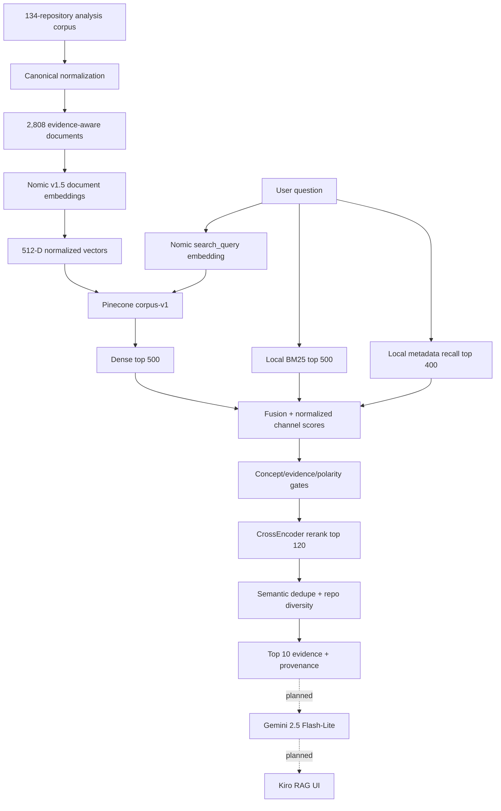
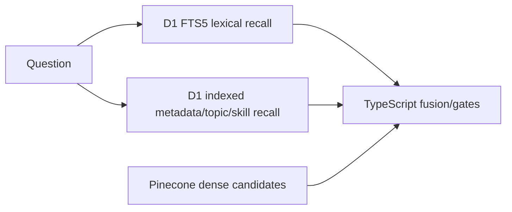
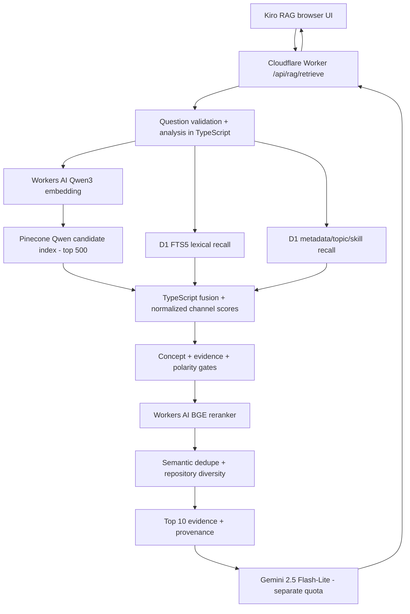
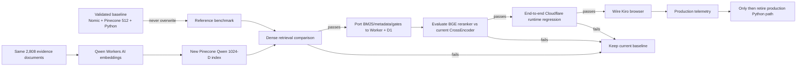

# Cloudflare-Native Zero-Cost RAG Runtime Migration

> **Decision date:** `2026-08-31`  
> **Status:** `CANDIDATE ARCHITECTURE — NOT YET IMPLEMENTED`  
> **Current production-equivalent baseline:** Nomic v1.5 + Pinecone + Python FastAPI retrieval runtime  
> **Primary goal:** remove the production Python/Docker hosting requirement without degrading evidence retrieval quality or creating a large client-side download.  
> **Cost constraint:** target `$0` ongoing infrastructure under the documented free allocations; temporary credits do not count as sustainable free capacity.

## Table of Contents

- [1. Executive Decision](#1-executive-decision)
- [2. Hard Constraints](#2-hard-constraints)
- [3. Current Validated Baseline](#3-current-validated-baseline)
- [4. What Actually Makes the Current Runtime Heavy](#4-what-actually-makes-the-current-runtime-heavy)
- [5. Deployment Pathway Comparison](#5-deployment-pathway-comparison)
- [6. Deployment Caps and Constraint Fit](#6-deployment-caps-and-constraint-fit)
- [7. Why Nomic Is the Main Embedding Deployment Friction](#7-why-nomic-is-the-main-embedding-deployment-friction)
- [8. Candidate Embedding Model: Qwen3-Embedding-0.6B](#8-candidate-embedding-model-qwen3-embedding-06b)
- [9. Important Correction: Embedding-Only Capacity Is Not Full-RAG Capacity](#9-important-correction-embedding-only-capacity-is-not-full-rag-capacity)
- [10. Workers AI Free-Capacity Calculations](#10-workers-ai-free-capacity-calculations)
- [11. Reranking Is the Next Runtime Constraint](#11-reranking-is-the-next-runtime-constraint)
- [12. Pinecone vs Vectorize](#12-pinecone-vs-vectorize)
- [13. Why Vectorize Is Not the First Migration Step](#13-why-vectorize-is-not-the-first-migration-step)
- [14. D1 as the Cloudflare-Native Lexical and Metadata Store](#14-d1-as-the-cloudflare-native-lexical-and-metadata-store)
- [15. Candidate Runtime Architecture](#15-candidate-runtime-architecture)
- [16. Migration Architecture](#16-migration-architecture)
- [17. What Must Move Out of Python](#17-what-must-move-out-of-python)
- [18. What Can Stay Local in Python](#18-what-can-stay-local-in-python)
- [19. Gemini Generation Boundary](#19-gemini-generation-boundary)
- [20. Suggested Next Step](#20-suggested-next-step)
- [21. Acceptance Gates](#21-acceptance-gates)
- [22. Future Files That Need to Change](#22-future-files-that-need-to-change)
- [23. Files That Should Not Be Deleted Yet](#23-files-that-should-not-be-deleted-yet)
- [24. Failure Modes and Rollback](#24-failure-modes-and-rollback)
- [25. Final Recommendation](#25-final-recommendation)
- [26. Official Sources](#26-official-sources)

<a id="1-executive-decision"></a>
## 1. Executive Decision

The current deployment problem is **not RAG itself** and **not the existence of a vector database**. The deployment problem comes from the production runtime owning two local ML models plus Python-side ranking logic:

1. `nomic-ai/nomic-embed-text-v1.5` for query embeddings;
2. `cross-encoder/ms-marco-MiniLM-L6-v2` for reranking;
3. local BM25 and metadata recall;
4. fusion, evidence gates, polarity logic, semantic dedupe, repository diversity and response shaping.

Replacing Nomic alone removes only one part of the Python runtime. A genuine no-Python production architecture must replace or port **all runtime responsibilities**, while keeping the already validated evidence corpus and regression suite as the reference.

The preferred migration sequence is therefore:

- ✅ keep the current Nomic/Pinecone/Python system untouched as the baseline;
- ✅ test Cloudflare-hosted `@cf/qwen/qwen3-embedding-0.6b` against the same 2,808 documents and retrieval tests;
- ✅ keep Pinecone for the first Qwen experiment so the embedding-model comparison is not contaminated by a simultaneous vector-database migration;
- ✅ instrument Pinecone read-unit usage for the current top-500 dense retrieval workload;
- ✅ if Qwen passes, port lexical/metadata/fusion/gating logic to the existing Cloudflare Worker + D1 boundary;
- ✅ evaluate Cloudflare-hosted `@cf/baai/bge-reranker-base` against the current CrossEncoder before removing Python;
- ❌ do not delete the current Nomic embeddings, Pinecone index, Python runtime or parity tests until the new path passes end-to-end regression;
- ❌ do not switch to Vectorize merely for architectural neatness; its current free accounting and `topK` limits materially constrain this exact retrieval pipeline.

<a id="2-hard-constraints"></a>
## 2. Hard Constraints

The deployment search is bounded by the following requirements:

| Constraint | Required? | Meaning |
|---|:---:|---|
| Ongoing infrastructure cost | ✅ `$0` target | Promotional credits do not count as sustainable free operation. |
| Production Python service | ❌ | Local/offline Python tooling is acceptable; a public Python host is not the desired steady-state architecture. |
| Docker requirement | ❌ | The final runtime should not depend on container hosting. |
| Large visitor download | ❌ | A visitor should not need to download a 100+ MB embedding model to ask a portfolio question. |
| Cloudflare-friendly | ✅ | Prefer the already deployed Worker/D1 platform where it can competently own the workload. |
| Retrieval quality | ✅ hard gate | Infrastructure simplification must not silently degrade employer-facing evidence retrieval. |
| Existing evidence/provenance | ✅ preserve | The 2,808 evidence-aware documents and their provenance remain canonical unless a separate corpus change is justified. |
| Current baseline | ✅ preserve during migration | Nomic/Pinecone remains the rollback/reference path until the replacement passes. |
| Secret handling | ✅ server-side | Pinecone/Gemini/API secrets must never reach the browser. |
| Sustainable capacity | ✅ explicit | Every free pathway must be evaluated against its real hard caps, not just the word “free.” |

<a id="3-current-validated-baseline"></a>
## 3. Current Validated Baseline



Current facts that must remain visible during migration:

| Property | Current baseline |
|---|---|
| repositories | `134` |
| retrieval documents | `2,808` |
| Nomic stored dimensions | `512` |
| current Pinecone index | `portfolio-career-rag-v1` |
| current namespace | `corpus-v1` |
| dense candidates | `500` |
| BM25 candidates | `500` |
| metadata candidates | `400` |
| CrossEncoder rerank candidates | `120` |
| final results | `10` |
| measured initialized Docker RAM | approximately `1.293 GiB` |
| current browser integration | not yet wired to live RAG |
| current generation | Gemini 2.5 Flash-Lite selected, not integrated |

<a id="4-what-actually-makes-the-current-runtime-heavy"></a>
## 4. What Actually Makes the Current Runtime Heavy

The current container is not heavy because Pinecone is a vector database. Pinecone is already a remote service. The memory/runtime burden comes from the local inference and ranking process:

```text
Python FastAPI process
  ├─ PyTorch / SentenceTransformers
  ├─ Nomic query embedding model
  ├─ CrossEncoder reranker model
  ├─ local evidence records
  ├─ BM25 structures
  ├─ metadata/topic/skill recall
  ├─ fusion and gates
  ├─ polarity logic
  ├─ semantic dedupe
  └─ HTTP serialization / provenance response
```

This distinction matters because it prevents a false architecture change such as replacing Pinecone with Vectorize while leaving the Python model runtime untouched. That would change the database but leave the actual hosting problem in place.

<a id="5-deployment-pathway-comparison"></a>
## 5. Deployment Pathway Comparison

| Path | Ongoing `$0`? | Python/Docker? | Visitor burden | Preserves current Nomic space? | Main cap/blocker | Decision |
|---|:---:|:---:|:---:|:---:|---|---|
| Current PC as public inference host | ✅ monetary | ✅ Python | low | ✅ | personal machine availability/security | ❌ reject |
| Cloudflare Containers + current runtime | ❌ | ✅ Docker/Python | low | ✅ | Containers require Workers Paid; free compute unavailable | ❌ reject under current constraint |
| Render Free + current container | ✅ | ✅ Docker/Python | low | ✅ | 512 MB / 0.1 CPU vs measured ~1.293 GiB; idle spin-down | ❌ does not fit |
| Nomic hosted API | ❌ sustainable `$0` | ❌ | low | ✅ exact model family | current Nomic Plus is `$10/month` for full API access | ❌ reject |
| Fireworks embedding API | ❌ sustainable `$0` | ❌ | low | provider-dependent | `$1` promo credit, then usage pricing | ❌ reject |
| Hugging Face Inference Provider for exact Nomic | n/a | ❌ | low | would be ✅ | exact Nomic v1.5 currently not deployed by any HF Inference Provider | ❌ unavailable |
| Browser Nomic ONNX | ✅ server cost | ❌ | **high** | approximately | ~111–137+ MB first model transfer plus client RAM/CPU/battery | ❌ reject UX |
| Cloudflare Worker/Python Worker running Nomic weights | ✅ | no Docker | low | theoretically | 128 MB memory, 10 ms CPU/request, 3 MB compressed bundle on Free | ❌ wrong runtime/resource envelope |
| Deno Deploy + Nomic ONNX | ✅ plan | no Python required | low | requires parity test | 768 MB default memory, 10 CPU-hours/month, cold starts/model load; more moving parts | 🟠 fallback experiment |
| Workers AI Qwen + **existing Pinecone** | ✅ candidate | ❌ production Python target | low | ❌ new space | Qwen/reranker parity + Pinecone RU + D1/Worker caps | 🟢 preferred first migration candidate |
| Workers AI Qwen + Vectorize | ✅ candidate | ❌ | low | ❌ new space | Vectorize free dimension accounting + `topK` 100/50 | 🟠 evaluate later |

<a id="6-deployment-caps-and-constraint-fit"></a>
## 6. Deployment Caps and Constraint Fit

### 6.1 Cloudflare Workers Free

Current documented limits include:

- `100,000` Worker requests/day;
- `10 ms` CPU time per HTTP request;
- `128 MB` memory per isolate;
- `50` external subrequests per invocation;
- `3 MB` compressed Worker bundle size;
- `1 second` startup-time limit.

Consequences:

- ✅ suitable as orchestration/API gateway;
- ✅ waiting on Workers AI, D1 and network `fetch()` does not consume the same CPU budget as active JS computation;
- ❌ unsuitable for loading the current Nomic + CrossEncoder model stack directly;
- ❌ unsuitable for bundling the current ~34 MB `embedding-records.jsonl` directly into the Worker; runtime data should live in D1/R2/another data service or be compiled into a much smaller purpose-built index.

#### Cloudflare Containers paid-path cap

Cloudflare Containers are not available on Workers Free. The minimum Workers Paid plan is `$5/month`, so this path fails the hard `$0` constraint before capacity is considered. The current paid-plan included container allocation is:

```text
memory: 25 GiB-hours/month
CPU:    375 vCPU-minutes/month
disk:   200 GB-hours/month
```

The existing ~1.293 GiB Python container is technically in the class of workload Containers are designed to host, but using this route would preserve Python/Docker and introduce a non-zero fixed plan cost. It is therefore retained only as a documented paid fallback, not a target architecture.

### 6.2 Workers AI Free

Current free allocation:

```text
10,000 neurons/day
reset: 00:00 UTC
```

This allocation is **shared across Workers AI models used by the account**, so embedding + reranking + any future Workers-AI generation would draw from the same daily pool.

### 6.3 Vectorize Free

Current free allocation:

```text
queried vector dimensions: 30,000,000 / month
stored vector dimensions:   5,000,000
```

Current query result limits:

```text
topK without values/metadata: 100
topK with values/full metadata: 50
```

This is a functional mismatch with the current dense candidate stage, which intentionally asks Pinecone for `top 500`.

### 6.4 D1 Free

Current allocation:

```text
rows read:    5,000,000 / day
rows written:   100,000 / day
storage:              5 GB total
```

The portfolio already has a D1 `DB` binding. This makes D1 attractive for a compact RAG evidence table, metadata indexes and FTS5 lexical search. Actual row-read cost must be measured; a naive full scan of all 2,808 evidence rows per question would have a rough upper bound of only about `5,000,000 / 2,808 ≈ 1,780` queries/day before other D1 reads. Indexed FTS5/metadata queries should not be assumed to have that full-scan cost; measure the actual D1 `meta` usage.

### 6.5 Pinecone Starter

Current Starter allowances include:

```text
storage:      up to 2 GB
read units:   up to 1,000,000 / month
write units:  up to 2,000,000 / month
egress:       up to 1 GB / month
indexes:      up to 5
namespaces:   100 / index
```

Pinecone query/fetch responses expose `usage.read_units`. Therefore the correct capacity calculation for this project is **not a guessed queries/day number**. The next benchmark should record read units for the current top-500 query plus any vector fetch used for dedupe, then derive:

```text
monthly_query_capacity = 1,000,000 RU / measured_RU_per_full_RAG_query
```

Pinecone supports a query `topK` up to 10,000, so it can preserve the current top-500 dense candidate breadth.

### 6.6 Render Free

Current Free web-service compute:

```text
CPU: 0.1
RAM: 512 MB
```

The current container measured approximately `1.293 GiB`, or about `2.6x` the RAM allowance. Free services also spin down after 15 minutes of inactivity and take about a minute to spin back up. Render explicitly positions Free instances as hobby/testing rather than durable production.

### 6.7 Deno Deploy Free

Current Free application allowance includes:

```text
requests:          1,000,000 / month
egress:            20 GiB / month
active CPU:        10 hours / month
default memory:    768 MB
memory time:       150 GiB-hours
revision storage:  10 GiB
idle shutdown:     approximately 20–30 seconds
```

This makes server-side ONNX technically more plausible than on Workers Free, but model initialization, peak RSS and cold-start behavior still need measurement. It also introduces a second runtime platform, which is why it is a fallback rather than the preferred first migration.

### 6.8 Gemini 2.5 Flash-Lite

Google currently lists Gemini 2.5 Flash-Lite input/output as free on the Free tier, but public rate-limit documentation says actual model quotas vary by project and should be read in AI Studio. Therefore generation **cannot be assigned a guaranteed public queries/day number in this document** without checking the actual project quota.

A second consideration: Google currently states Free-tier Gemini API content may be used to improve its products. If the public portfolio sends visitor questions to the Free tier, that data-flow should be disclosed and minimized; the system should not silently externalize visitor text under a different privacy assumption.

### 6.9 Hosted Nomic / Fireworks / Hugging Face

These are simpler operationally but fail the sustainable `$0` requirement in different ways:

| Hosted path | Current cap / commercial boundary | Constraint result |
|---|---|---|
| Nomic Atlas Starter | `$0`, but current Starter does not include full API access | ❌ cannot be the production embedding API |
| Nomic Atlas Plus | `$10/month`, includes `10M` text tokens and full API access | ❌ fixed recurring cost |
| Fireworks | `$1` introductory credit; embedding models up to 150M parameters are currently `$0.008 / 1M` input tokens | ❌ temporary credit + paid usage |
| Hugging Face Inference Providers | exact `nomic-ai/nomic-embed-text-v1.5` currently has no Inference Provider deployment | ❌ unavailable for the exact-model requirement |

The issue is not that these services are expensive at portfolio scale. The issue is that they do not satisfy the explicitly selected **permanent-zero-ongoing-cost** deployment constraint.

### 6.10 Browser Nomic ONNX

Nomic's published ONNX artifacts include approximately:

```text
q4f16:      ~111 MB
quantized:  ~137 MB
fp16:       ~274 MB
fp32:       ~547 MB
```

The first model load therefore transfers roughly 111–137+ MB even with aggressive quantization, before considering browser runtime overhead. The model can be cached after first load, but the initial network transfer, RAM, CPU/GPU and battery cost are moved onto the portfolio visitor. This route is rejected for UX and resource-externalization reasons, not because browser inference is technically impossible.

### 6.11 Personal-PC Hosting

There is no provider quota, but the operational cap is the availability and security of a personal workstation/network. A public portfolio would become dependent on that machine being powered, reachable, patched and exposed safely. This is rejected as a production boundary even though its direct cloud bill can be `$0`.

<a id="7-why-nomic-is-the-main-embedding-deployment-friction"></a>
## 7. Why Nomic Is the Main Embedding Deployment Friction

Nomic v1.5 remains a valid retrieval model, but its exact open-weight model is not currently offered by a Hugging Face Inference Provider, and Nomic's current full hosted API access is on a paid plan. Running the open model ourselves means model weights and inference have to live somewhere.

The previously evaluated options merely move that burden:

```text
Python host        -> our server pays RAM/CPU and operational complexity
Browser ONNX       -> visitor pays bandwidth/RAM/CPU/battery
Deno ONNX          -> second serverless platform + model cold start
Cloudflare Worker  -> model does not fit Free Worker resource envelope
```

Therefore it is reasonable to challenge the model choice **provided retrieval quality remains the decision criterion**. The validated Nomic corpus should be a baseline, not a sacred implementation detail.

<a id="8-candidate-embedding-model-qwen3-embedding-06b"></a>
## 8. Candidate Embedding Model: Qwen3-Embedding-0.6B

Cloudflare directly hosts:

```text
@cf/qwen/qwen3-embedding-0.6b
```

Current Cloudflare documentation reports:

- Cloudflare-hosted;
- `1,024`-dimension embeddings in AI Search model configuration;
- up to `8,192` input tokens in current supported-model documentation;
- cosine metric;
- `$0.012 / 1M input tokens` nominal pricing;
- Workers AI neuron conversion for this model: `1,075 neurons / 1M input tokens`.

The direct model API exposes task-oriented `queries` and `documents` inputs in addition to generic `text`. The migration should test those task-specific interfaces and instructions instead of mechanically carrying Nomic's `search_query:` / `search_document:` prefixes into a different model family.

The current evidence documents have a validated max of `1,343` Nomic-tokenizer tokens, so their observed length is comfortably below Cloudflare's currently documented Qwen context ceiling. The tokenizers differ, so the Qwen ingestion script must still count Qwen-side tokens and fail explicitly on overflow.

<a id="9-important-correction-embedding-only-capacity-is-not-full-rag-capacity"></a>
## 9. Important Correction: Embedding-Only Capacity Is Not Full-RAG Capacity

An earlier architectural estimate of roughly `90,000–300,000` free queries/day referred **only to Qwen query-embedding inference** under the 10,000-neuron Workers AI allowance. It did not include:

- reranking;
- Vectorize queried-dimension accounting;
- Pinecone read units;
- D1 row reads;
- Gemini generation;
- Worker request limits;
- any other Workers AI workload on the same account.

The full-RAG capacity is always:

```text
minimum(
  Worker request cap,
  Workers AI shared neuron cap,
  vector database cap,
  D1 cap,
  generation-provider quota,
  any other shared account limits
)
```

This distinction is mandatory in future capacity discussions.

<a id="10-workers-ai-free-capacity-calculations"></a>
## 10. Workers AI Free-Capacity Calculations

### 10.1 Qwen embedding only

With `10,000 neurons/day` and Qwen at `1,075 neurons / 1M input tokens`:

```text
free Qwen input tokens/day ≈ 10,000 / 1,075 * 1,000,000
                           ≈ 9.30 million tokens/day
```

Approximate embedding-only capacity:

| Average query input | Neurons/query | Qwen embeddings/day before other caps |
|---:|---:|---:|
| 25 tokens | 0.0269 | ~372,000 |
| 50 tokens | 0.0538 | ~186,000 |
| 100 tokens | 0.1075 | ~93,000 |
| 200 tokens | 0.2150 | ~46,500 |
| 500 tokens | 0.5375 | ~18,600 |

Because Workers Free itself is `100,000 requests/day`, a one-request-per-question Worker path caps the 25/50-token cases at no more than 100,000 Worker invocations/day even before other services are considered.

### 10.2 Qwen document re-indexing

The 2,808-document corpus must be embedded once for the candidate index. This is an ingestion cost, not a per-visitor cost. It should be done in bounded batches and recorded in a new embedding manifest. Do not overwrite the Nomic artifacts.

<a id="11-reranking-is-the-next-runtime-constraint"></a>
## 11. Reranking Is the Next Runtime Constraint

The current Python runtime reranks `120` candidates using `cross-encoder/ms-marco-MiniLM-L6-v2`. Eliminating Nomic while keeping this exact local CrossEncoder would still require the Python model host.

Cloudflare hosts:

```text
@cf/baai/bge-reranker-base
```

Current pricing conversion:

```text
283 neurons / 1M input tokens
```

Cloudflare AI Search currently lists a `512`-token input limit for this reranker. The current evidence documents have median length `315` tokens and maximum `1,343` under the Nomic tokenizer. Therefore a truncation/windowing policy must be explicit and regression-tested.

### Illustrative shared-neuron capacity

These are **engineering estimates, not guaranteed quotas**, because exact tokenization must be measured. Assume:

- query ≈ `100` tokens;
- median candidate ≈ `315` tokens;
- reranker sees query + candidate for every pair;
- Qwen embedding uses ≈ `0.1075` neurons/query;
- no Workers-AI generation is included.

| Rerank candidates | Illustrative rerank input/query | Approx. total neurons/query | Approx. queries/day from 10k neurons |
|---:|---:|---:|---:|
| 120 | ~49,800 tokens | ~14.20 | ~704 |
| 50 | ~20,750 tokens | ~5.98 | ~1,672 |
| 30 | ~12,450 tokens | ~3.63 | ~2,754 |
| 20 | ~8,300 tokens | ~2.46 | ~4,071 |
| 10 | ~4,150 tokens | ~1.28 | ~7,801 |

The lesson is not “use 30.” The lesson is:

> **Reranking, not query embedding, may become the dominant Workers AI free-tier cost.**

The candidate-count reduction should happen only if the retrieval benchmark proves that quality remains acceptable.

<a id="12-pinecone-vs-vectorize"></a>
## 12. Pinecone vs Vectorize

Vectorize **is a vector database**. The question is not whether it is legitimate; the question is whether migrating the vector database helps this exact pipeline.

| Property | Current Pinecone | Cloudflare Vectorize |
|---|---|---|
| Role | dense ANN/vector store | dense ANN/vector store |
| Current active state | ✅ validated | ❌ not integrated |
| Current corpus | Nomic 512-D / 2,808 | would require a new compatible index for Qwen |
| `topK` ceiling | up to 10,000 in query API | 100 without values/metadata; 50 with values/full metadata |
| Current pipeline need | 500 dense candidates | current single-query API cannot return 500 |
| Free accounting | 1M read units/month + storage/egress caps | 30M queried dims/month + 5M stored dims |
| Query capacity | must measure current RU/query | calculable from stored vectors + dimensions |
| Cloudflare-native binding | ❌ external HTTPS/API | ✅ native Worker binding |
| Migration risk | none if kept | DB + model change if done with Qwen |

<a id="13-why-vectorize-is-not-the-first-migration-step"></a>
## 13. Why Vectorize Is Not the First Migration Step

Qwen's Cloudflare vector shape is currently `1,024` dimensions. With `2,808` documents:

```text
stored dimensions = 2,808 * 1,024
                  = 2,875,392
```

That consumes about `57.5%` of Vectorize's `5,000,000` free stored-dimension allowance.

Cloudflare defines queried dimensions using both the vectors in the index and the query vector count. Using the pricing example/formula for one query per user question:

```text
30,000,000 / 1,024 - 2,808
≈ 26,488 queries/month
```

Approximate average:

```text
30-day month: ~883 queries/day
31-day month: ~854 queries/day
```

This is still very reasonable for a personal portfolio, but it is **far lower than the embedding-only Qwen capacity** and it is not the only issue. The more important functional mismatch is current `top 500` dense recall vs Vectorize `topK` 100/50.

Therefore the recommended first Qwen experiment is:

```text
Qwen document/query embeddings
        ↓
new Pinecone 1024-D candidate index
        ↓
existing retrieval behavior as closely as possible
```

Only after the model/runtime migration passes should Vectorize be evaluated as an independent optimization.

<a id="14-d1-as-the-cloudflare-native-lexical-and-metadata-store"></a>
## 14. D1 as the Cloudflare-Native Lexical and Metadata Store

The Worker already has a D1 `DB` binding, and Cloudflare D1 supports SQLite FTS5. That gives a plausible serverless replacement for the Python process's local text and metadata structures:



Recommended new D1 state should be a **slim runtime representation**, not a blind import of the current ~34 MB `embedding-records.jsonl`. Suggested tables:

- `rag_documents` — document ID, repository identity, retrieval class, semantic area, polarity/evidence attributes, display/provenance fields needed at runtime;
- `rag_documents_fts` — FTS5 index over the retrieval text and selected fields;
- indexed metadata columns/tables needed for topic/skill recall;
- optional migration/version table recording corpus schema + embedding generation.

Important caution:

> D1 FTS5's BM25 ranking is not automatically identical to the current Python BM25 implementation.

The port must be evaluated as a retrieval-algorithm change, not merely a storage change.

<a id="15-candidate-runtime-architecture"></a>
## 15. Candidate Runtime Architecture

### Preferred candidate: Cloudflare orchestration + Pinecone dense store



This is the candidate that most directly eliminates the Python/Docker service while preserving the current architectural intent.

### Why Pinecone remains in this diagram

Keeping Pinecone during the first runtime migration provides three advantages:

1. preserves top-500 dense candidate breadth;
2. prevents model migration and DB migration from being debugged simultaneously;
3. provides per-operation read-unit telemetry for a real capacity decision.

<a id="16-migration-architecture"></a>
## 16. Migration Architecture



This sequencing is intentionally reversible.

<a id="17-what-must-move-out-of-python"></a>
## 17. What Must Move Out of Python

To truthfully say “production Python is gone,” every runtime responsibility below needs a replacement:

| Current Python responsibility | Candidate replacement | Validation required? |
|---|---|:---:|
| question validation/analysis | Worker TypeScript | ✅ |
| Nomic query embedding | Workers AI Qwen | ✅ major model change |
| Pinecone dense query | Worker `fetch()` / TS client | ✅ |
| local BM25 top 500 | D1 FTS5 or TS lexical index | ✅ ranking change |
| metadata/topic/skill recall | D1 SQL/indexed queries | ✅ |
| reciprocal-rank/score fusion | TypeScript | ✅ exact logic parity |
| concept/evidence gates | TypeScript | ✅ exact regression |
| polarity handling | TypeScript | ✅ exact regression |
| CrossEncoder rerank top 120 | Workers AI BGE reranker | ✅ major model change |
| semantic dedupe | TypeScript + vector fetch/available dense vectors | ✅ |
| max-2/repository diversity | TypeScript | ✅ |
| top-10 evidence packet | TypeScript | ✅ |
| FastAPI HTTP route | existing Cloudflare Worker | ✅ API contract |
| CORS/rate limiting | Worker | ✅ security tests |

<a id="18-what-can-stay-local-in-python"></a>
## 18. What Can Stay Local in Python

There is no problem with keeping Python for **offline engineering**:

- source-corpus parsing;
- evidence-document compilation;
- baseline Nomic embedding generation;
- Qwen migration validation scripts if convenient;
- regression analysis;
- one-time data export/import tooling;
- benchmark/report generation.

The architectural requirement is to remove **public runtime dependence** on a Python process, not to ban Python from the repository.

<a id="19-gemini-generation-boundary"></a>
## 19. Gemini Generation Boundary

Gemini 2.5 Flash-Lite remains selected but unintegrated. It must remain a separate capacity/security decision from retrieval.

The retrieval system should be able to return grounded evidence without generation:

```text
/api/rag/retrieve
  -> ranked evidence + provenance
```

Then generation can be layered separately:

```text
ranked evidence packet
  -> Gemini
  -> grounded answer
```

This separation allows:

- retrieval QA without LLM variability;
- independent rate-limit/failure handling;
- graceful degradation to evidence-only answers if generation quota is unavailable;
- explicit privacy treatment for visitor query text sent to a third party.

<a id="20-suggested-next-step"></a>
## 20. Suggested Next Step

### Next step: Qwen-on-Pinecone bake-off before any production port

Do **not** start by rewriting the Worker.

The next engineering increment should be a controlled candidate embedding generation and retrieval benchmark:

1. ✅ create Qwen embeddings for the existing 2,808 evidence documents using Workers AI;
2. ✅ preserve the current Nomic artifacts unchanged;
3. ✅ create a **new** Pinecone 1,024-D cosine index/namespace for Qwen rather than overwriting `portfolio-career-rag-v1`;
4. ✅ run the existing employer-style and regression queries against both models;
5. ✅ compare end-task retrieval quality, not vector equality between different embedding spaces;
6. ✅ capture Pinecone `usage.read_units` for top-500 Qwen queries and any fetches;
7. ✅ only if Qwen passes, begin the Worker/D1/reranker port.

This isolates one change at a time and answers the most important question first:

> **Can the Cloudflare-native embedding model preserve or improve the retrieval quality that justified the current RAG pipeline?**

<a id="21-acceptance-gates"></a>
## 21. Acceptance Gates

### Gate A — embedding/data integrity

- [ ] exactly 2,808 candidate document vectors;
- [ ] every vector finite and non-zero;
- [ ] consistent 1,024-D shape from Cloudflare's Qwen endpoint;
- [ ] no silent document truncation;
- [ ] stable document-ID mapping/provenance;
- [ ] new manifest records model alias, API path, timestamp and source-document hashes.

### Gate B — dense retrieval

- [ ] employer-style queries return the expected relevant repositories/documents;
- [ ] no major regression in Recall@K, MRR/nDCG or the project's existing equivalent metrics;
- [ ] authorization query still prioritizes direct implementation evidence;
- [ ] backend/system-design regression query remains protected;
- [ ] negative/absence-only evidence does not dominate positive capability questions.

### Gate C — hybrid pipeline port

- [ ] D1 lexical recall meets or beats current Python BM25 on the regression set;
- [ ] metadata recall behavior preserved;
- [ ] fusion/gate tests match intended current semantics;
- [ ] provenance survives D1/Pinecone joins;
- [ ] Worker CPU time stays inside Free-plan constraints in representative requests.

### Gate D — reranker replacement

- [ ] BGE reranker tested against current CrossEncoder;
- [ ] truncation behavior explicit for long evidence documents;
- [ ] top-120 vs smaller candidate-count tradeoff measured;
- [ ] final top-10 quality does not materially regress;
- [ ] actual Workers AI neurons/query recorded.

### Gate E — capacity

- [ ] Pinecone RU/query measured;
- [ ] D1 rows read/query measured;
- [ ] Workers AI neurons/query measured for embedding + reranking;
- [ ] Gemini project quota checked separately;
- [ ] full-system free queries/day reported as the **minimum** of all applicable caps.

### Gate F — production

- [ ] rate limiting and abuse controls;
- [ ] timeout/retry handling;
- [ ] evidence-only graceful degradation;
- [ ] no API secrets in browser bundle;
- [ ] Kiro loading/answer/failure states driven by actual network events;
- [ ] current Python baseline remains rollback-capable until production telemetry is satisfactory.

<a id="22-future-files-that-need-to-change"></a>
## 22. Future Files That Need to Change

The documentation update does **not** implement these code changes. This table records the expected implementation surface if the Qwen bake-off passes.

| File / path | Change | Why |
|---|---|---|
| `wrangler.jsonc` | add Workers AI binding/config; retain existing D1 binding | Qwen/reranker inference from the Worker |
| `worker/env.ts` | add `AI: Ai` and Pinecone/Gemini runtime config types as appropriate | type-safe runtime bindings/secrets |
| `worker/index.ts` | register RAG retrieval/generation routes | public server-side gateway |
| `worker/routes/rag.ts` **new** | RAG HTTP validation/orchestration | keep `index.ts` from becoming a monolith |
| `worker/rag/retrieval.ts` **new** | dense + lexical + metadata candidate retrieval | port Python retrieval ownership |
| `worker/rag/scoring.ts` **new** | fusion, gates, polarity, diversity | preserve evidence-aware ranking semantics |
| `worker/rag/rerank.ts` **new** | Workers AI BGE wrapper and truncation policy | remove local CrossEncoder runtime |
| `worker/rag/types.ts` **new** | stable evidence/result contracts | parity and frontend safety |
| `worker/__tests__/...` | add RAG regression/API tests | prevent ranking/security regressions |
| `migrations/0005-rag-runtime-search.sql` **new** | slim RAG tables + FTS5/indexes | serverless lexical/metadata runtime |
| `.dev.vars.example` | document secret names, never values | local Worker integration |
| `rag/scripts/...` | add Qwen generation/benchmark/import tooling or parameterize existing scripts | one-time migration and parity testing |
| `rag/rag-corpus/...` | add a separate Qwen embedding manifest/results directory | preserve Nomic baseline and provenance |
| `src/kiro-rag-page.tsx` | replace simulated timers with live API states after backend passes | browser integration |
| `package.json` / `package-lock.json` | only if a new npm dependency is actually required | avoid unnecessary Worker bundle growth |

### Files that may not need modification

`src/App.tsx` already routes the Kiro page; it should only change if the final API integration requires route-level behavior. Likewise, using plain `fetch()` for Pinecone can avoid adding a large client library if the REST integration remains simple enough.

<a id="23-files-that-should-not-be-deleted-yet"></a>
## 23. Files That Should Not Be Deleted Yet

Until the migration passes all gates, preserve:

- `rag/runtime/rag-api-pinecone-v1.py`;
- `rag/runtime/requirements-rag-api-v1.txt`;
- current Nomic embedding artifacts;
- current `portfolio-career-rag-v1` index and `corpus-v1` namespace;
- Pinecone parity validators and reports;
- Docker/containerization evidence;
- existing retrieval regression fixtures/results.

The migration is a candidate replacement, not retroactive proof that the current runtime was wrong.

<a id="24-failure-modes-and-rollback"></a>
## 24. Failure Modes and Rollback

| Failure | Risk | Required response |
|---|---|---|
| Qwen dense retrieval regresses | simpler hosting but worse evidence | stop migration; retain Nomic baseline |
| D1 FTS5 changes lexical ranking materially | hidden retrieval drift | tune/port exact BM25 or retain alternative lexical implementation |
| BGE reranker regresses final ranking | Python still required for exact CrossEncoder | test smaller/alternative serverless reranker or keep current runtime |
| Worker exceeds 10 ms CPU frequently | Free Worker termination | reduce local CPU work, precompute/index more, split service boundary if justified |
| Pinecone RU unexpectedly high | free capacity lower than expected | use measured RU to redesign candidate/fetch pattern before considering DB migration |
| Vectorize topK insufficient | recall loss | do not force migration; keep Pinecone |
| Workers AI neuron budget dominated by reranking | full RAG cap lower than embedding estimate | reduce rerank candidates only after quality benchmark; cache where valid |
| Gemini quota unavailable | answer generation failure | return ranked evidence and explanatory degraded response |
| external free-tier policy changes | sustainability risk | preserve provider abstraction and baseline artifacts; re-evaluate without rewriting corpus |

<a id="25-final-recommendation"></a>
## 25. Final Recommendation

The recommended target is **not** “replace everything with Cloudflare immediately.” It is:

```text
Phase 1 — prove Qwen quality
  Current documents -> Workers AI Qwen -> new Pinecone Qwen index -> benchmark

Phase 2 — prove no-Python retrieval
  Worker + D1 + Pinecone + Workers AI reranker -> benchmark

Phase 3 — integrate browser/generation
  Kiro UI -> Worker -> grounded evidence -> Gemini -> answer

Phase 4 — only then reconsider the vector DB
  Pinecone vs Vectorize using measured workload and quality requirements
```

This order minimizes simultaneous change, preserves rollback, and keeps the infrastructure decision subordinate to retrieval truth rather than forcing the evidence system to fit a preferred vendor topology.

<a id="26-official-sources"></a>
## 26. Official Sources

Verified against public documentation on `2026-08-31`:

- Cloudflare Workers AI pricing: https://developers.cloudflare.com/workers-ai/platform/pricing/
- Cloudflare Qwen3 embedding model: https://developers.cloudflare.com/workers-ai/models/qwen3-embedding-0.6b/
- Cloudflare BGE reranker model: https://developers.cloudflare.com/workers-ai/models/bge-reranker-base/
- Cloudflare AI Search supported models: https://developers.cloudflare.com/ai-search/configuration/models/supported-models/
- Cloudflare Workers limits: https://developers.cloudflare.com/workers/platform/limits/
- Cloudflare Vectorize pricing: https://developers.cloudflare.com/vectorize/platform/pricing/
- Cloudflare Vectorize limits: https://developers.cloudflare.com/vectorize/platform/limits/
- Cloudflare D1 pricing: https://developers.cloudflare.com/d1/platform/pricing/
- Cloudflare D1 supported SQL/extensions (FTS5): https://developers.cloudflare.com/d1/sql-api/sql-statements/
- Cloudflare Containers pricing: https://developers.cloudflare.com/containers/platform/pricing/
- Pinecone pricing: https://www.pinecone.io/pricing/
- Pinecone query API/read-unit response: https://docs.pinecone.io/reference/api/2025-10/data-plane/query
- Pinecone usage monitoring: https://docs.pinecone.io/guides/manage-cost/monitor-usage-and-costs
- Render compute plans: https://render.com/docs/compute-plans
- Render Free limitations: https://render.com/docs/free
- Deno Deploy pricing: https://deno.com/deploy/pricing
- Nomic Atlas pricing: https://atlas.nomic.ai/pricing
- Nomic v1.5 model/provider status: https://huggingface.co/nomic-ai/nomic-embed-text-v1.5
- Fireworks pricing: https://fireworks.ai/pricing
- Gemini Developer API pricing: https://ai.google.dev/gemini-api/docs/pricing
- Gemini rate-limit behavior: https://ai.google.dev/gemini-api/docs/rate-limits

## Related Documentation

- [Cloudflare integration](cloudflare-integration.md)
- [Active pipeline](pipeline.md)
- [Embedding history](embedding-version-history.md)
- [Pinecone backend](pinecone.md)
- [Regeneration matrix](regeneration-matrix.md)
- [Runtime](../runtime/README.md)
- [Deployment QC record](../../docs/qc/rag/2026-08-31-cloudflare-native-zero-cost-runtime-evaluation.md)
