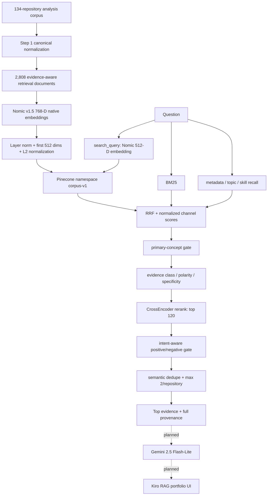

# Active RAG Pipeline - End to End

## Table of Contents

- [Pipeline Contract](#pipeline-contract)
- [Stage 0 - Source Analysis](#stage-0-source-analysis)
- [Stage 1 - Normalize](#stage-1-normalize)
- [Stage 2 - Compile Evidence Documents](#stage-2-compile-evidence-documents)
- [Stage 3 - Embed](#stage-3-embed)
- [Stage 4 - Offline Evidence-Aware Retrieval](#stage-4-offline-evidence-aware-retrieval)
- [Stage 5 - Pinecone Serving Copy](#stage-5-pinecone-serving-copy)
- [Stage 6 - Python HTTP Runtime](#stage-6-python-http-runtime)
- [Stage 7 - Grounded Generation (Selected / Not Integrated)](#stage-7-grounded-generation-selected-not-integrated)
- [Stage 8 - Kiro Browser Integration (Not Integrated)](#stage-8-kiro-browser-integration-not-integrated)

## Pipeline Contract

## Stage 0 - Source Analysis

The eleven `other/repositories-*.md` files are not ad-hoc scraped README text. They are longitudinal evidence reports with explicit provenance, limitations, chronology and skill evidence. Source completeness is 134/134.

## Stage 1 - Normalize

`prepare-rag-corpus.py` parses source reports into per-repository JSON and combined JSONL. Historical output is valid. Because the script moved away from its input files, do not rerun until its path discovery is repaired.

## Stage 2 - Compile Evidence Documents

The compiler examines 77,612 blocks, fingerprints repeated structure, suppresses 39,342 template blocks and 7,340 tiny generic blocks in the derived layer, retains 30,930 useful blocks and compiles 2,808 retrieval documents across five evidence classes and eight semantic areas.

## Stage 3 - Embed

Pinned Nomic v1.5 produces 768 native dimensions, then `layer_norm -> first 512 -> L2`. All 2,808 vectors are finite/nonzero/normalized. Document and query prefixes must remain asymmetric (`search_document:` / `search_query:`).

## Stage 4 - Offline Evidence-Aware Retrieval

Exact dense scores + BM25 + metadata -> RRF -> concept gate -> evidence score -> CrossEncoder -> intent-aware polarity -> dedupe/diversity. This exact-matrix implementation is the reference logic.

## Stage 5 - Pinecone Serving Copy

All vectors are copied into a 512-D cosine serverless index. Dense parity v2 proves candidate overlap and exact fetched-vector fidelity. Pinecone is serving infrastructure, not canonical source.

## Stage 6 - Python HTTP Runtime

The runtime keeps text/provenance/BM25/metadata/gates/CrossEncoder local and replaces exact dense candidate selection with Pinecone ANN. It fetches candidate vectors for dedupe. Current endpoints provide evidence retrieval only.

## Stage 7 - Grounded Generation (Selected / Not Integrated)

Gemini 2.5 Flash-Lite will synthesize a controlled evidence packet. This stage must preserve uncertainty/limitations and cannot invent repository evidence.

## Stage 8 - Kiro Browser Integration (Not Integrated)

The existing Kiro GLB UI already has semantic RAG states. Network events should replace the demo timers while preserving the model contract.

## Related Documentation

- Parent: [../README.md](../README.md)
- [Scripts](../scripts/README.md)
- [Runtime](../runtime/README.md)
